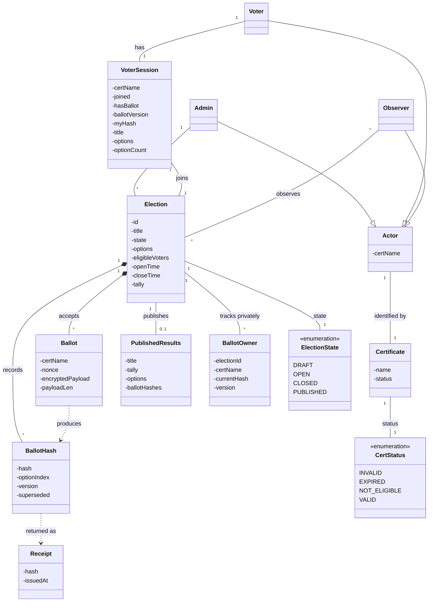
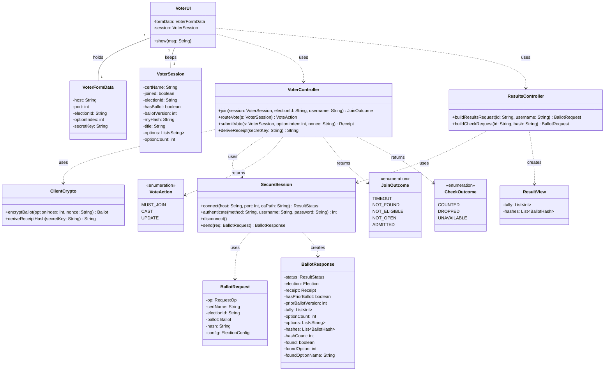
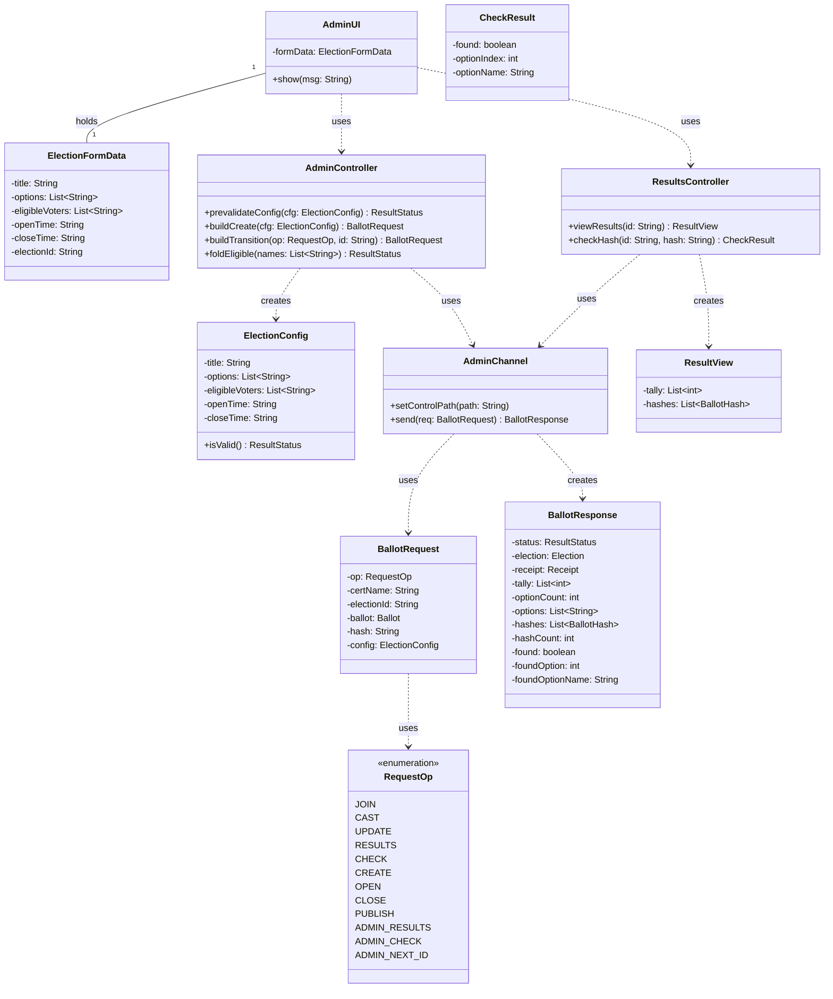
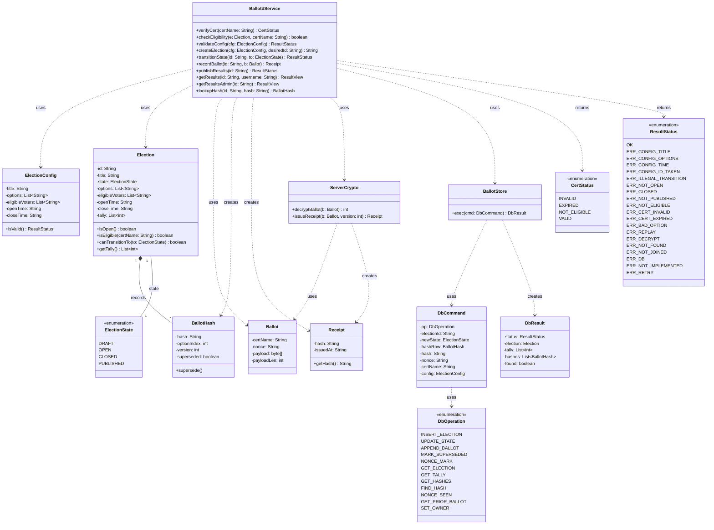

## Design

BallotBox is implemented in C, which has no classes, so every class below maps to a struct, an opaque context handle, or a module (a header plus its translation units).

### Domain Class Diagram

`BallotHash` is the only per-ballot entity published in results, and it holds no voter identity.
The store keeps the voter-to-current-hash association in the separate, private `BallotOwner` mapping used for updates.

### Solution Class Diagram: voter client (ballotu)

An Observer views results through this same client, so `ResultsController` serves UC-5 for both voters and observers.
`VoterController` represents the `bu_*` functions in `libballotclient`; it is not a stored C object.
The executable keeps one `bcl_ctx` transport context and one `bu_session_t` voter session.
Voter identity comes from the username confirmed by the server's LOGIN or REGISTER exchange.

### Solution Class Diagram: admin client (ballotctl)

`AdminController` holds no election of its own: it represents the `bc_*` request-building functions, not a stored C object.
`prevalidateConfig` calls the daemon library's authoritative validator, so the config rules exist in one place and the admin sees errors before a round trip.

`BallotRequest` and `BallotResponse` are shared protocol types from `libballotclient.a`.
Unlike ballotu, ballotctl sends every request through a one-shot, owner-only AF_UNIX control socket and never opens a TCP/tetriSH voter session.

### Solution Class Diagram: daemon tier

`ballotd` runs on the admin machine and is the only tier that touches the store.
ballotu reaches `BallotdService` through TCP/tetriSH after LOGIN or REGISTER.
ballotctl reaches it through ballotd's local AF_UNIX control plane.

