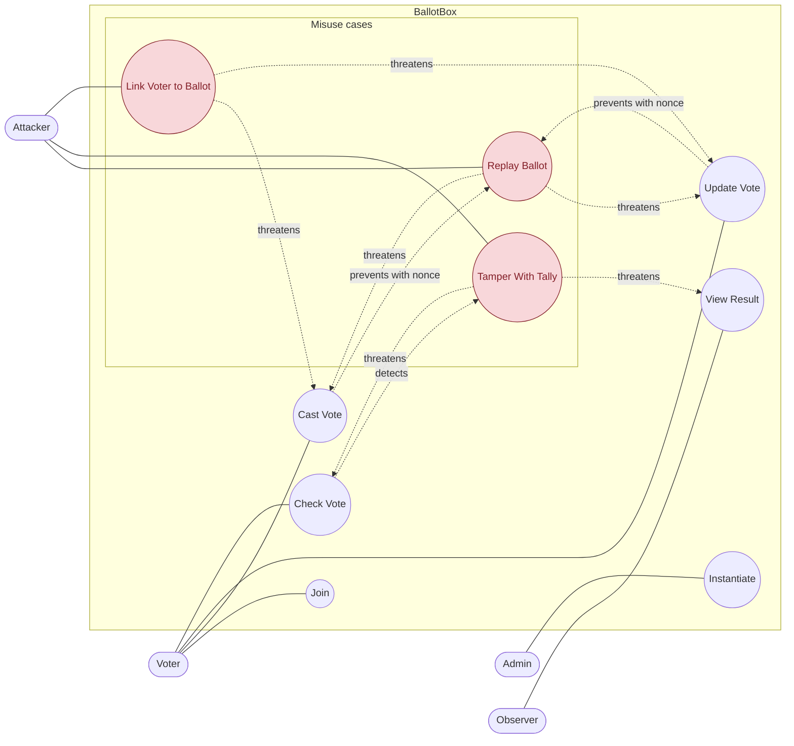
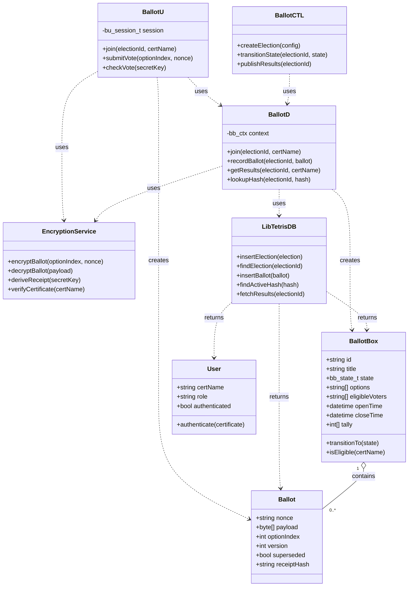
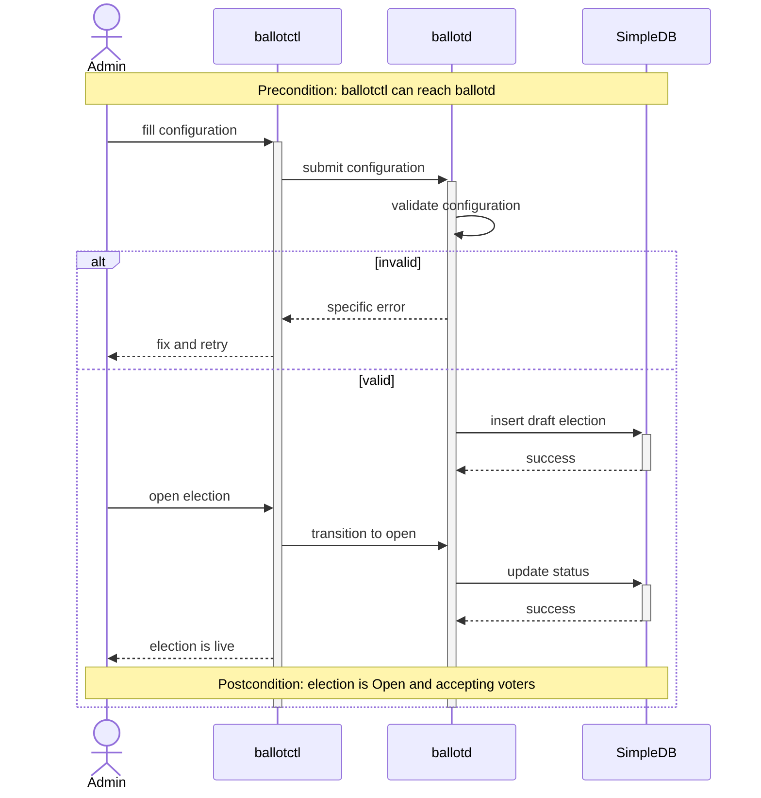
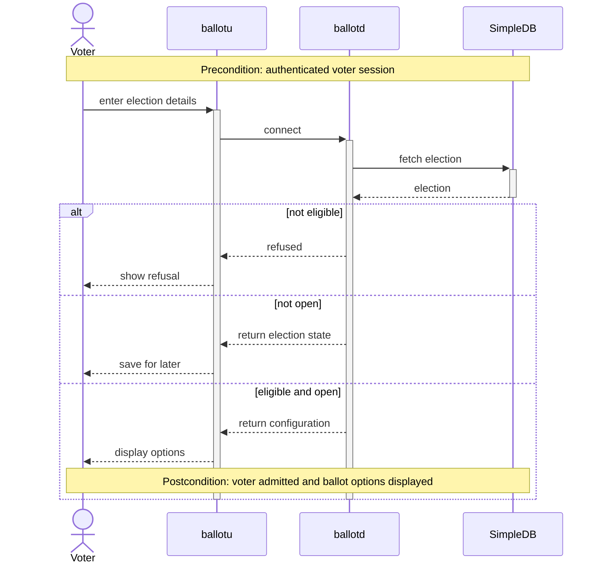
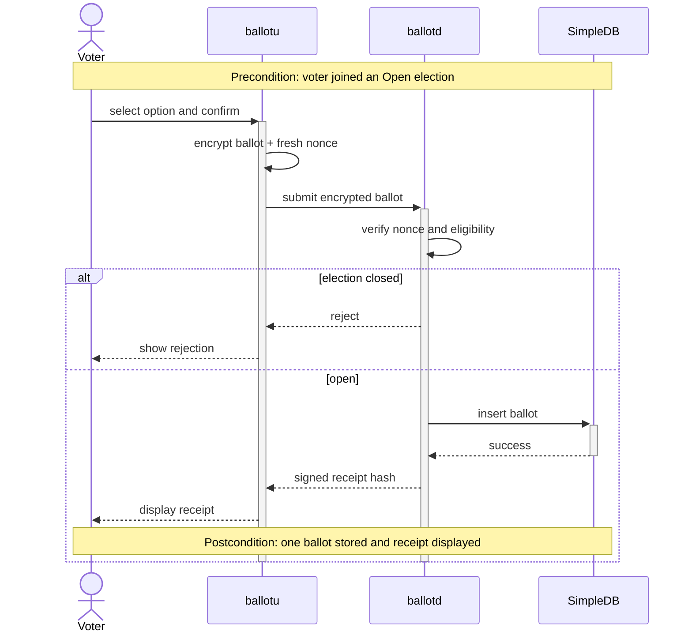
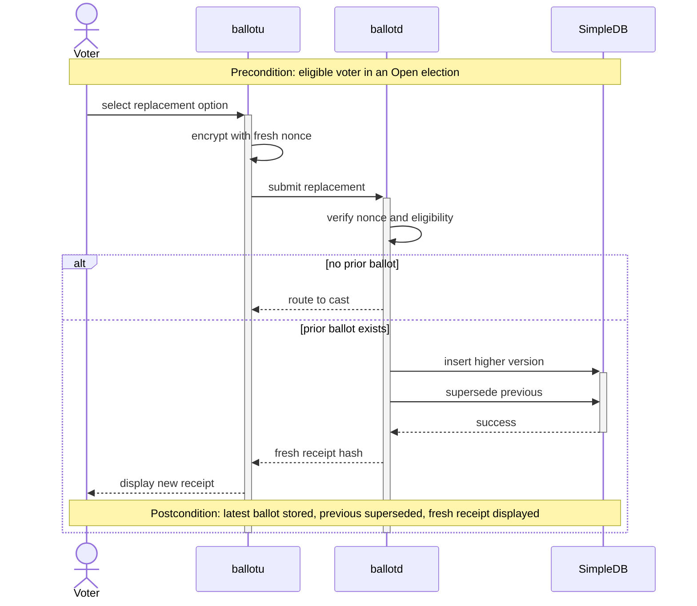
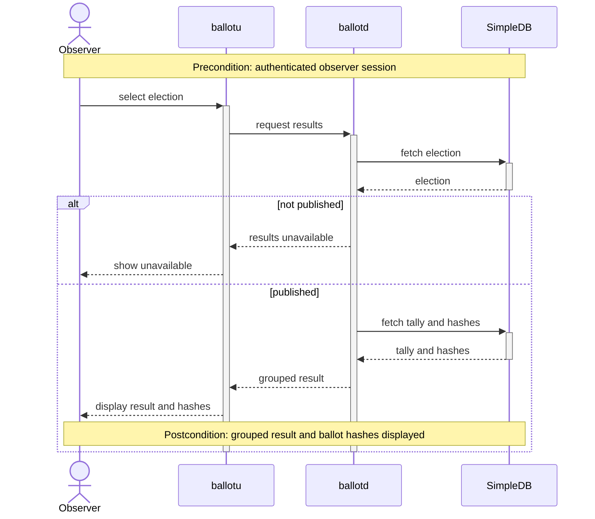
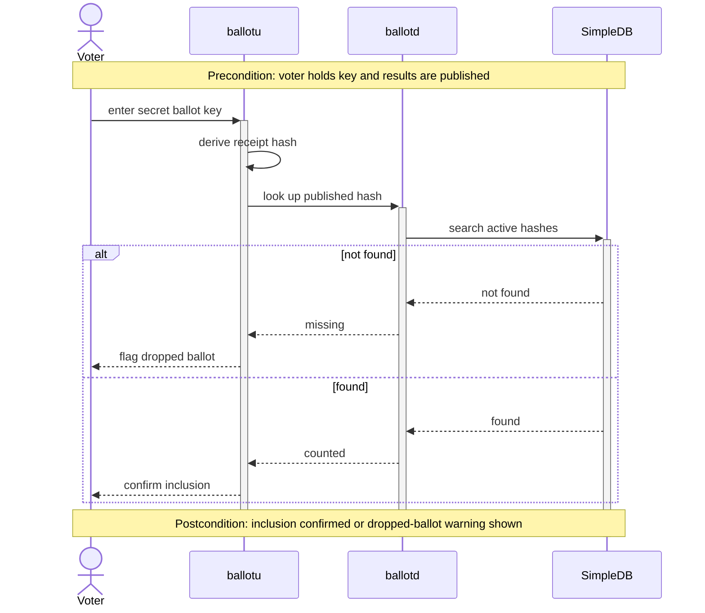

# BallotBox

**Authors:**

- 1009098 Pitchayut Ariyachansil
- 1009164 Phatsakorn Ukanchanakitti
- 1009195 Popsuk Sumetchoengprachya

BallotBox is a secure e-voting system for small orgs (clubs, coops, unions) solving the core tension: ballots must be secret (untraceable to voters) yet verifiable (tally is auditable).

## Requirements



## Running

```sh
make all      # ballotd, ballotctl, ballotu, the shell, the shared daemons
make client   # ballotu only, with client-side libraries, then ./tetrish
make test
make clean
make start    # clean + all, then ./tetrish
```

### Admin device (runs `ballotd`)

```sh
make all
./tetrish
```

Inside `tetrish`:

```sh
tetrisdb start
dspawn2 ballotd
ballotctl
```

On the very first run against a brand new `var/db`, run `ballotd` once before
`tetrisdb start`, then restart the database:

```sh
dspawn2 ballotd
tetrisdb stop
tetrisdb start
```

After that first run, the normal order above (`tetrisdb start` then
`dspawn2 ballotd`) is all you need on every later start.

### Voter device (runs `ballotu`)

```sh
make client
```

This drops you into `./tetrish`. Inside it:

```sh
ballotu
```

Enter the admin device's IP and port when prompted.

## Designs

### Solution Class Diagram



### UC-1: Instantiate BallotBox

| Field          | Detail                                                             |
| -------------- | ------------------------------------------------------------------ |
| Description    | Admin creates a new election instance and opens it for voting.     |
| Actors         | Admin                                                              |
| Triggers       | Admin fills in and submits an election configuration in ballotctl. |
| Preconditions  | ballotctl can reach ballotd.                                       |
| Postconditions | The election is Open and accepting voters.                         |

**Flow**

1. Admin fills in the election configuration.
2. ballotctl submits the configuration to ballotd.
3. ballotd validates the configuration.
4. ballotd inserts a draft election into SimpleDB.
5. Admin opens the election.
6. ballotd updates the election state to Open.
7. ballotctl confirms the election is live.

**Alternative Flows**

3a. Invalid configuration returns a specific error and allows the Admin to fix and retry.

**Error States**

Invalid configuration does not create or open an election.



### UC-2: Join BallotBox

| Field          | Detail                                             |
| -------------- | -------------------------------------------------- |
| Description    | An eligible voter joins an open election instance. |
| Actors         | Voter                                              |
| Triggers       | Voter enters the election details in ballotu.      |
| Preconditions  | Voter has an authenticated session.                |
| Postconditions | Voter is admitted and can view the ballot options. |

**Flow**

1. Voter enters the election details.
2. ballotu connects to ballotd.
3. ballotd fetches the election from SimpleDB.
4. ballotd verifies that the voter is eligible and the election is Open.
5. ballotd returns the election configuration.
6. ballotu displays the ballot options.

**Alternative Flows**

4a. An eligible voter attempting to join a non-open election has the election saved for later.

**Error States**

4b. An ineligible voter is refused and ballotu displays the refusal.



### UC-3: Cast a vote

| Field          | Detail                                                                |
| -------------- | --------------------------------------------------------------------- |
| Description    | Voter submits an encrypted ballot and receives a signed receipt hash. |
| Actors         | Voter                                                                 |
| Triggers       | Voter selects an option and confirms the vote.                        |
| Preconditions  | Voter has joined the election and the election is Open.               |
| Postconditions | One ballot is stored and a receipt is displayed.                      |

**Flow**

1. Voter selects an option and confirms.
2. ballotu encrypts the ballot with a fresh nonce.
3. ballotu submits the encrypted ballot to ballotd.
4. ballotd verifies the nonce and voter eligibility.
5. ballotd inserts the ballot into SimpleDB.
6. ballotd returns a signed receipt hash.
7. ballotu displays the receipt.

**Alternative Flows**

5a. If the election closes before persistence, ballotd rejects the submission.

**Error States**

A rejected submission displays an error and does not insert a ballot.



### UC-4: Update a vote

| Field          | Detail                                                                                                    |
| -------------- | --------------------------------------------------------------------------------------------------------- |
| Description    | Voter replaces a prior ballot with a new ballot version.                                                  |
| Actors         | Voter                                                                                                     |
| Triggers       | Voter selects a replacement option.                                                                       |
| Preconditions  | Voter is eligible and the election is Open.                                                               |
| Postconditions | The higher ballot version is stored, the previous ballot is superseded, and a fresh receipt is displayed. |

**Flow**

1. Voter selects a replacement option.
2. ballotu encrypts the replacement with a fresh nonce.
3. ballotu submits the replacement to ballotd.
4. ballotd verifies the nonce and voter eligibility.
5. ballotd inserts a higher ballot version.
6. ballotd marks the previous ballot superseded.
7. ballotd returns a fresh receipt hash.
8. ballotu displays the new receipt.

**Alternative Flows**

5a. If no prior ballot exists, ballotu routes the voter to the cast-vote flow.

**Error States**

A replacement is not stored unless the nonce and eligibility checks succeed.



### UC-5: View results

| Field          | Detail                                                |
| -------------- | ----------------------------------------------------- |
| Description    | Observer views the published tally and ballot hashes. |
| Actors         | Observer                                              |
| Triggers       | Observer selects an election and requests results.    |
| Preconditions  | Observer has an authenticated session.                |
| Postconditions | The grouped result and ballot hashes are displayed.   |

**Flow**

1. Observer selects an election.
2. ballotu requests results from ballotd.
3. ballotd fetches the election from SimpleDB.
4. ballotd fetches the published tally and ballot hashes.
5. ballotd returns the grouped result.
6. ballotu displays the result and hashes.

**Alternative Flows**

4a. If the election is not Published, ballotd reports that results are unavailable.

**Error States**

ballotu displays that results are unavailable and does not show a tally.



### UC-6: Verify a vote

| Field          | Detail                                                                    |
| -------------- | ------------------------------------------------------------------------- |
| Description    | Voter confirms that their ballot appears in the published result.         |
| Actors         | Voter                                                                     |
| Triggers       | Voter enters their secret ballot key.                                     |
| Preconditions  | Voter holds the secret ballot key and results are published.              |
| Postconditions | Voter receives either inclusion confirmation or a dropped-ballot warning. |

**Flow**

1. Voter enters the secret ballot key.
2. ballotu derives the receipt hash.
3. ballotu asks ballotd to look up the published hash.
4. ballotd searches the active hashes in SimpleDB.
5. ballotd returns that the ballot was counted.
6. ballotu confirms inclusion.

**Alternative Flows**

5a. If the hash is not found, ballotd reports it as missing.

**Error States**

ballotu flags a possible dropped ballot when the hash is missing.



## Implementation Challenge

### Security: Secret yet verifiable

The first challenge was preserving ballot secrecy while allowing each voter to verify that the system counted their vote.
Storing a voter's identity beside their selected option would make verification simple, but it would also allow the ballot to be traced back to that voter.

We addressed this challenge by separating voter ownership from the ballot record.
The voter client submits the ballot through an encrypted and authenticated session, and the server stores the receipt hash, selected option, and ballot version without the voter's identity in the ballot table.
The identity-to-current-ballot mapping is kept in a separate private ownership table and is used only to enforce eligibility and support vote updates.
After a successful cast or update, the voter receives a receipt hash that acts as a secret verification key.
The voter can later submit this hash to confirm that the corresponding ballot remains in the live, non-superseded set, while published results expose receipt hashes rather than voter identities.
This design provides individual verifiability without publishing a direct link between a voter and their choice.

### Concurrency

The second challenge was accepting multiple voter connections without losing, duplicating, or partially applying ballots.
A race between two submissions could otherwise assign the same ballot version, count both an old and a replacement ballot, reuse a nonce, or accept a vote while the election is closing.
Any such inconsistency could change the election result and undermine trust in the system.

We addressed connection concurrency by giving each voter connection its own session worker while a central admin thread processes all domain operations against one authoritative BallotBox context.
Ballot writes are additionally protected by a write mutex and executed as one SimpleDB read-check-write transaction.
Within that transaction, the server reloads the election state, rechecks voter eligibility, rejects reused nonces, determines the next ballot version, stores the new identity-free ballot record, supersedes the previous version, updates the private ownership mapping, and consumes the nonce.
If any check or database operation fails, the transaction is rolled back so no partial ballot remains.
If SimpleDB aborts a transaction to resolve a deadlock, the server retries the entire transaction rather than only the failed statement.
This approach allows the network layer to serve voters concurrently while keeping each ballot update atomic and consistent.

## Testing Method

Four levels, each answering a different question, each with its own mocking rule.

| Level       | Question                                               | Mocking rule                                     | Scale                                 |
| ----------- | ------------------------------------------------------ | ------------------------------------------------ | ------------------------------------- |
| Unit        | Does one function obey its contract?                   | Every collaborator replaced by a seam            | 106 tests, 14 binaries                |
| Integration | Do real layers still agree once the seam is removed?   | Only the outermost boundary substituted          | 24 cases (`I-07` … `I-35`)            |
| E2E system  | Does a use case work with everything real?             | Nothing inside the system is mocked              | 44 named cases, 8 use cases           |
| Robustness  | What must the code _never_ do, on inputs nobody wrote? | No fixed inputs at all — a fuzzer generates them | 10 harnesses, 9 active, ~230 M inputs |

Everything through the system suite runs from `make test`. Robustness runs from
`make fuzz-regress` (deterministic gate), `make fuzz-smoke` and `make fuzz-long`
(mutation campaigns).

---

### 1. Unit tests

**Picked example: UC-3 (cast a vote). 106 tests across three isolated layers,
each substituting only its own direct dependency.**

| Layer                                        | Tests | Files                                                                                                                                                                                                                                             | What is substituted                                       |
| -------------------------------------------- | ----: | ------------------------------------------------------------------------------------------------------------------------------------------------------------------------------------------------------------------------------------------------- | --------------------------------------------------------- |
| Ballot brain (`libballotbrain`, daemon side) |    57 | `test_brain_record.c`, `test_brain_join.c`, `test_brain_results.c`, `test_brain_lookup.c`, `test_brain_lifecycle.c`, `test_brain_create.c`, `test_brain_config.c`, `test_brain_eligibility.c`, `test_brain_secrecy.c`, `test_brain_concurrency.c` | Store, decrypt and PKI seams (`fake_brain_seams.h`)       |
| Client logic (`ballotu` / `ballotctl`)       |    30 | `test_voter_flow.c`, `test_voter.c`, `test_admin.c`                                                                                                                                                                                               | Transport and ballot-crypto seams (`fake_client_seams.h`) |
| Wire codec (`libballotclient/codec.c`)       |    19 | `test_codec.c`                                                                                                                                                                                                                                    | Nothing — pure bytes in, struct out                       |

Each layer is tested on its own, with only its direct dependency substituted.
Because the libraries are static archives, a test that defines a seam symbol
keeps the real implementation out of its binary — **no production code carries
test hooks**. Each file is its own Unity binary, so a failure names the layer.

The picked UC-3 examples below show both boundary checking and invalid-input
handling, not just successful cases.

#### Boundary case — `U-16`, option index of a 3-option election

```c
/* tests/unit/test_brain_record.c
   U-16: option index boundaries for a 3-option election -
   -1 and 3 are rejected, 0 and 2 are accepted. */
const int index[]           = {-1, 0, 2, 3};
const bb_result_t expected[] = {BB_ERR_BAD_OPTION, BB_OK, BB_OK, BB_ERR_BAD_OPTION};

for (int i = 0; i < 4; i++) {
  fake_reset();
  fake_seed_election("E-100", BB_STATE_OPEN, 3, ELIGIBLE, 2);
  fake.decrypt_option_set = 1;
  fake.decrypt_option     = index[i];      /* a real ciphertext could carry any value */

  TEST_ASSERT_EQUAL_INT(expected[i], bb_record_ballot(ctx, "E-100", &b, &r));
  TEST_ASSERT_EQUAL_INT(expected[i] == BB_OK ? 1 : 0,
                        fake_count(BB_DB_APPEND_BALLOT));   /* nothing written on reject */
}
```

Two-part oracle: the return status **and** the number of store commands issued.
A function that returned `BB_ERR_BAD_OPTION` after already appending the row
would pass a status-only assertion and still corrupt the tally.

#### Negative case — `U-37b`, vote before join

```c
/* tests/unit/test_voter_flow.c - decision-table rule 1 */
void test_U37_vote_before_join_sends_nothing(void) {
  TEST_ASSERT_EQUAL_INT(BB_ERR_NOT_JOINED,
                        bu_submit_vote(ctx, &session, 1, "nonce-1", NULL));
  TEST_ASSERT_EQUAL_INT(0, fake_client.send_count);      /* nothing sent   */
  TEST_ASSERT_EQUAL_INT(0, fake_client.encrypt_calls);   /* nothing encrypted */
}
```

#### Where the cases come from

Specification, not code. Three techniques:

- **Boundary value testing** — option index (U-16), option count 0/1/2
  (U-01a/b, U-02a/b), time window at `close = open`, `open − 1s`, `open + 1s`
  (U-04, U-05a/b), zero-ballot publish (U-28).
- **Equivalence class testing** — the four join refusals (U-09 … U-12), the
  three lookup outcomes (U-29 … U-31).
- **Decision table** — the vote command, whose behaviour depends on three
  conditions at once (a plan ID implemented in two files carries a letter
  suffix in the inventory — `U-37a` in `test_voter.c`, `U-37b` in
  `test_voter_flow.c`):

| ~                | 1         | 2               | 3              | 4               | 5                  |
| ---------------- | --------- | --------------- | -------------- | --------------- | ------------------ |
| joined           | N         | Y               | Y              | Y               | Y                  |
| has prior ballot | –         | N               | N              | Y               | Y                  |
| election open    | –         | N               | Y              | N               | Y                  |
| **action**       | must join | reject (closed) | cast + receipt | reject (closed) | update + supersede |
| **case**         | U-37a/b   | U-19            | U-38a/b        | U-19            | U-39a/b            |

Two cases carry security requirements rather than functional ones: **U-21a/b**
assert the voter's certificate appears in no log line while the receipt hash
does (ballot secrecy), and **U-22** runs 16 threads recording for 16 voters and
requires 16 appends with 16 distinct hashes, all at version 1.

All 106 unit cases pass. The plan's U-32 (RSA-OAEP round trip) is not in the
executed inventory — the ballot crypto is exercised through the client seam and
end to end instead.

---

### 2. Integration tests — the call graph as the integration structure

One cast-vote request, one new real layer per stage, bottom-up. The four stages
are executed cases `I-32` … `I-35` in `tests/test_bottomup.c`:

```
  4  Public client API      bcl_connect / bu_join / bu_submit_vote
     ▲                      verified independently over the admin channel
  3  Transport              real ballotd + real tetrissh session, live socket
     ▲
  2  Domain logic           real bb_record_ballot, fake store seam removed
     ▲
  1  Leaf: SimpleDB         one ballot row inserted in a real transaction, read back
```

**Stage 1 — leaf already unit-tested (`I-32`).** No brain, no daemon: the driver writes
one ballot row inside a real transaction and reads it back, establishing the
store before anything depends on it.

**Stage 2 — domain logic added (`I-33`).** The fake store seam is swapped for the real
database. `bb_record_ballot` must persist exactly once and reject a repeated
nonce — the same assertions the unit tests made against the fake.

**Stage 3 — transport added (`I-34`).** The real daemon and encrypted session start; the
same request is hand-encoded onto the real wire, bringing framing, short reads
and the handshake into scope.

**Stage 4 — the real client API drives it (`I-35`).** Hand-building stops; the store is
then verified over the admin channel, so the client library is never used to
confirm its own claims.

#### Why this is integration testing

- **No mocking between our own layers** — hand-offs between client, transport,
  daemon and store are visible, which is exactly where unit tests are blind.
- It checks framing, routing, validation ordering and the wire response
  contract, not just return values.
- The only substituted thing is the outer boundary: cases that do not need the
  live store run against a **deliberately unreachable** store, which turns "the
  database is down" into a tested path (`BB_ERR_DB`, no hang) instead of an
  unknown one.
- **Nothing is re-mocked once integrated** — so a failure isolates to the layer
  just added.

---

### 3. Integration tests — selected coverage examples (UC-1 … UC-6)

24 executed cases: `test_ballotd.c` (11), `test_client_transport.c` (9) and
`test_bottomup.c` (4), carrying IDs `I-07` … `I-35`.

| Use case                         | Test categories                                                                                                                                                                                                                                                                                                                                                                             | Count | What it proves                                                                                                                                                                          |
| -------------------------------- | ------------------------------------------------------------------------------------------------------------------------------------------------------------------------------------------------------------------------------------------------------------------------------------------------------------------------------------------------------------------------------------------- | ----: | --------------------------------------------------------------------------------------------------------------------------------------------------------------------------------------- |
| UC-1 — Instantiate               | Real validation error over the real admin socket (`I-08a`) and through the client library (`I-08b`); CREATE with no reachable store fails cleanly (`I-19`); CREATE succeeds against the live store, via ctl (`I-07`) and via the daemon directly (`I-25`); two concurrent CREATEs share one admin thread (`I-26`); admin op with no `ctl_path` configured is not silently rerouted (`I-30`) |     7 | Validation runs on the real path, not just in the brain; an unreachable store degrades to `BB_ERR_DB` without hanging; concurrent admin requests serialize; the admin route is explicit |
| UC-1 / UC-2 — Channel separation | Voter-shaped op refused on the admin socket (`I-18`); voter handshake succeeds while a CREATE over the voter channel is refused (`I-24`); CREATE then JOIN round trips end to end (`I-27`)                                                                                                                                                                                                  |     3 | The two channels are not interchangeable; the real tetrissh handshake and the real admin path meet correctly on one election                                                            |
| UC-2 — Join                      | `bcl_connect` succeeds against a real `ballotd` (`I-28`); `bcl_connect` fails cleanly against a closed port (`I-29`); `bu_join` admits an eligible voter against the live store (`I-09`)                                                                                                                                                                                                    |     3 | Real handshake, real auth, real store admit a voter; an absent daemon produces a controlled failure rather than a hang or crash                                                         |
| UC-2/3/4 — Rejoin                | Rejoin after cast reports the prior ballot (`I-16`)                                                                                                                                                                                                                                                                                                                                         |     1 | Session state survives disconnect because it lives in the store; the next vote is a real `UPDATE`, leaving exactly one counted ballot                                                   |
| UC-5 — Results                   | `ADMIN_RESULTS` carries the election title after create → open → close → publish (`I-17`)                                                                                                                                                                                                                                                                                                   |     1 | The published response contract is honoured on the wire, not only in the struct                                                                                                         |
| UC-3 — Bottom-up ladder          | Leaf SimpleDB adapter (`I-32`); `ballotd` + real store (`I-33`); secure session (`I-34`); `ballotu` client on top (`I-35`)                                                                                                                                                                                                                                                                  |     4 | One cast-vote request survives each newly integrated layer, and a failure localises to the layer just added                                                                             |
| Operational surface              | Malformed HTTTP → 400, connection survives (`I-20`); oversized frame → closed, no reply (`I-21`); `SIGTERM` while idle (`I-22`); `SIGTERM` with a worker attached (`I-23`); `bcl_send` after `bcl_disconnect` fails cleanly (`I-31`)                                                                                                                                                        |     5 | The daemon degrades predictably under garbage input and shuts down cleanly mid-session — behaviour no unit test can reach                                                               |

Cases marked "live store" run against the shared SocketRunner
(`java` + `db/dist/simpledb.jar`); the rest run against an unreachable store on
purpose.

The plan's backend IDs `I-01` … `I-06` (restart persistence, version chain,
50 concurrent casts, published-view consistency) are not executed at this level:
those properties are asserted by the unit suite against the store seam and again
end to end in `test_system_e2e.c`, so they are not duplicated here.

---

### 4. Integration tests — worked example

#### `test_ballotd.c` — `I-20`, `ctl malformed HTTTP gets 400`

```c
static int test_ctl_malformed_http_gets_400(void) {
  pid_t pid = start_ballotd();                       /* the real daemon */
  int fd = ctl_connect();                            /* the real control socket */

  const char *junk = "not an htttp request at all";
  ctl_frame_write(fd, (const uint8_t *)junk, (uint32_t)strlen(junk));

  uint8_t rbuf[CTL_MAX_FRAME];
  uint32_t rlen = 0;
  CHECK(ctl_frame_read(fd, rbuf, sizeof rbuf, &rlen) == 0,
        "expected a reply frame");                         /* ① connection survived */

  htttp_response_t http;
  CHECK(htttp_parse_response(rbuf, rlen, &http) == HTTTP_OK,
        "the reply itself must be well-formed");           /* ② the error is parseable */
  CHECK(http.status == 400, "malformed body should get 400");

  CHECK(stop_ballotd(pid) == 0, "daemon exited non-zero"); /* ③ clean shutdown after */
}
```

**① The transport check** — garbage bytes must not close the connection; the
daemon answers and stays up.
**② The integration check** — the daemon's _error path_ must itself produce a
well-formed frame. A 400 that is unparseable is a second bug hiding behind the
first, and only a test spanning framing + codec + daemon can see it.
**③ The lifecycle check** — the daemon still exits zero afterwards, so a bad
frame leaves no wedged state.

This case spans the frame layer, the HTTTP codec and the daemon's dispatch,
while substituting nothing inside the system.

#### `test_client_transport.c` — `I-16`, `rejoin after cast reports prior ballot (live store)`

Cast a ballot → disconnect → **fresh client, fresh session, fresh login** →
JOIN the same election again. The join must report the prior ballot, and the
next vote must be a real `UPDATE`, not a silent overwrite. Postcondition:
exactly one counted ballot for that voter, previous receipt superseded. Session
state that lived only in client memory would pass a unit test and fail here.

---

### 5. E2E system test — what runs

> "All components supporting a feature are actively tested; no internal mocking."

Every case in `tests/test_system_e2e.c` is derived directly from a use case and
runs through the real, deployed process tree.

```
 Real, unmocked inside our system                         Substituted boundary
 ────────────────────────────────────────────────────     ───────────────────────
 ballotu / ballotctl  (real client processes)             none for the protocol
        │  real tetrissh encrypted TCP session
 ballotd             (real daemon, forked sessions)       clock is real
        │  real control socket / real wire codec
 SimpleDB via JVM SocketRunner (real store, per-case)     per-case temp dataset
        │
 tetrislogd          (real logger, real log file)         eligibility roster fixture
```

Each named case builds a **private temporary root**: its own SimpleDB files, JVM
runner, account store, JWT secret, daemon, control socket, TCP port, log file
and client processes — and tears every one of them down after success or
failure. Any path runs alone with `bin/test_system_e2e CASE-ID`, which makes a
failure cheap to investigate.

The suite **fails rather than skips** when Java, `simpledb.jar` or a BallotBox
executable is missing, so a green run is always a real run.

---

### 6. E2E system test — path coverage

44 independently named cases; every main flow, alternative flow and error state
in the specification has its own case.

| Use case          | Cases                                                                                                                                | Count |
| ----------------- | ------------------------------------------------------------------------------------------------------------------------------------ | ----: |
| UC-1 Instantiate  | `UC1-MAIN`, `UC1-2A-TITLE`, `UC1-2A-OPTIONS-ZERO`, `UC1-2A-OPTIONS-ONE`, `UC1-2A-TIME-EQUAL`, `UC1-2A-TIME-REVERSED`, `UC1-ID-TAKEN` |     7 |
| UC-2 Join         | `UC2-MAIN`, `UC2-2A`, `UC2-2B`, `UC2-3A`, `UC2-4A-DRAFT`, `UC2-4A-CLOSED`, `UC2-4A-PUBLISHED`                                        |     7 |
| UC-3 Cast vote    | `UC3-MAIN`, `UC3-1A`, `UC3-1B`, `UC3-4A`, `UC3-LOG`                                                                                  |     5 |
| UC-4 Update vote  | `UC4-MAIN`, `UC4-1A`, `UC4-1B`, `UC4-4A`, `UC4-RECONNECT`                                                                            |     5 |
| UC-5 View results | `UC5-MAIN`, `UC5-2A`, `UC5-3A-DRAFT`, `UC5-3A-OPEN`, `UC5-3A-CLOSED`                                                                 |     5 |
| UC-6 Check vote   | `UC6-MAIN`, `UC6-4A`                                                                                                                 |     2 |
| UC-7 Close        | `UC7-MAIN`, `UC7-SELF-CLOSED`, `UC7-ERR-DRAFT`, `UC7-ERR-PUBLISHED`                                                                  |     4 |
| UC-8 Publish      | `UC8-MAIN`, `UC8-SELF-PUBLISHED`, `UC8-ERR-DRAFT`, `UC8-ERR-OPEN`                                                                    |     4 |
| Shared lifecycle  | `LC-DRAFT-OPEN`, `LC-SELF-OPEN`, `LC-ERR-CLOSED-OPEN`, `LC-ERR-PUBLISHED-OPEN`                                                       |     4 |
| Full journey      | `JOURNEY`                                                                                                                            |     1 |

**Oracle for every case.** On success: the client's output, exactly one
authoritative row in the real database, and a receipt. On failure: a specific
error **and** an unchanged database. Both halves are required — an error message
with a written row is a lost-integrity bug that message-only checking cannot
see.

---

### 7. E2E system test — actions driven, and how determinism is kept

| Step | Use case | Action driven through the real system                                                                       |
| ---- | -------- | ----------------------------------------------------------------------------------------------------------- |
| 1    | UC-1     | Admin fills a configuration in `ballotctl` and creates the election                                         |
| 2    | UC-1/7   | Admin opens the election, later closes it, through the live control socket                                  |
| 3    | UC-2     | A voter process logs in, connects over the real tetrissh session and joins                                  |
| 4    | UC-3     | The voter selects an option; `ballotu` encrypts with a fresh nonce and submits; a signed receipt comes back |
| 5    | UC-4     | The voter reconnects, submits a replacement; v1 is superseded, v2 counted                                   |
| 6    | UC-8     | Admin publishes; the tally becomes readable                                                                 |
| 7    | UC-5     | An observer requests results and gets the title, id and tally                                               |
| 8    | UC-6     | The voter derives the receipt hash from the secret ballot key and confirms inclusion                        |

`JOURNEY` runs all eight in one election.

Three techniques keep the suite deterministic instead of timing-dependent:

**The close race is forced, not raced.** `UC3-4A` / `UC4-4A` block the
submitting thread _after_ encryption and _before_ transport using an in-test
barrier; the admin then closes the election through the live control socket;
only then is the request released:

```c
/* tests/test_system_e2e.c - the barrier the submitting thread parks on */
pthread_mutex_lock(&barrier->mutex);
barrier->encrypted = 1;                       /* ciphertext exists, nothing sent yet */
pthread_cond_broadcast(&barrier->cond);
while (!barrier->release)
  pthread_cond_wait(&barrier->cond, &barrier->mutex);   /* admin closes here */
pthread_mutex_unlock(&barrier->mutex);
```

The window is created by the test, so the race happens on **every** run.

**Lifecycle cases restart the daemon.** After each legal transition the case
restarts `ballotd` and recreates the admin client, proving state survives
reconnection rather than living in memory.

**Secrecy is asserted against the real log.** `UC3-LOG` requires the successful
receipt to appear in the real daemon log and rejects any line linking the
voter's name to an option.

---

### 8. Robustness test

**Picked example: the control-frame reader and the HTTTP/codec pipeline, from
`tests/fuzz/` — 10 harnesses (`F-01` … `F-10`), 9 active, 5 oracle classes.**

`F-08` (`fuzz_rc_bind`) is **obsolete**: `rc_bind()` and its
`rc_key_t` / `rc_defect_t` vocabulary were deleted when the rc reader was
rewritten down to `rc_get` / `rc_get_int` / `rc_get_bool` / `rc_reload`, and
unlike `F-07` there is no successor function to retarget. The harness is kept on
disk but excluded from the build so it cannot abort the other nine; retargeting
it against the surviving readers is open work.

Every case above states an input and the answer expected from it. A fuzz target
states no input at all: it names a property that must hold on **any** input, and
a fuzzer generates them. A unit test can only assert what someone thought to
write down, and the inputs that break a parser are by definition the ones nobody
thought of.

#### Generation-based and mutation-based, together

|                      | How inputs are produced                                                                                                                                                                | Where it lives                           |
| -------------------- | -------------------------------------------------------------------------------------------------------------------------------------------------------------------------------------- | ---------------------------------------- |
| **Generation-based** | 73 grammar-valid seeds written by `make fuzz-seed`, one per protocol operation, plus per-target dictionaries supplying tokens (`Content-Length:`, `eligible=`) a mutator cannot invent | `tests/fuzz/corpus/`, `tests/fuzz/dict/` |
| **Mutation-based**   | libFuzzer flips, splices, truncates and inserts, keeping any input that reaches a new branch — coverage-guided, so the corpus evolves toward deep parser states                        | `bin/fuzz_*`                             |

#### The four properties every target asserts, beyond "does not crash"

1. **Memory safety** — ASan/UBSan on the replay build.
2. **Contract invariants** — a parser returning OK must not hand back a struct
   its own header says cannot exist (unterminated field, count past the array,
   slice outside the input).
3. **Round trip** — `decode(encode(decode(x))) == decode(x)`; a failure means
   two peers read one message differently.
4. **Never-true / determinism** — no fuzzer-invented JWT may verify (the signing
   key is private to the target); the same input twice must give the same
   verdict.

#### Fuzz property (example) — `fuzz_ctl_frame`

```c
/* tests/fuzz/fuzz_ctl_frame.c - the peer picks the 4-byte length prefix,
   driven over a real socketpair so short reads and torn frames happen. */
memset(buf, 0xC3, FUZZ_CAP);                  /* tripwire fill */

int rc = ctl_frame_read(fd, buf, FUZZ_CAP, &len);

if (rc == 0) {
  FUZZ_CHECK(len > 0 && len <= FUZZ_CAP);     /* a frame larger than cap is refused */
  for (size_t i = len; i < FUZZ_CAP; i++)
    FUZZ_CHECK(buf[i] == 0xC3);               /* nothing written past the reported length */
}
```

For every fuzzed input we require only that the reader stay inside the contract
it published. A crash is the weakest possible finding — the `0xC3` fill turns a
silent one-byte overrun into a hard failure.

#### Scale of the runs

| Run                       | Command             | Budget                           | Inputs                                            |
| ------------------------- | ------------------- | -------------------------------- | ------------------------------------------------- |
| Smoke (first campaign)    | `make fuzz-smoke`   | 60 s × 10 targets                | ~230 million                                      |
| CI gate, every push/PR    | `make fuzz-regress` | seconds, deterministic           | 73 seed files + 11 filed crash inputs, under ASan |
| Nightly search, 03:00 UTC | CI cron             | 10 min per target, corpus cached | resumes where the last run stopped                |
| Long campaign             | `make fuzz-long`    | 8640 s per target                | run by hand — a hosted runner is killed at 6 h    |

(The 60 s smoke figures below are the original ten-target baseline, taken before
`rc_bind` was retired.)

Throughput ranges from ~1.9 M execs/s (`fuzz_playername`, 100 % line coverage)
to ~7 k execs/s (`fuzz_rows`, 96 % of `rows.c`); the codec pair, at 48–50 % of
`codec.c`, is where a long campaign still pays.

#### Findings — six real bugs in the first two hours, all fixed and filed

| Target                | Bug                                                                                                                                       | Impact                                                           |
| --------------------- | ----------------------------------------------------------------------------------------------------------------------------------------- | ---------------------------------------------------------------- |
| `fuzz_htttp_request`  | `copy_token` accepted a NUL inside a header name — `"\0Cert-Name: alice"` parses, every `htttp_header_get("Cert-Name")` misses it         | **Header smuggling**                                             |
| `fuzz_htttp_response` | Exactly `HTTTP_MAX_HEADERS` headers serialized fine; the generated `Date`/`Content-Length` pushed the wire past the parse bound           | The library emits a frame it cannot read                         |
| `fuzz_codec_request`  | `body_append` let `\n`/`\r` in a text field become extra body lines: title `"Budget\neligible=mallory"` injects an `eligible=` line       | **Field injection into the ballot protocol**                     |
| `fuzz_codec_response` | `hash_count=` taken off the wire by `atoi` while row writers stop at the array bound — a struct announcing 78 entries in a 64-entry array | A hostile daemon chooses how far past the array its client reads |
| both codec targets    | `body_for_each` computed `NULL + 0` on a bodyless message                                                                                 | Undefined behaviour on any message without a body                |
| `fuzz_rows`           | `block_count` accumulated the trailer row count with no overflow guard                                                                    | Signed overflow in the parser every credential check uses        |

Three of the six are not memory-safety bugs at all — they are **two pieces of
code disagreeing about a number** (serialize vs parse, claimed count vs rows
delivered, digits consumed vs int range). "No crash" would have found none of
them; the contract and round-trip oracles did.

All six landed in commit `8c147b4`, each fix carrying a comment naming the
target that found it, and each crash input minimised and filed into
`tests/fuzz/regress/` — so the CI gate replays every one of them on every push,
forever.

## Feature Progress Record

This table is sorted from oldest to latest.

| Author     | Feature                                                                   |
| ---------- | ------------------------------------------------------------------------- |
| Everyone   | collect requirements and design all use cases                             |
| Pitchayut  | tetrish: the shell program lives in.                                      |
| Pitchayut  | ballotu and ballotctl: client with mock data                              |
| Pitchayut  | libballotbrain and libballotclient: logic behind                          |
| Popsuk     | libtetrissh and libhtttp: networking library                              |
| Pitchayut  | plan unit tests and integration tests                                     |
| Pitchayut  | unit tests for libballotbrain and libballotclient                         |
| Phatsakorn | ballotd: daemon server, connect logic and client                          |
| Phatsakorn | possible integration tests and the rest of unit tests                     |
| Pitchayut  | libtetrisauth, libtetrisdb, SimpleDB: authentication and database handler |
| Phatsakorn | integrated them with ballotd                                              |
| Phatsakorn | the rest of integration tests                                             |
| Pitchayut  | system e2e test                                                           |
| Popsuk     | robustness(fuzzing) test                                                  |

## Final notes

### Shared library with tetriSH

| Shared library with tetriSH |                           |
| --------------------------- | ------------------------- |
| tetrish                     | a shell                   |
| tetrislogd                  | a logger daemon           |
| libhtttp                    | a http protocol           |
| libtetrissh                 | a secure shell            |
| libtetrisui                 | a ui library              |
| libtetrisauth               | an authentication library |
| libtetrisdb and tetrisdb    | a connector to SimpleDB   |
| libtetrisutil               | a utility library         |

### Sustainability, Diversity, and Inclusion

BallotBox supports sustainability by enabling secure remote voting for clubs, cooperatives, and unions, reducing paper use, printing, travel, and administrative work. Its auditable results, secret ballots, and voter-verification features promote transparent and accountable decision-making, contributing primarily to UN SDG 16: Peace, Justice and Strong Institutions.

The project can also encourage inclusion by making participation possible regardless of location and protecting voters from intimidation. However, its CLI-based interface, internet and device requirements, language support, and differing levels of technical literacy may disadvantage some cultural, demographic, elderly, or disabled groups. Future versions should provide multilingual, accessible interfaces, low-bandwidth support, clear non-technical instructions, and alternative voting channels to reduce inequality and support SDG 10.
