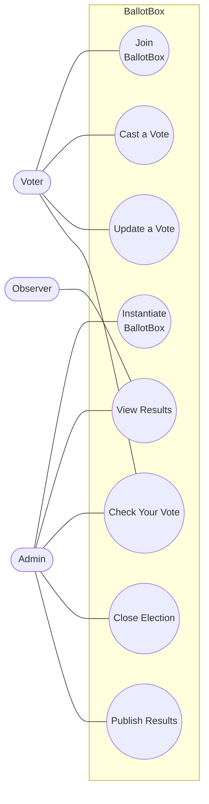
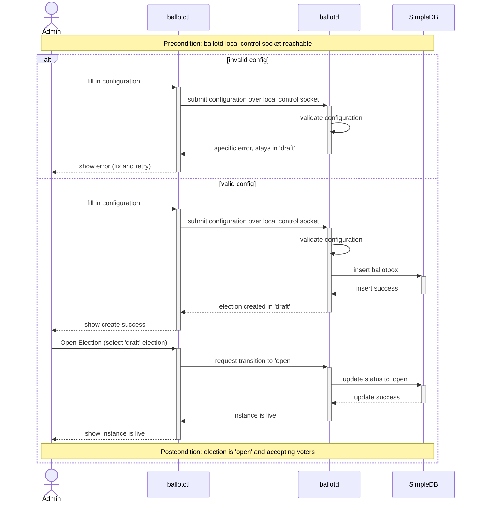
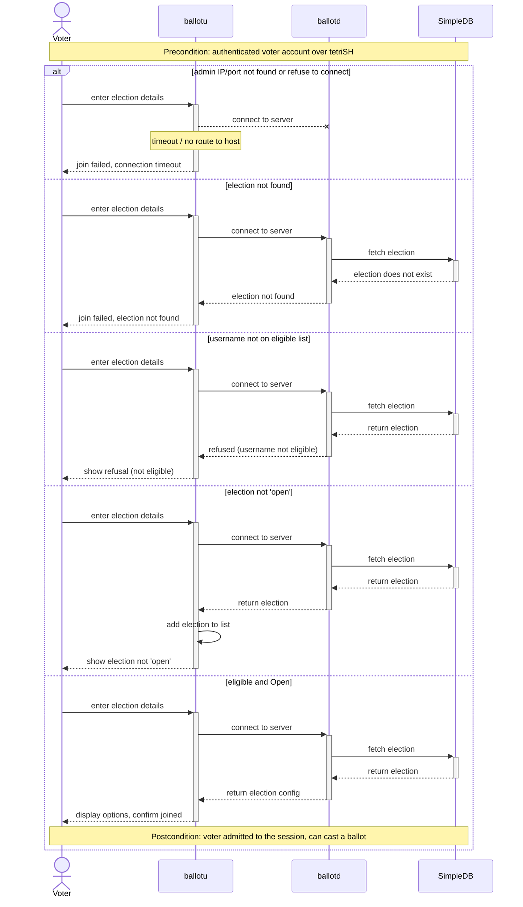
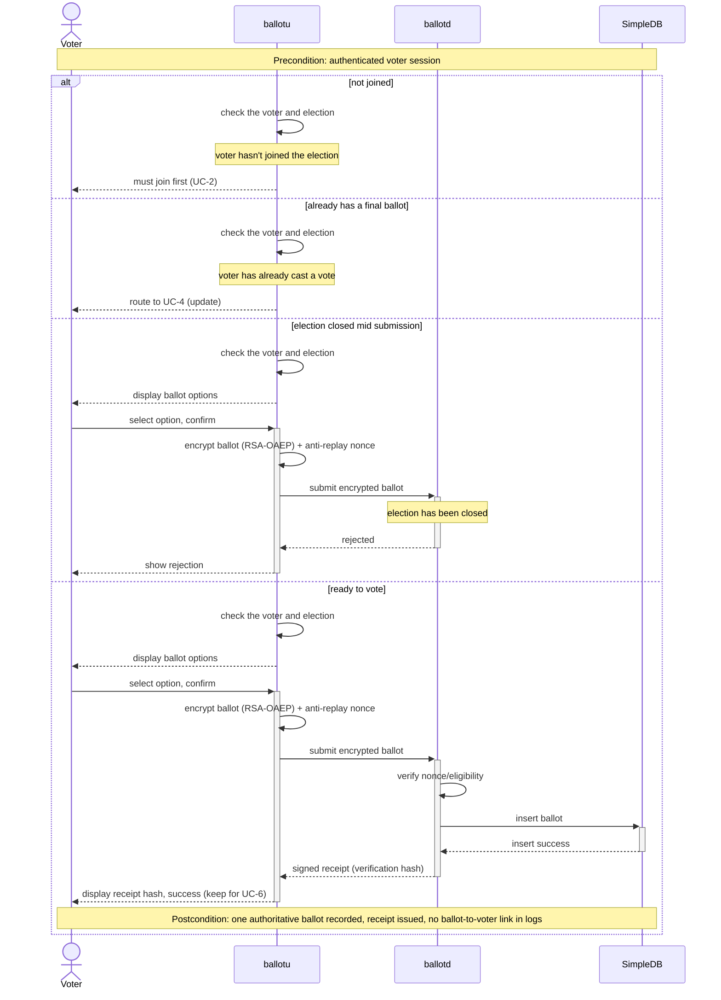
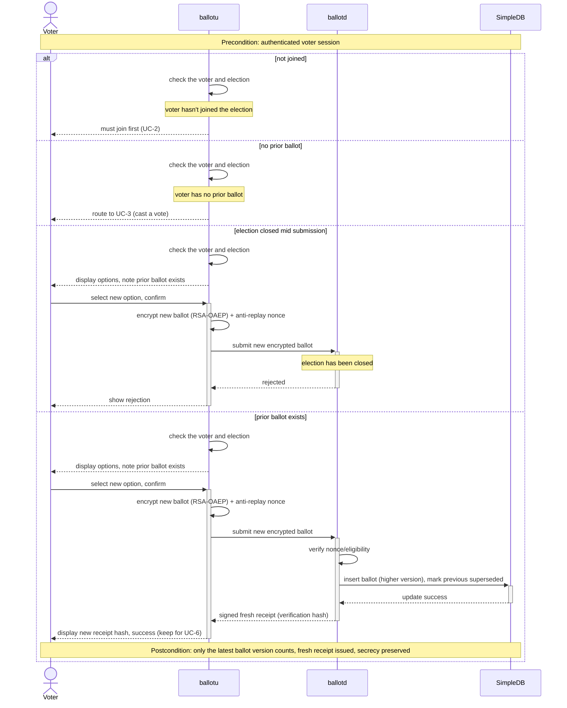
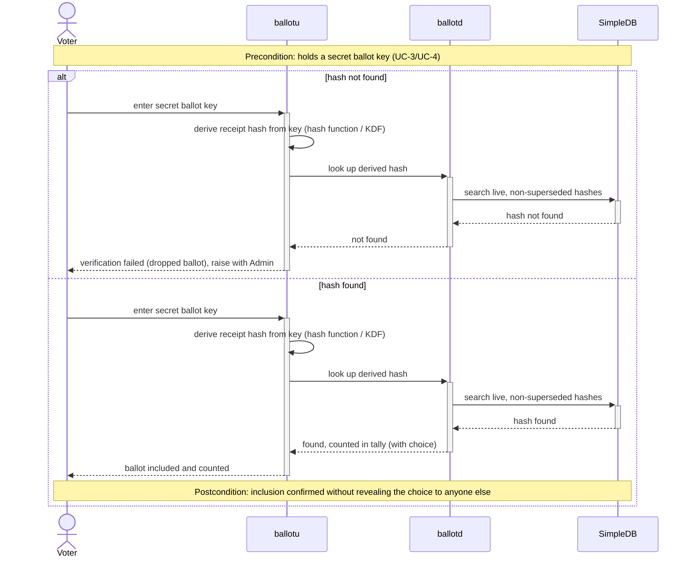

## Requirements

### Use Case Diagram



### UC-1: Instantiate BallotBox

| Field          | Detail                                                         |
| -------------- | -------------------------------------------------------------- |
| Description    | Admin creates a new election instance and opens it for voting. |
| Actors         | Admin                                                          |
| Triggers       | Admin runs the create-election command in ballotctl.           |
| Preconditions  | Admin can access ballotd's owner-only local control socket.    |
| Postconditions | Election is Open and accepting voters.                         |

**Flow**

1. Admin fills in the title, options, eligible-voter certs, and open/close times in ballotctl.
2. ballotd validates the configuration (title and options required, close time after open time).
3. ballotd inserts the election into SimpleDB in 'draft'.
4. Admin runs Open Election in ballotctl and selects the 'draft' election.
5. ballotd updates the election status to 'open' in SimpleDB and begins accepting voters; ballotctl confirms the instance is live.

**Alternative Flows**

None.

**Error States**

2a. Invalid config (no title/options, or close time ≤ open time) → rejected with a specific error; stays in 'draft'.



### UC-2: Join BallotBox

| Field          | Detail                                                     |
| -------------- | ---------------------------------------------------------- |
| Description    | An eligible voter joins an open election instance.         |
| Actors         | Voter                                                      |
| Triggers       | Voter runs the join command.                               |
| Preconditions  | Authenticated voter account over a secure tetriSH session. |
| Postconditions | Voter is admitted to the session and can cast a ballot.    |

**Flow**

1. Voter connects to ballotd, logs in or registers, and enters the election ID in ballotu.
2. ballotu connects to ballotd; ballotd fetches the election from SimpleDB.
3. ballotd checks the server-confirmed username against the eligible-voter list.
4. ballotd confirms the election is 'open' and admits the voter to the session.
5. ballotu displays the ballot options and confirms the voter has joined.

**Alternative Flows**

4a. Election not 'open' → cannot join yet; ballotu saves the election for later (UC-5, UC-6).

**Error States**

2a. ballotd unreachable (timeout / no route to host) → join failed.
2b. Election not found → join failed.
3a. Authenticated username not on the eligible list → refused.



### UC-3: Cast a Vote

| Field          | Detail                                                                                        |
| -------------- | --------------------------------------------------------------------------------------------- |
| Description    | Voter submits a secret ballot and receives a verifiable receipt (hash).                       |
| Actors         | Voter                                                                                         |
| Triggers       | Voter runs the vote command before the close time.                                            |
| Preconditions  | Authenticated voter session.                                                                  |
| Postconditions | One authoritative ballot recorded; receipt hash issued; no log links the ballot to the voter. |

**Flow**

1. ballotu checks the voter has joined an 'open' election.
2. ballotu displays the ballot options; Voter selects one and confirms.
3. ballotu encrypts the ballot (RSA-OAEP) with a fresh anti-replay nonce and submits it to ballotd.
4. ballotd verifies the nonce and eligibility and inserts the ballot into SimpleDB.
5. ballotd issues a signed receipt hash; ballotu displays it for the voter to keep (UC-6).

**Alternative Flows**

1b. Voter already has a final ballot → route to UC-4 (Update a Vote).

**Error States**

1a. Voter has not joined the election → must join first (UC-2).
4a. Election closed mid-submission → ballotd rejects it; ballotu shows the rejection.



### UC-4: Update a Vote

| Field          | Detail                                                                                        |
| -------------- | --------------------------------------------------------------------------------------------- |
| Description    | Voter re-casts to override a prior selection while voting is still open.                      |
| Actors         | Voter                                                                                         |
| Triggers       | Voter runs update vote before the close time.                                                 |
| Preconditions  | Authenticated voter session.                                                                  |
| Postconditions | Tally counts only the latest ballot version; a new receipt hash is issued; secrecy preserved. |

**Flow**

1. ballotu checks the voter has joined an 'open' election and has a prior ballot.
2. ballotu displays the options, noting a prior ballot exists; Voter selects a new option and confirms.
3. ballotu encrypts the new ballot (RSA-OAEP) with a fresh anti-replay nonce and submits it to ballotd.
4. ballotd inserts it into SimpleDB under a higher version and marks the previous receipt superseded (only the latest version counts).
5. ballotd issues a fresh receipt hash; ballotu displays the updated success message.

**Alternative Flows**

1b. Voter has no prior ballot → route to UC-3 (Cast a Vote).

**Error States**

1a. Voter has not joined the election → must join first (UC-2).
4a. Election closed mid-submission → ballotd rejects it; ballotu shows the rejection.



### UC-5: View Result

| Field          | Detail                                                                               |
| -------------- | ------------------------------------------------------------------------------------ |
| Description    | An eligible observer or the local admin views the published tally and ballot hashes. |
| Actors         | Observer, Admin                                                                      |
| Triggers       | Observer or Admin runs the results command.                                          |
| Preconditions  | Authenticated voter account, or access to ballotd's local admin socket.              |
| Postconditions | The final tally and the full list of ballot verification hashes are displayed.       |

**Flow**

1. Observer selects an election in ballotu, or Admin enters an election ID in ballotctl.
2. ballotd fetches the election from SimpleDB and checks observer eligibility.
   The local admin path bypasses the eligible-voter check.
3. ballotd confirms the election is 'published' and returns the tally and the counted ballot hashes from SimpleDB.
4. The selected client displays the tally and hash list, grouped by option.

**Alternative Flows**

None.

**Error States**

2a. Observer not eligible → refused.
3a. Election not 'published' → results not available.

```mermaid
sequenceDiagram
    actor Observer
    participant ballotu
    participant ballotd
    participant SimpleDB

    note over Observer,ballotd: Precondition: authenticated voter account; admin uses the local control socket

    alt Observer not eligible
        Observer->>+ballotu: select election
        ballotu->>+ballotd: request results
        ballotd->>+SimpleDB: fetch election
        SimpleDB-->>-ballotd: return election
        ballotd->>ballotd: check observer eligibility
        note over ballotd: observer is not eligible
        ballotd-->>-ballotu: refused (not eligible)
        ballotu-->>-Observer: show refusal (not eligible)
    else election not 'published'
        Observer->>+ballotu: select election
        ballotu->>+ballotd: request results
        ballotd->>+SimpleDB: fetch election
        SimpleDB-->>-ballotd: return election
        ballotd->>ballotd: check observer eligibility
        note over ballotd: election is not 'published'
        ballotd-->>-ballotu: results not available
        ballotu-->>-Observer: show "results not available"
    else 'published'
        Observer->>+ballotu: select election
        ballotu->>+ballotd: request results
        ballotd->>+SimpleDB: fetch election
        SimpleDB-->>-ballotd: return election
        ballotd->>ballotd: check observer eligibility
        ballotd->>+SimpleDB: fetch tally and counted ballot hashes
        SimpleDB-->>-ballotd: return tally + hashes
        ballotd-->>-ballotu: tally + counted ballot hashes (grouped by option)
        ballotu-->>-Observer: display tally and hash list
        note over Observer,SimpleDB: Postcondition: final tally and full ballot hash list displayed
    end
```

### UC-6: Check Your Vote

| Field          | Detail                                                                                  |
| -------------- | --------------------------------------------------------------------------------------- |
| Description    | A voter confirms their own ballot was counted, using their secret ballot key.           |
| Actors         | Voter                                                                                   |
| Triggers       | Voter runs the check command.                                                           |
| Preconditions  | Caller holds a secret ballot key from UC-3/UC-4.                                        |
| Postconditions | Voter confirms inclusion of their ballot without revealing their choice to anyone else. |

**Flow**

1. Voter enters their secret ballot key in ballotu.
2. ballotu derives the receipt hash from the key (hash function / KDF).
3. ballotu sends the derived hash to ballotd to look up in the live ballot-hash set.
4. ballotd searches the non-superseded hashes in SimpleDB.
   This lookup works before and after publication.
5. ballotu reports the voter's ballot was included and shows their recorded choice.

**Alternative Flows**

None.

**Error States**

4a. Derived hash not found in the live ballot-hash set → verification failed; ballotu flags it as a dropped ballot for the voter to raise with the Admin.



---

### UC-7: Close Election

The local administrator closes an `OPEN` election through `ballotctl` and ballotd's owner-only control socket.
The successful transition persists `CLOSED`, after which both casts and updates are rejected without changing the live ballot set.
Closing from `DRAFT`, `CLOSED`, or `PUBLISHED` is an illegal transition and leaves the stored state unchanged.

### UC-8: Publish Results

The local administrator publishes a `CLOSED` election through the same control socket.
The successful transition persists terminal state `PUBLISHED` and exposes the final tally and live receipt hashes through UC-5.
Publishing from `DRAFT`, `OPEN`, or `PUBLISHED` is an illegal transition and leaves the stored state unchanged.

The legal lifecycle is `DRAFT -> OPEN -> CLOSED -> PUBLISHED`.
Every other ordered transition, including a self-transition, is rejected.
