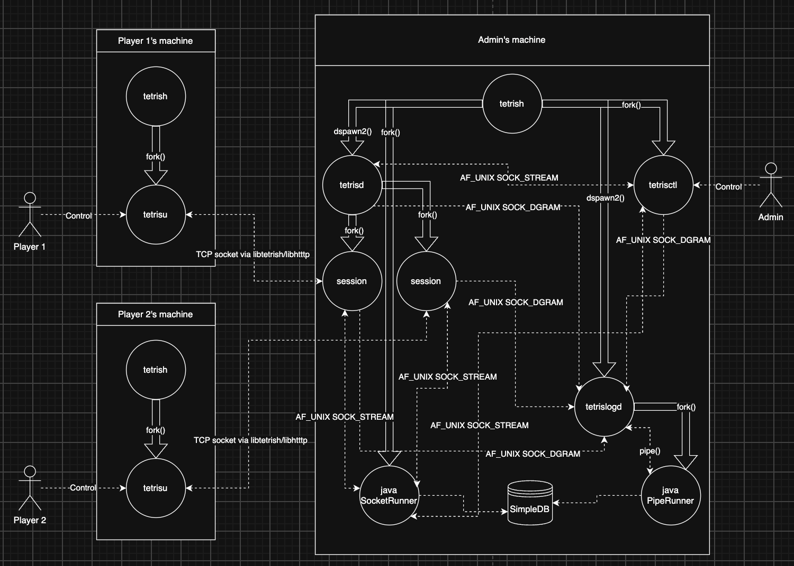
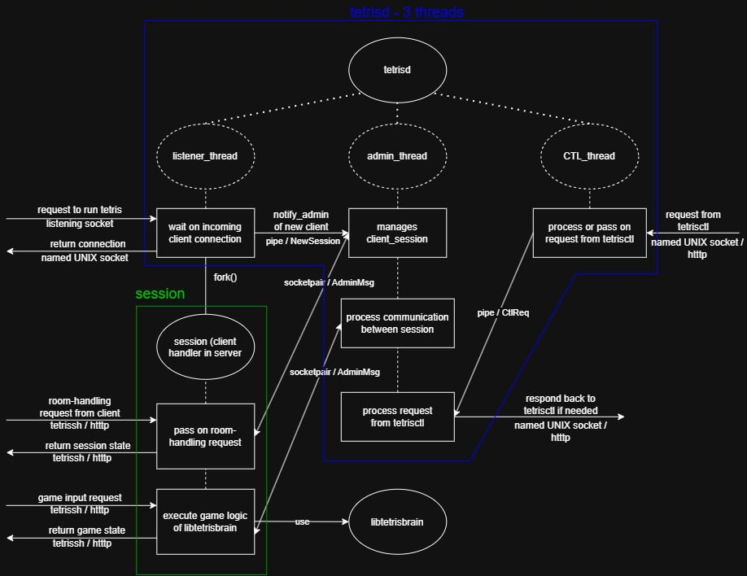

# tetriSH

C-based multiplayer terminal Tetris

---

_Author_
1009098 Pitchayut Ariyachansil
1009164 Phatsakorn Ukanchanakitti
1009195 Popsuk Sumetchoengprachya

---

This is a 3D project, combining 3 SUTD courses:
50.003 Elements of Software Construction x 50.005 Computer System Engineering x 50.043 Database System

---

## Run the program

### Required packages

**This programme only supports macOS and Linux.**
The code is POSIX throughout - `fork`, `execvp`, `setsid`, `AF_UNIX` sockets, `pthreads` - and does not build on Windows.
Fork the repository and use WSL2 if you need it there.

| Package          | Needed for                                             |
| ---------------- | ------------------------------------------------------ |
| `clang` or `gcc` | Everything. The Makefile defaults to `cc`.             |
| `make`           | The build itself.                                      |
| OpenSSL 3        | `libtetrissh`: the handshake and the AES/HMAC framing. |
| ncurses          | `bin/tetrisu` and `libtetrisui`: board and lobby UI.   |
| Java 17 JDK      | Compiling and running the database.                    |
| Apache Ant       | Building the database.                                 |

### Installation

macOS:

```sh
xcode-select --install
brew install openssl@3 ncurses openjdk@17 ant
```

Debian or Ubuntu:

```sh
sudo apt install clang make libssl-dev libncurses-dev openjdk-17-jdk ant
```

### Clone and build

```sh
git clone https://github.com/JediNakDev/tetriSH.git
cd tetriSH
make start    # complie all c and java file, setup .rc file and initiate ./tetrish in one go
```

#### Building

```sh
make all      # libraries, daemons, clients, shell, system programs
make client   # tetrish and tetrisu, with client-side libraries only
make test
make clean
make start
```

#### Running

**Everything runs inside `./tetrish`.**

```sh
./tetrish
```

When inside tetrish we recommend you run everything in tetrisctl or tetrisu

```sh
tetrisctl
tetrisu
```

Alternatively, you can spawn tetrisd, tetrislogd, and tetrisdb by yourself

```sh
dspawn2 tetrisd
dspawn2 tetrislogd
tetrisdb start
```

## Architecture



| Component        | Type    | Role                                                        |
| ---------------- | ------- | ----------------------------------------------------------- |
| `tetrish`        | binary  | Interactive shell, reads `.tetrishrc`, launches the daemons |
| `tetrisd`        | binary  | Concurrent game server (the body of the system)             |
| `tetrislogd`     | binary  | Dedicated logger daemon (separate process)                  |
| `tetrisctl`      | binary  | Admin CLI for the running game daemon                       |
| `tetrisdb`       | binary  | Inititate java SocketRunner                                 |
| `tetrisu`        | binary  | Terminal-based game client (the user-facing program)        |
| `libtetrissh`    | library | Secure session (cert auth, RSA-wrapped AES, framing)        |
| `libhtttp`       | library | HTTTP protocol parser and serialiser                        |
| `libtetrisbrain` | library | Tetris game logic (board, pieces, gravity, line clear)      |
| `libtetrisauth`  | library | Account authentication, registration, and token handling    |
| `libtetrisdb`    | library | Database schema, JVM checks, and pipe or socket access      |
| `libtetrisui`    | library | Reusable ncurses menus, forms, dialogs, and status widgets  |
| `libtetrisutil`  | library | Shared configuration, state, limits, names, and log types   |

## Binaries

### `tetrish`: the shell

> All PA1 shell behaviour: REPL, `fork()` plus `execvp()`, builtins (`cd, help, exit, usage, env, setenv, unsetenv`), `.tetrishrc` execution on startup, background process tracking and spawning using `sys`, `dspawn`, `dcheck`, no crashes on bad input.

`tetrish` is the **entry** point. From inside `tetrish`, the user can launch `tetrisd` and `tetrislogd` in the background, run `tetrisctl` queries (server side), or start `tetrisu` (client side) to play.

#### Additional system program: dspawn2

We use dspawn2 to launch tetrisd and tetrislogd instead of dspawn.

| Different design                               | Why?                                                                                                         |
| ---------------------------------------------- | ------------------------------------------------------------------------------------------------------------ |
| No umask(0)                                    | log file and db file should not be able to be access freely                                                  |
| No chdir("/")                                  | both daemons rely heavily on project-relative path eg.                                                       |
| stdout and stderr go to the daemon's error log | so that we can see log and error for both daemons when initiate (before able to properly log via tetrislogd) |
| Does not allow duplicate daemon                | we don’t want a duplicate tetrisd and tetrislogd                                                             |

### `tetrisd`: the game daemon

> - Detach from the controlling terminal when launched in background from `tetrish`
> - Bind to the TCP port configured in `.tetrishrc`
> - Accept multiple concurrent clients
> - Establish a secure session (via `libtetrissh`) with each client before any HTTTP traffic
> - Parse and serialise HTTTP messages (via `libhtttp`)
> - Maintain rooms with multiple players, run game logic (via `libtetrisbrain`), broadcast state
> - Handle `SIGTERM` (graceful shutdown), `SIGHUP` (reload config), `SIGUSR1` (dump state to log)
> - Ignore `SIGPIPE`; detect broken connections via `write()` returning `EPIPE`
> - Forward all log records to `tetrislogd` over IPC, with non-blocking enqueue from game-critical threads
> - Expose a control plane to `tetrisctl` (see Section 6)

`tetrisd` is the **process** that runs the **server**. It contains threads. The threads inside `tetrisd` should orchestrate the listeners, per-client handlers, per-room game ticks, the signal handler, and the channel out to `tetrislogd`. The libraries (`libtetrissh`, `libhtttp`, `libtetrisbrain`) should provide the heavy lifting.



### `tetrislogd`: the logger daemon.

`tetrislogd` is a separate **process**, not a thread inside `tetrisd`. It receives log records over an UNIX datagram socket and writes them to disk.

> - Accept log records from `tetrisd` over IPC
> - Write records to the log file specified in `.tetrishrc`
> - Maintain a "dropped records" counter that increments when the IPC channel cannot keep up, and emit a summary line periodically (e.g. `dropped 47 records in last 30s`)
> - Handle `SIGTERM` (flush buffered records, close file, exit) and `SIGHUP` (reopen log file, for log rotation)
> - Survive a `tetrisd` restart without dying (i.e. accept reconnections, do not exit when its IPC peer disappears)

### `tetrisctl`: the admin CLI.

> `tetrisctl` is a separate binary that runs administrative actions against a running `tetrisd`. At minimum it must support a status query and a graceful shutdown trigger. The channel it uses must be a real IPC mechanism, not a network connection to the public TCP port.
>
> The control plane must remain available even when the public TCP listener is saturated.

| Commands                             | What does it do                      |
| ------------------------------------ | ------------------------------------ |
| tetrisctl                            | open the live console (tty only)     |
| tetrisctl status                     | uptime, session and room counts      |
| tetrisctl shutdown                   | graceful stop; alias of stop tetrisd |
| tetrisctl rooms                      | one line per room                    |
| tetrisctl players                    | one line per connected session       |
| tetrisctl kick <room> <player>       | disconnect one player                |
| tetrisctl start <tetrisd/tetrislogd> | spawn via bin/dspawn2 and confirm    |
| tetrisctl stop <tetrisd/tetrislogd>  | SHUTDOWN, or SIGTERM for tetrislogd  |

### `tetrisu`: the game client.

> - Connect via TCP, complete the secure session handshake (via `libtetrissh`)
> - Send HTTTP requests for game actions (via `libhtttp`)
> - Receive and render server-pushed `STATE` frames
> - Handle keyboard input non-blocking (so it can read input and network simultaneously)
> - Exit cleanly on `q` or `SIGINT`
> - Rendering using `ncurses`\

## Libraries

### `libtetrissh`

This library implements the secure session handshake between client and server.

> Every byte of HTTTP traffic flows inside an authenticated, confidential session established at connection time. The session protocol follows the PA2 pattern:
>
> 1. Client connects, sends a fresh nonce.
> 2. Server sends its X.509 certificate.
> 3. Client verifies the certificate against the bundled CA (`cacsertificate.crt`).
> 4. Server signs the client nonce with its private key (RSA-PSS).
> 5. Client verifies the signature using the public key from the certificate.
> 6. Client generates a 32-byte AES-256 session key, RSA-OAEP encrypts it with the server's public key, sends it.
> 7. From this point on, every frame is `[4-byte big-endian length][AES ciphertext]` carrying one HTTTP message.
>
> Frame size limit: 64 KiB. Larger HTTTP messages must be split by the application or rejected with `413 Payload Too Large`.
>
> Cryptographic primitives come from PA2's `common.c`.

`libtetrissh` is linked into `tetrisd` (server-side handshake) and `tetrisu` (client-side handshake). Linking the same library into both ends **prevents protocol drift** between client and server.

| Function          | Caller | Usage                             | Protocol                       |
| ----------------- | ------ | --------------------------------- | ------------------------------ |
| `session_connect` | Client | Handshake, fills `session_t`      | `nonce → verify → wrapped key` |
| `session_accept`  | Server | Handshake, proves identity        | `nonce → sign + cert → unwrap` |
| `session_send`    | Both   | One frame out                     | `seq‖pt → enc → len‖token`     |
| `session_receive` | Both   | One frame in                      | `HMAC → decrypt → seq check`   |
| `session_close`   | Both   | Cleanse key, keep file descriptor | -                              |

### `libhtttp`

This is the HTTTP protocol library.

> `libhtttp` parses incoming HTTTP messages and serialises outgoing ones. Both `tetrisd` and `tetrisu` should link against it.
>
> The wire format is fixed and details are described the section [below](#hypertext-tetris-transfer-protocol). `libhtttp` must conform to it exactly.

`libhtttp` is made as a separate library:

1. **Testability**: The protocol parser can be unit-tested in isolation, without needing the daemon running or the client connected.
2. **Reuse**: The same parser code is used on both sides of the connection and there won't be any drift (disagreement, outdated interface)
3. **Separation of concerns**: The dispatcher in `tetrisd` reasons in terms of parsed **messages**, not **bytes**. The renderer in `tetrisu` reasons in terms of `STATE` structures, not strings. They belong in two different level of abstraction.

| Function                                       | Caller              | Usage                                            |
| ---------------------------------------------- | ------------------- | ------------------------------------------------ |
| `htttp_parse_request(buf, len, req)`           | Both                | One frame → struct; `body` points into `buf`     |
| `htttp_parse_response(buf, len, res)`          | Client, `tetrisctl` | One frame → struct; status range-checked         |
| `htttp_serialize_request(req, out, *out_len)`  | Both                | Struct → bytes; adds `Content-Length`            |
| `htttp_serialize_response(res, out, *out_len)` | Server only         | Struct → bytes; adds `Content-Length` and `Date` |
| `htttp_header_get(headers, n, key)`            | Both                | Case-insensitive lookup; `NULL` if absent        |
| `htttp_header_set(headers, *n, key, value)`    | Both                | Append; `TOOLONG` at 32 headers                  |
| `htttp_reason(status)`                         | Both                | Status → canonical phrase; `NULL` if unknown     |

| Method        | Path                      | Direction | Body                 | Purpose                                                                   |
| ------------- | ------------------------- | --------- | -------------------- | ------------------------------------------------------------------------- |
| `LOGIN`       | `/auth`                   | C→S       | `username\npassword` | Authenticate an existing account; a `200` response carries a token.       |
| `REGISTER`    | `/auth`                   | C→S       | `username\npassword` | Create an account, then authenticate.                                     |
| `GUEST`       | `/auth`                   | C→S       | -                    | Play without an account or database access.                               |
| `JOIN`        | `/room/{id}`              | C→S       | -                    | Join room `id`, or use `id=0` to create a room.                           |
| `LEAVE`       | `/room/{id}`              | C→S       | -                    | Leave the current room.                                                   |
| `START`       | `/room/{id}`              | C→S       | -                    | Have the room owner start the round for every member.                     |
| `MOVE`        | `/room/{id}/player/{pid}` | C→S       | `LEFT` or `RIGHT`    | Shift the active piece.                                                   |
| `ROTATE`      | `/room/{id}/player/{pid}` | C→S       | `CW` or `CCW`        | Rotate the active piece.                                                  |
| `DROP`        | `/room/{id}/player/{pid}` | C→S       | `SOFT` or `HARD`     | Drop the active piece; a hard drop also flushes garbage.                  |
| `STATE`       | `/room/{id}`              | S→C       | `GameState` bytes    | Broadcast the board at 20 Hz.                                             |
| `UPD_SESSION` | `/session/state`          | S→C       | `SessionState` bytes | Send the room ID, player ID, ownership, roster, and phase.                |
| `UPD_RESULT`  | `/game/result`            | S→C       | `int32` winner       | Announce that the round is over and identify the winner.                  |
| `STATUS`      | `/`                       | C→S       | -                    | Report uptime, session count, and room count.                             |
| `ROOMS`       | `/`                       | C→S       | -                    | Report each room's ID, phase, members, and owner.                         |
| `PLAYERS`     | `/`                       | C→S       | -                    | Report each player's room, ID, PID, owner status, score, lines, and name. |
| `KICK`        | `/room/{id}/player/{pid}` | C→S       | -                    | Send `403` to the player, terminate the process, and reap it.             |
| `SHUTDOWN`    | `/`                       | C→S       | -                    | Reply with `200`, then stop the daemon.                                   |
| `RELOAD`      | `/`                       | C→S       | -                    | Reserved; responds with `501`.                                            |

### `libtetrisbrain`

This library implements the main Tetris game logic,

> `libtetrisbrain` implements the Tetris game rules. Pieces, rotation, gravity, line clear, scoring, lock delay, soft and hard drop, game over detection. It is **pure logic with no I/O**, no networking, no file system access and no side-effects.
>
> `tetrisd` links against it for authoritative server-side game state. `tetrisu` may link against it for client-side prediction (optional) or just render server state directly.

### `libtetrisauth`

This library handles authentication

> We use custom token, develop from jwt
>
> - We encode signature in hex instead of base64 url
> - And we divide section by \n instead of . and json
> - `sup\nname\niat\nexp\nsig`
>
> Save user to database
>
> - Password is stored as hashed, salt, and iters.
>
> Both password and token sig are hashed in HMAC SHA256
> Authenticate user can store/view history and also view their max stat

### `libtetrisdb`

This library connects to database and proivide API for processes to interact with SimpleDB and DBMS written in java located in ./db.

> 2 types of db connector
>
> Pipe: for log
>
> - A child process spawn by tetrislogd and talks to it parents via pipe
>
> Socket: for everything else (user and history)
>
> - A binaries (need to run tetrisdb start or click Start DB inside tetrisctl)
> - Accept connection from multiple processes via UNIX stream socket
>   - session for WR (both history and user)
>   - tetrisctl for R (history)
> - Socket established when needed
>   - open socket -> write to socket/get response until finished -> close socket

#### DB race condition handling

- SimpleDB has 1 (+1) simple problem
  - It does not provide a ‘unique’ field
  - Hence, it also does not provide an auto increment field
- Thus, when we insert history to db:
  - select max_id (aggr) -> insert(history)
- And a bit more for register
  - select name where name = \*\*\* -> select max_id (aggr) -> insert(user)
- Which we needs mutex
  - Semaphore, since both insert are from session processes which have N processes for N players (mutex for different process)
  - Verify by test_race_cond

Test Database Race Condition

- We simulate 254 history/register request at the same time
- For register, we assumed user will try to to click register again 2 more time immediately after fail (so a total of 3 attempts)
- Allow time out and insert fail
- But requires no duplicate/gapped IDs among whatever committed

## Concurrency

**We can handle 254 players at a time without deadlock, crash, or memory leak**
Proven by load test.

- We test 254 tetrisu instant connect to tetrisd via TCP socket
- Fires request every 100ms
- Since avg person click 5-7 cps, we assumed 10 cps.
- We test 3 cases
  - 254 players in 1 room
  - 254 players in 254 rooms, 1 player per room
  - 254 players in 20 rooms, randomly assigned
- Then check for deadlock, memory leak, or crash
- The game survive 1 hour load test for all 3 cases
