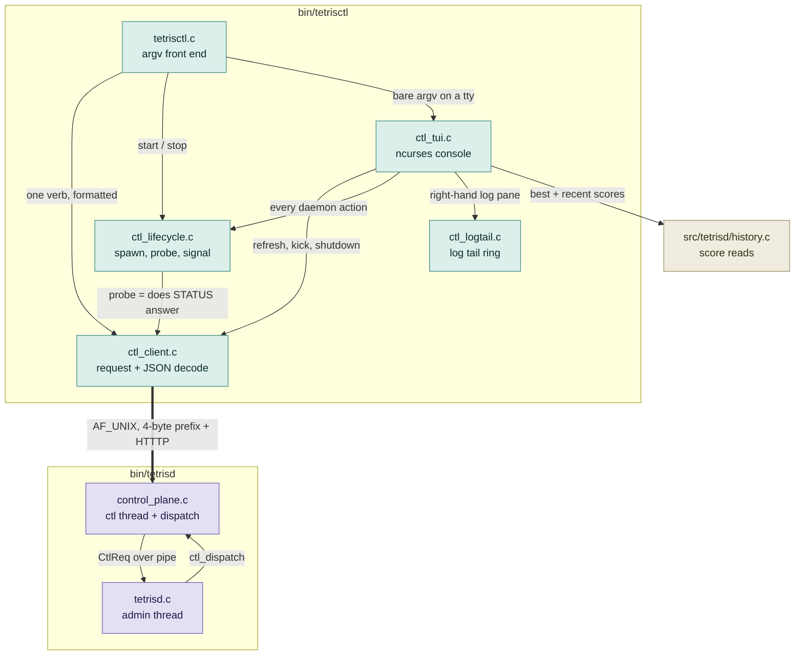
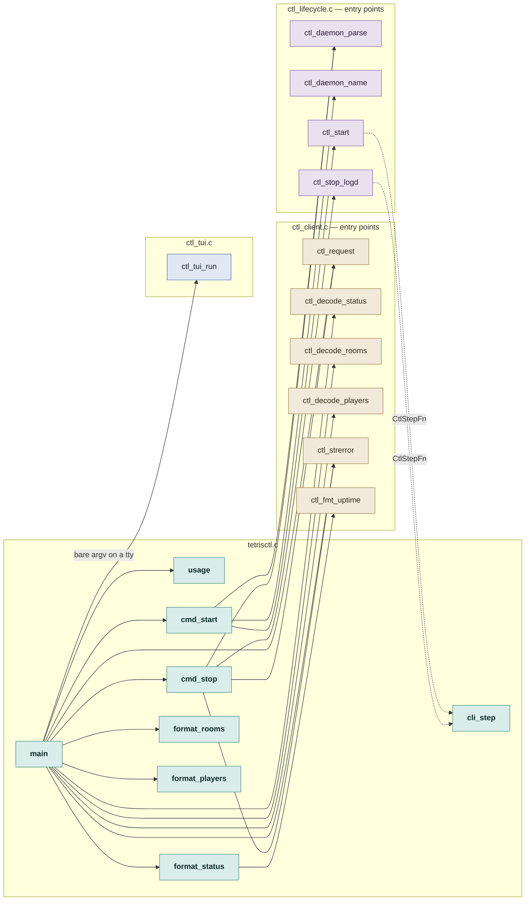
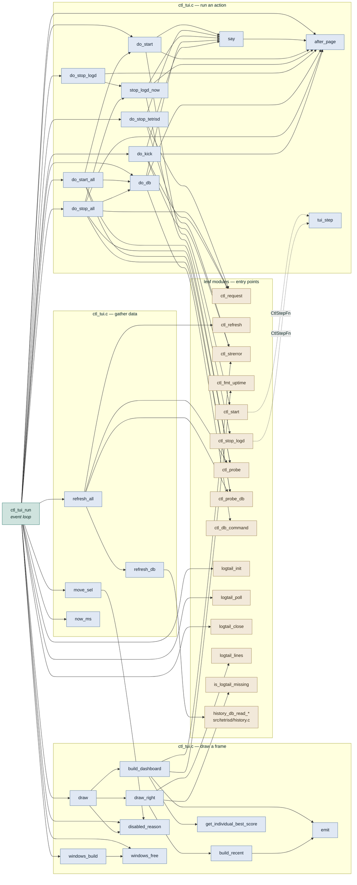
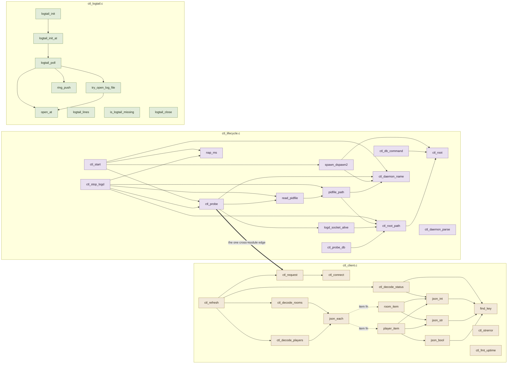
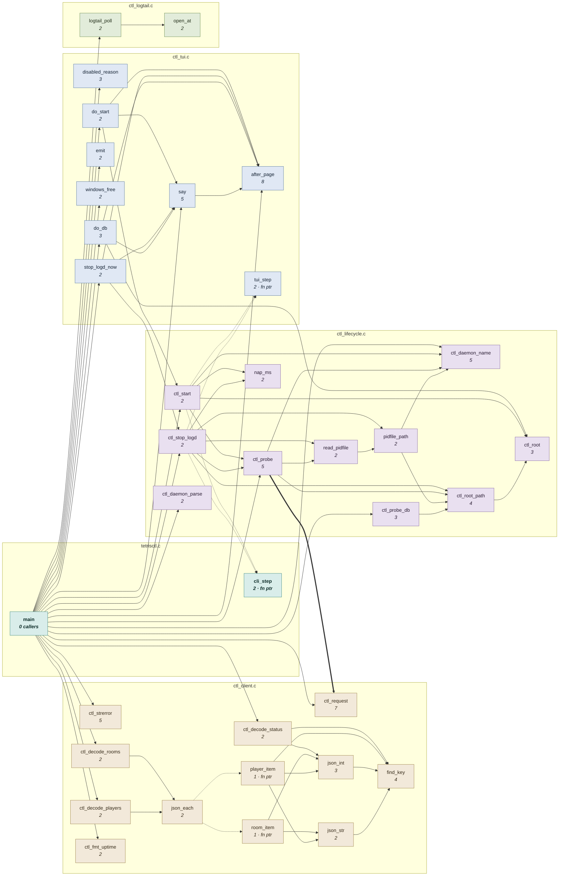
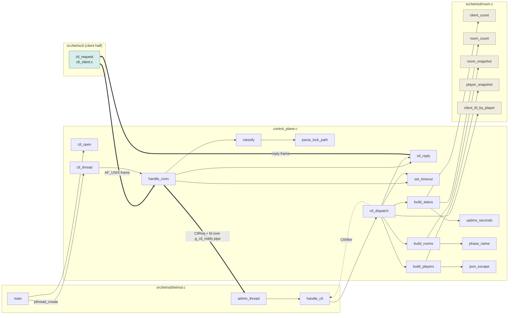
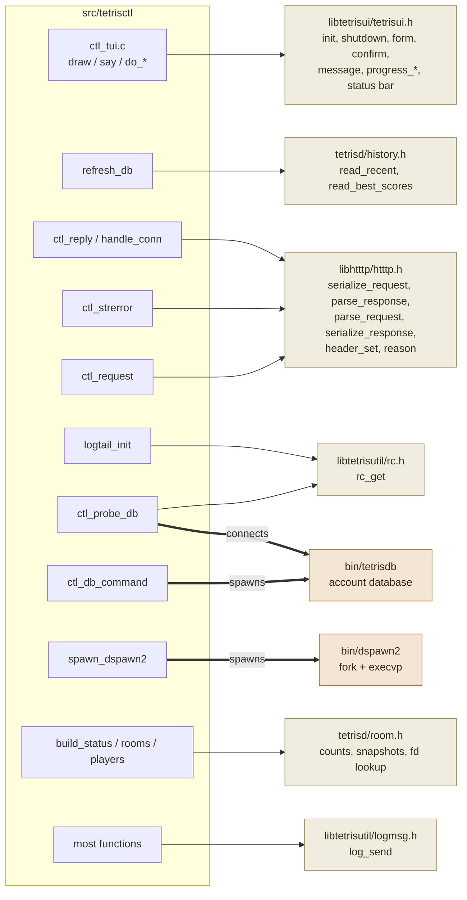

# `src/tetrisctl` — the call graph

Every function in the six files of `src/tetrisctl`, boxed by the file it lives
in, with an edge for every call — including the ones that leave the folder, and
the one that leaves the process.

**The folder is not one binary.** Five files link into `bin/tetrisctl`;
`control_plane.c` links into `bin/tetrisd` and shares no symbol with the other
five (`Makefile:139` versus `Makefile:157`). It sits here because it is the
other half of the same protocol, not because it ships in the same executable.

| | files | functions | call edges |
|---|---|---|---|
| `bin/tetrisctl` | `tetrisctl.c` `ctl_client.c` `ctl_lifecycle.c` `ctl_logtail.c` `ctl_tui.c` | 71 | 135 |
| `bin/tetrisd` | `control_plane.c` | 14 | — |

`src/tetrisd/history.c` is also linked into `bin/tetrisctl`, for the console's
score panel.

**Reading the diagrams.** A solid arrow is a direct call; a dotted arrow is a
call through a function pointer; a thick arrow crosses a process boundary. Node
fill is the file the function is defined in.

---

## 1. File level — who depends on whom

`ctl_client.c` and `ctl_lifecycle.c` are the two leaf modules; both front ends
sit on top of them, and neither front end knows about the other. The only edge
between the two binaries is the socket.

---

## 2. The argv front end — `tetrisctl.c`, outward

One graph per front end, so no edge has to cross the whole picture. Here:
everything `tetrisctl.c` defines, and the entry points it reaches for. The leaf
modules' own internals are section 4.

`main` is the only caller of everything else in the file. `cli_step` is the one
thing called from outside it, and only through a function pointer that
`ctl_lifecycle.c` was handed.

---

## 3. The console — `ctl_tui.c`, outward

All 25 functions, split into the three things the file actually does — draw a
frame, run an action, gather data — plus the entry points each reaches for.

`after_page` (8 callers) and `say` (5) are the file's real shared plumbing;
every `do_*` action ends in one of them. `do_stop_all` is the only function that
reaches all four subsystems in one call.

---

## 4. Inside the leaf modules

The three modules nothing calls upward from. Each is a short tree, which is why
they read cleanly on their own — and the single edge that escapes is
`ctl_probe → ctl_request`.

`ctl_strerror`, `ctl_fmt_uptime`, `ctl_daemon_parse`, `logtail_lines`,
`is_logtail_missing` and `logtail_close` have no outgoing edge — pure leaves,
called only from the front ends above.

**What the edges say.**

- `ctl_lifecycle.c → ctl_client.c` is a single edge: `ctl_probe` asks
  `ctl_request` whether STATUS answers. That is the whole reason liveness is by
  observation and not by pidfile.
- `ctl_start` and `ctl_stop_logd` call back *up* into their caller's file
  through `CtlStepFn` — `cli_step` prints a line, `tui_step` advances a progress
  bar, and neither is known to the lifecycle module.
- `json_each` is the same trick one level down: `ctl_decode_rooms` and
  `ctl_decode_players` hand it `room_item` / `player_item`, so the array walk
  exists once.
- `ctl_tui.c` has no edge into `tetrisctl.c`. The console adds no capability the
  argv CLI lacks; the dependency runs one way only.

---

## 5. The load-bearing half — single-caller functions removed

Same binary, with every function that has exactly one caller deleted and its
edges spliced through to that caller. Those 35 could be pasted into their single
call site without changing a symbol anyone else can see — they exist for
readability, not for sharing. What survives is the 36 functions that are
actually shared, plus `main`, which has no caller at all.

**One exception is kept.** `cli_step`, `tui_step`, `room_item` and `player_item`
each have one static call site, but that site invokes them through a function
pointer — `CtlStepFn` and `json_each`'s item callback. Inlining them would
delete the indirection they exist to provide.

`main` absorbs the whole `tetrisctl.c` command layer and the entire console
event loop, because every one of those was a single-caller function — which is
why it ends up with 20 outgoing edges here and 8 in the real code.

**What the reduction says.**

- `ctl_logtail.c` collapses from 9 functions to 2. Seven of the nine have
  exactly one caller — the module is a private state machine with a thin public
  face, which is what a log tail should be.
- `ctl_tui.c` collapses from 25 to 9, and all the survivors are plumbing
  (`after_page`, `say`, `emit`) or actions reused by the two bulk operations
  (`do_start`, `stop_logd_now`, `do_db`). Every drawing function and every
  top-level handler is single-caller.
- `ctl_lifecycle.c` barely shrinks — 14 to 11. Almost everything in it is
  genuinely shared, which is the signature of a real module rather than one
  function cut into pieces.
- The five most-called functions are `after_page` (8 callers), `ctl_request`
  (7), and `ctl_daemon_name`, `ctl_probe` and `ctl_strerror` (5 each). Those are
  the signatures that cost the most to change.

| File | Functions | Single caller | Kept |
|---|---:|---:|---:|
| `tetrisctl.c` | 8 | 6 | 2 |
| `ctl_tui.c` | 25 | 16 | 9 |
| `ctl_client.c` | 15 | 3 | 12 |
| `ctl_lifecycle.c` | 14 | 3 | 11 |
| `ctl_logtail.c` | 9 | 7 | 2 |
| **total** | **71** | **35** | **36** |

---

## 6. `bin/tetrisd` — `control_plane.c`, and the seam

`control_plane.c` is compiled into the daemon, so its callers live in
`src/tetrisd/tetrisd.c` and its callees in `src/tetrisd/room.c`. The split of
work between the two threads is the design: the control thread touches every
byte that came from outside the process, the admin thread touches the room
tables and nothing else.

One socket hop from the CLI, one pipe hop from the control thread to the admin
thread. `ctl_dispatch` returns a `CtlAfter` rather than acting, because shutdown
and fd-drop belong to `tetrisd.c`, not here.

---

## 7. Calls that leave the folder

Every symbol `src/tetrisctl` reaches for outside its own six files, and which
function reaches for it. This is the surface that has to hold still for the
folder to keep compiling.

`tetrisd/room.h` is reached only from `control_plane.c` and `tetrisd/history.h`
only from `ctl_tui.c` — the two edges that make this folder not self-contained,
in opposite directions.

---

## 8. Function index

Line numbers as of the working tree at the time of writing. **In** is the number
of distinct functions that call it; **1** means it was dropped from section 5.

### `tetrisctl.c` — 465 lines

| Function | Line | In | Calls |
|---|---:|---:|---|
| `main` | 213 | 0 | usage, cmd_start, cmd_stop, format_*, ctl_request, ctl_decode_*, ctl_strerror, ctl_tui_run |
| `cli_step` | 116 | 2 | fn-ptr target of ctl_start / ctl_stop_logd |
| `usage` | 45 | 1 | — |
| `format_status` | 63 | 1 | ctl_fmt_uptime |
| `format_rooms` | 70 | 1 | — |
| `format_players` | 90 | 1 | — |
| `cmd_start` | 123 | 1 | ctl_daemon_parse, ctl_daemon_name, ctl_start |
| `cmd_stop` | 163 | 1 | ctl_daemon_parse, ctl_request, ctl_stop_logd, ctl_strerror |

### `ctl_client.c` — 385 lines

| Function | Line | In | Calls | External |
|---|---:|---:|---|---|
| `ctl_request` | 144 | 7 | ctl_connect | htttp_serialize_request, htttp_parse_response, log_send |
| `ctl_strerror` | 224 | 5 | — | htttp_reason |
| `find_key` | 26 | 4 | — | — |
| `json_int` | 34 | 3 | find_key | — |
| `json_str` | 41 | 2 | find_key | — |
| `json_each` | 80 | 2 | fn ptr: room_item / player_item | — |
| `ctl_decode_status` | 255 | 2 | find_key, json_int | — |
| `ctl_decode_rooms` | 284 | 2 | json_each | — |
| `ctl_decode_players` | 316 | 2 | json_each | — |
| `ctl_fmt_uptime` | 243 | 2 | — | — |
| `room_item` | 271 | 1\* | json_int, json_str | — |
| `player_item` | 300 | 1\* | json_int, json_str, json_bool | — |
| `ctl_connect` | 120 | 1 | — | socket, connect |
| `json_bool` | 64 | 1 | find_key | — |
| `ctl_refresh` | 328 | 1 | ctl_request, ctl_decode_* | log_send |

\* one static call site, but reached through a function pointer.

### `ctl_lifecycle.c` — 487 lines

| Function | Line | In | Calls | External |
|---|---:|---:|---|---|
| `ctl_daemon_name` | 44 | 5 | — | — |
| `ctl_probe` | 133 | 5 | ctl_daemon_name, read_pidfile, logd_socket_alive, **ctl_request** | log_send |
| `ctl_root_path` | 70 | 4 | ctl_root | — |
| `ctl_root` | 62 | 3 | — | getenv, getcwd |
| `ctl_probe_db` | 183 | 3 | ctl_root_path | rc_get, connect → bin/tetrisdb |
| `ctl_start` | 332 | 2 | ctl_probe, spawn_dspawn2, ctl_daemon_name, nap_ms, *step cb* | log_send |
| `ctl_stop_logd` | 411 | 2 | ctl_probe, read_pidfile, pidfile_path, ctl_root_path, nap_ms, *step cb* | kill, log_send |
| `read_pidfile` | 88 | 2 | pidfile_path | — |
| `pidfile_path` | 81 | 2 | ctl_daemon_name, ctl_root_path | — |
| `ctl_daemon_parse` | 49 | 2 | — | — |
| `nap_ms` | 266 | 2 | — | nanosleep |
| `logd_socket_alive` | 113 | 1 | ctl_root_path | socket, connect |
| `ctl_db_command` | 204 | 1 | ctl_root | fork/exec → bin/tetrisdb |
| `spawn_dspawn2` | 281 | 1 | ctl_daemon_name, ctl_root | fork/exec → bin/dspawn2 |

### `ctl_logtail.c` — 224 lines

| Function | Line | In | Calls | External |
|---|---:|---:|---|---|
| `logtail_poll` | 106 | 2 | try_open_log_file, open_at, ring_push | read, stat |
| `open_at` | 52 | 2 | — | open, lseek |
| `ring_push` | 44 | 1 | — | — |
| `try_open_log_file` | 74 | 1 | open_at | — |
| `logtail_init_at` | 87 | 1 | logtail_poll | — |
| `logtail_init` | 99 | 1 | logtail_init_at | rc_get |
| `is_logtail_missing` | 196 | 1 | — | — |
| `logtail_lines` | 201 | 1 | — | — |
| `logtail_close` | 217 | 1 | — | — |

### `ctl_tui.c` — 869 lines

| Function | Line | In | Calls | External |
|---|---:|---:|---|---|
| `after_page` | 455 | 8 | — | ncurses |
| `say` | 467 | 5 | after_page | tetrisui_message |
| `disabled_reason` | 103 | 3 | — | — |
| `do_db` | 541 | 3 | ctl_db_command, say, after_page | — |
| `emit` | 142 | 2 | — | — |
| `windows_free` | 259 | 2 | — | delwin |
| `do_start` | 483 | 2 | ctl_start, say, after_page | tetrisui_progress_begin / _end |
| `stop_logd_now` | 516 | 2 | ctl_stop_logd, say, after_page | tetrisui_progress_begin / _end |
| `tui_step` | 477 | 2 | fn-ptr target of ctl_start / ctl_stop_logd | tetrisui_progress_step |
| `ctl_tui_run` | 732 | 1 | windows_build/_free, draw, refresh_all, move_sel, now_ms, after_page, disabled_reason, do_*, logtail_* | tetrisui_init, tetrisui_shutdown, log_send |
| `draw` | 368 | 1 | build_dashboard, draw_right, disabled_reason | tetrisui_set_status, tetrisui_draw_status_bar |
| `draw_right` | 328 | 1 | build_recent, logtail_lines, is_logtail_missing | ncurses |
| `build_dashboard` | 170 | 1 | emit, get_individual_best_score, ctl_fmt_uptime, ctl_strerror | — |
| `build_recent` | 303 | 1 | emit | — |
| `get_individual_best_score` | 156 | 1 | — | — |
| `windows_build` | 273 | 1 | windows_free | newwin |
| `do_stop_tetrisd` | 500 | 1 | ctl_request, ctl_strerror, say, after_page | tetrisui_confirm |
| `do_stop_logd` | 529 | 1 | stop_logd_now, after_page | — |
| `do_start_all` | 551 | 1 | do_start, do_db, ctl_probe, ctl_probe_db | — |
| `do_stop_all` | 564 | 1 | stop_logd_now, do_db, ctl_request, ctl_probe, ctl_probe_db, after_page | — |
| `do_kick` | 582 | 1 | ctl_request, ctl_strerror, say, after_page | tetrisui_form |
| `refresh_all` | 670 | 1 | refresh_db, ctl_refresh, ctl_probe, ctl_probe_db | log_send |
| `refresh_db` | 636 | 1 | — | history_db_read_recent, history_db_read_best_scores |
| `move_sel` | 713 | 1 | disabled_reason | — |
| `now_ms` | 629 | 1 | — | clock_gettime |

### `control_plane.c` — 752 lines, links into `bin/tetrisd`

| Function | Line | Calls | External |
|---|---:|---|---|
| `ctl_open` | 217 | — | bind, listen, log_send · **called by tetrisd.c main** |
| `ctl_thread` | 446 | handle_conn | poll, accept · **pthread entry from tetrisd.c main** |
| `handle_conn` | 384 | set_timeout, classify, ctl_reply | htttp_parse_request, write → g_ctl_notify |
| `classify` | 354 | parse_kick_path | — |
| `parse_kick_path` | 345 | — | — |
| `ctl_dispatch` | 605 | build_status, build_rooms, build_players, ctl_reply, set_timeout | client_fd_by_player, log_send · **called by tetrisd.c handle_ctl** |
| `build_status` | 555 | uptime_seconds | client_count, room_count |
| `build_rooms` | 563 | phase_name | room_snapshot |
| `build_players` | 581 | json_escape | player_snapshot |
| `ctl_reply` | 151 | — | htttp_header_set, htttp_serialize_response, log_send |
| `json_escape` | 81 | — | — |
| `phase_name` | 54 | — | — |
| `uptime_seconds` | 41 | — | time |
| `set_timeout` | 48 | — | setsockopt |
