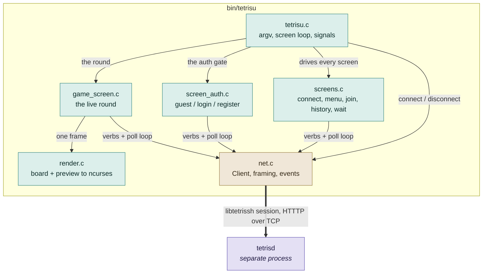
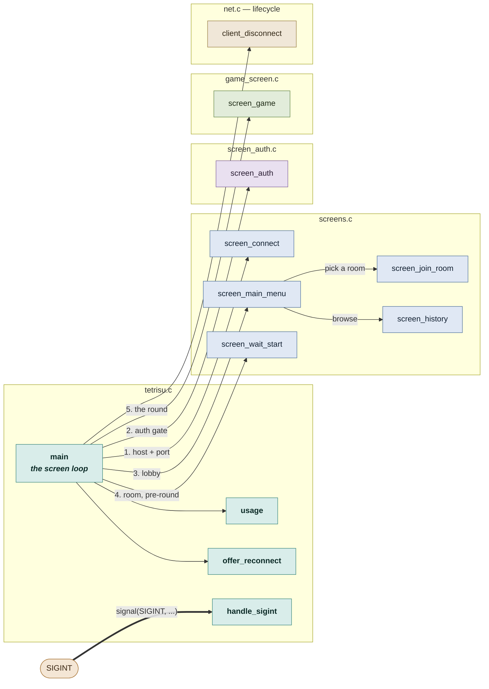
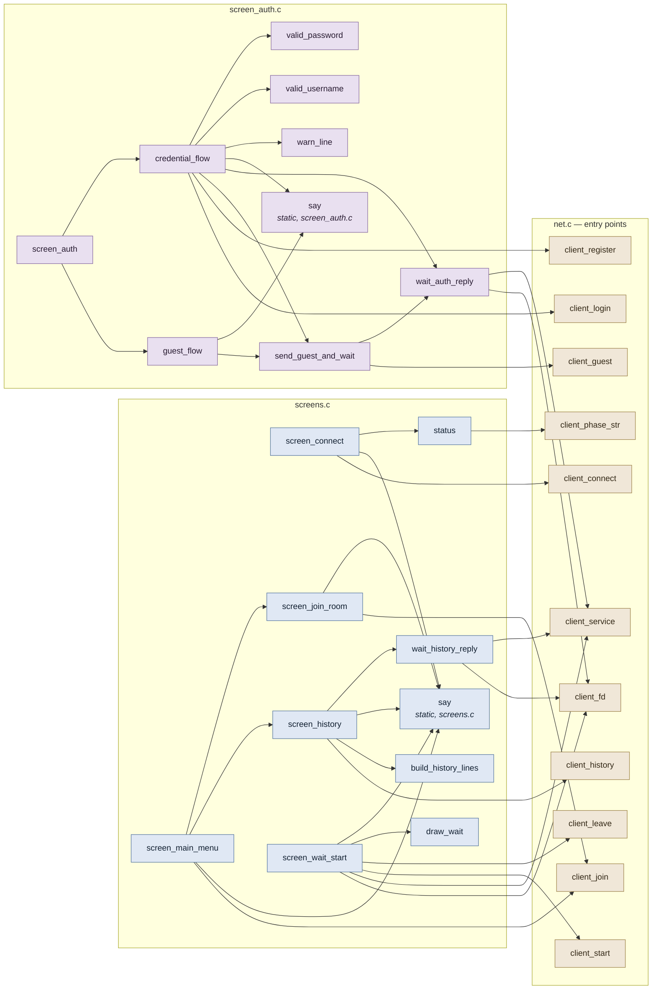
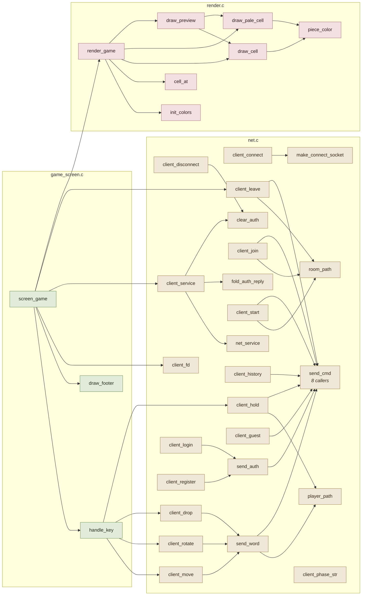
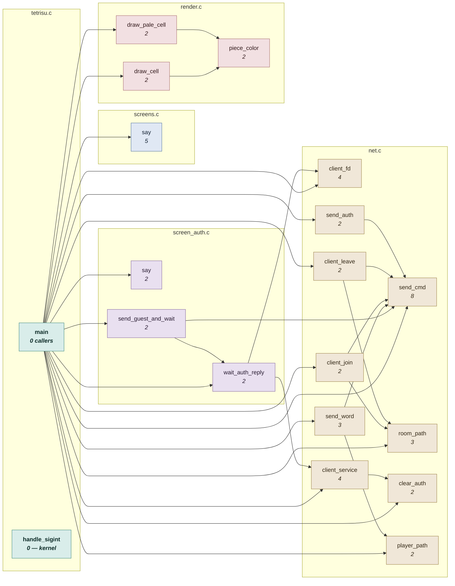
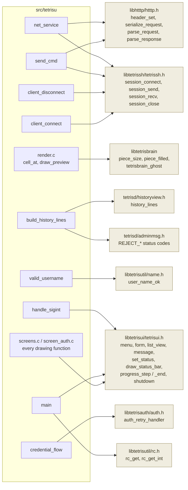

# `src/tetrisu` — the call graph

Every function in the six files of `src/tetrisu`, boxed by the file it lives in,
with an edge for every call — plus the ones that leave the folder for the shared
libraries. All six link into a single binary, `bin/tetrisu` (`Makefile:167`), so
unlike `src/tetrisctl` there is no linker seam running through the folder.

| | |
|---|---|
| functions | **58** across six files, 2 260 lines |
| call edges | **88** internal, no cycles |
| single caller | **39** could be pasted into their one call site |
| entry points | **2** — `main`, and `handle_sigint` from the kernel |

**Reading the diagrams.** A solid arrow is a direct call; a thick arrow crosses
a boundary (socket, signal). Node fill is the file the function is defined in.

---

## 1. File level — who depends on whom

`net.c` is the one leaf: everything calls into it and it calls nothing in the
folder back. The three screen files are siblings that never call each other
except through `tetrisu.c`'s loop — with one exception, `screen_main_menu`,
which invokes two other screens directly.

One binary, one direction. `render.c` is reached only from `game_screen.c`, and
knows nothing about the network — it is handed a `GameState` and draws it.

---

## 2. The screen loop — `tetrisu.c`, the spine

Every screen is a function that returns a `ScreenResult` and `main` decides
where to go next. That is the whole control structure of the client — there is
no screen stack and no dispatch table, so this graph *is* the state machine.

`main` calls five screens; only `screen_main_menu` calls screens of its own, and
both of those return to it rather than to `main`. `handle_sigint` is the second
entry point — nothing in the program calls it.

---

## 3. Inside the screens — `screens.c` and `screen_auth.c`

The two screen files and the `net.c` entry points they reach for. Each keeps a
private `say` helper — same name, same signature, two separate `static`
functions with no sharing between them.

`client_fd` and `client_service` always appear together — that pair is the poll
loop, written out three times here and once more in `screen_game`.
`credential_flow` falls through to `send_guest_and_wait`, which is how a failed
login can still end up in a guest session.

---

## 4. `net.c`, `render.c`, `game_screen.c` — the leaves

The three files nothing in the folder calls upward from. `net.c` is a funnel:
twenty-five functions, every outbound one ending at `send_cmd`, and every
inbound byte arriving through `net_service`.

`send_cmd` has 8 callers and is the only place a request is serialized;
`client_service` wraps `net_service` and is the only place an event is
interpreted. Those two are the entire read and write surface of the client.

---

## 5. The load-bearing half — single-caller functions removed

Same binary, with every function that has exactly one caller deleted and its
edges spliced through to that caller. Those 39 could be pasted into their single
call site without changing a symbol anyone else can see. What survives is the 17
functions that are genuinely shared, plus the two entry points nothing calls.

**No exceptions this time.** Unlike `src/tetrisctl`, nothing in `src/tetrisu` is
reached through a function pointer — there is no callback type and no dispatch
table in the folder, so a single static caller really does mean inlineable.

`game_screen.c` disappears completely — all three of its functions have exactly
one caller. `screens.c` is reduced to its private `say`: every screen in the
file is called from exactly one place.

**What the reduction says.**

- `net.c` keeps 10 of 25 and every survivor is internal plumbing — `send_cmd`,
  `send_word`, `room_path`, `player_path`, `send_auth`. The public `client_*`
  verbs are almost all single-caller facades over it, which is the shape of a
  protocol wrapper doing its job.
- `game_screen.c` vanishes and `screens.c` keeps only `say`. The screen layer is
  a straight-line sequence, not a graph — which is exactly what section 2 shows.
- The two functions with the same name are both survivors. `screens.c`'s `say`
  has 5 callers, `screen_auth.c`'s has 2 — duplicated deliberately, one per
  file, rather than promoted to a shared header.
- `send_cmd` at 8 callers is the single busiest function in the folder;
  `client_fd` and `client_service` tie at 4 because the poll loop is written out
  four separate times.

| File | Lines | Functions | Single caller | Kept |
|---|---:|---:|---:|---:|
| `net.c` | 524 | 25 | 15 | 10 |
| `screens.c` | 570 | 10 | 9 | 1 |
| `screen_auth.c` | 309 | 9 | 6 | 3 |
| `render.c` | 385 | 7 | 4 | 3 |
| `tetrisu.c` | 245 | 4 | 2 | 2 |
| `game_screen.c` | 227 | 3 | 3 | 0 |
| **total** | **2 260** | **58** | **39** | **19** |

---

## 6. Calls that leave the folder

`libtetrisui` is the widest dependency — it is touched by every file that draws.

`net.c` is the only file that touches `libtetrissh` or `libhtttp`, and no screen
file touches either — the protocol is sealed behind the `Client` API in
`include/tetrisu/client.h`.

---

## 7. Function index

Line numbers as of the working tree at the time of writing. **In** is the number
of distinct functions that call it; **1** means it was dropped from section 5.

### `tetrisu.c` — 245 lines

| Function | Line | In | Calls | External |
|---|---:|---:|---|---|
| `main` | 67 | 0 | usage, offer_reconnect, client_disconnect, screen_connect, screen_auth, screen_main_menu, screen_wait_start, screen_game | rc_get, rc_get_int, tetrisui_message, tetrisui_shutdown |
| `handle_sigint` | 60 | 0 | — *registered with `signal(SIGINT)`* | tetrisui_shutdown |
| `usage` | 41 | 1 | — | — |
| `offer_reconnect` | 52 | 1 | — | — |

### `net.c` — 524 lines

| Function | Line | In | Calls | External |
|---|---:|---:|---|---|
| `send_cmd` | 121 | 8 | — | htttp_header_set, htttp_serialize_request, session_send |
| `client_fd` | 113 | 4 | — | — |
| `client_service` | 489 | 4 | net_service, fold_auth_reply, clear_auth | — |
| `room_path` | 166 | 3 | — | — |
| `send_word` | 178 | 3 | player_path, send_cmd | — |
| `clear_auth` | 93 | 2 | — | — |
| `player_path` | 171 | 2 | — | — |
| `client_join` | 186 | 2 | room_path, send_cmd | — |
| `client_leave` | 198 | 2 | room_path, send_cmd | — |
| `send_auth` | 264 | 2 | send_cmd | — |
| `make_connect_socket` | 36 | 1 | — | socket, connect |
| `client_connect` | 59 | 1 | make_connect_socket | session_connect |
| `client_disconnect` | 101 | 1 | clear_auth | session_close |
| `client_start` | 224 | 1 | room_path, send_cmd | — |
| `client_move` | 231 | 1 | send_word | — |
| `client_rotate` | 235 | 1 | send_word | — |
| `client_drop` | 239 | 1 | send_word | — |
| `client_hold` | 243 | 1 | player_path, send_cmd | — |
| `client_history` | 250 | 1 | send_cmd | — |
| `client_login` | 282 | 1 | send_auth | — |
| `client_register` | 287 | 1 | send_auth | — |
| `client_guest` | 292 | 1 | send_cmd | — |
| `fold_auth_reply` | 308 | 1 | — | — |
| `net_service` | 327 | 1 | — | session_recv, htttp_parse_request, htttp_parse_response |
| `client_phase_str` | 508 | 1 | — | — |

### `screens.c` — 570 lines

| Function | Line | In | Calls | External |
|---|---:|---:|---|---|
| `say` | 41 | 5 | — | tetrisui_message |
| `status` | 35 | 1 | client_phase_str | tetrisui_set_status |
| `screen_connect` | 49 | 1 | client_connect, say, status | tetrisui_form, tetrisui_progress_step / _end |
| `screen_main_menu` | 123 | 1 | client_join, say, screen_history, screen_join_room | tetrisui_menu |
| `wait_history_reply` | 160 | 1 | client_fd, client_service | poll, tetrisui_progress_step / _end |
| `build_history_lines` | 201 | 1 | — | history_lines, REJECT_* codes |
| `screen_history` | 263 | 1 | client_history, build_history_lines, say, wait_history_reply | tetrisui_list_view |
| `screen_join_room` | 291 | 1 | client_join, say | — |
| `draw_wait` | 325 | 1 | — | tetrisui_draw_status_bar |
| `screen_wait_start` | 425 | 1 | client_fd, client_service, client_start, client_leave, draw_wait, say | poll |

### `screen_auth.c` — 309 lines

| Function | Line | In | Calls | External |
|---|---:|---:|---|---|
| `say` | 31 | 2 | — | tetrisui_message |
| `wait_auth_reply` | 88 | 2 | client_fd, client_service | poll, tetrisui_progress_step / _end |
| `send_guest_and_wait` | 129 | 2 | client_guest, wait_auth_reply | — |
| `valid_username` | 41 | 1 | — | user_name_ok |
| `valid_password` | 50 | 1 | — | — |
| `warn_line` | 67 | 1 | — | — |
| `guest_flow` | 138 | 1 | say, send_guest_and_wait | tetrisui_set_status |
| `credential_flow` | 162 | 1 | client_login, client_register, say, send_guest_and_wait, wait_auth_reply, warn_line, valid_username, valid_password | auth_retry_handler, tetrisui_set_status |
| `screen_auth` | 292 | 1 | guest_flow, credential_flow | tetrisui_menu |

### `render.c` — 385 lines

| Function | Line | In | Calls | External |
|---|---:|---:|---|---|
| `piece_color` | 118 | 2 | — | — |
| `draw_pale_cell` | 149 | 2 | piece_color | ncurses |
| `draw_cell` | 163 | 2 | piece_color | ncurses |
| `init_colors` | 78 | 1 | — | ncurses |
| `cell_at` | 226 | 1 | — | piece_filled |
| `draw_preview` | 247 | 1 | draw_cell, draw_pale_cell | piece_size |
| `render_game` | 268 | 1 | init_colors, cell_at, draw_cell, draw_pale_cell, draw_preview | tetrisbrain_ghost |

### `game_screen.c` — 227 lines · every function single-caller

| Function | Line | In | Calls | External |
|---|---:|---:|---|---|
| `screen_game` | 89 | 1 | handle_key, draw_footer, client_fd, client_service, client_leave, render_game | poll |
| `handle_key` | 27 | 1 | client_move, client_rotate, client_drop, client_hold | — |
| `draw_footer` | 76 | 1 | — | ncurses |
