# tetrisu & tetrisctl — how the two clients work

Both binaries in this document are *clients*: neither owns game state, and
neither is the daemon. `tetrisu` is the player's face on `tetrisd`; `tetrisctl`
is the administrator's. They were written months apart by different hands, and
they solve the same three problems — talk to a server, decode what comes back,
draw it — with two visibly different answers. Reading them side by side is the
fastest way to understand the system.

**How to use this.** Eleven phases, six for `tetrisu` and five for `tetrisctl`.
Each phase is self-contained: what happens, which functions run in which order,
and the one design decision worth remembering. Read a phase, open the file it
names, then move on. Every claim cites `file:line` so you can check it.

---

# Part A — `tetrisu`, the player client

## A0. Orientation

```
bin/tetrisu
├── tetrisu.c        argv, the connection loop, the lobby state machine
├── screens.c        connect / menu / join / wait-for-start
├── screen_auth.c    login, register, guest
├── game_screen.c    the live round — the only 20 Hz thing here
├── net.c            the ONLY file that touches a socket
├── render.c         board, panels, ghost piece
└── mock.c           a fake server that runs the real rules engine
```

The organising idea lives in `include/tetrisu/client.h:6`:

> The screens render from a `Client` and call the functions below; they never
> touch a socket, a frame buffer or libhtttp.

One struct, `Client`, holds **both** the transport (`fd`, `session_t sh`) and
everything the client *believes* (`phase`, `session`, `game`). Screens read the
belief and call `client_*()` to act. They cannot reach the wire even if they
want to.

That split buys two things. The mock backend (`mock.c`) becomes a drop-in —
same struct, same functions, no socket — so the whole UI is playable with no
server. And the wire format lives in exactly one file, so a protocol change
touches `net.c` and nothing else.

| Concept | Where |
|---|---|
| `ClientPhase` — where the client thinks it is | `client.h:40` |
| `ClientEvent` — what the last service call folded in | `client.h:65` |
| `Client` — the whole world | `client.h:84` |
| `ScreenResult` — how a screen ended | `include/tetrisu/screens.h` |

---

## A1. Startup and connection

`main()` (`tetrisu.c:119`) parses at most three arguments, ignores `SIGPIPE`
so a dead server cannot kill the process inside `session_send`, then hands
control to `screen_connect`.

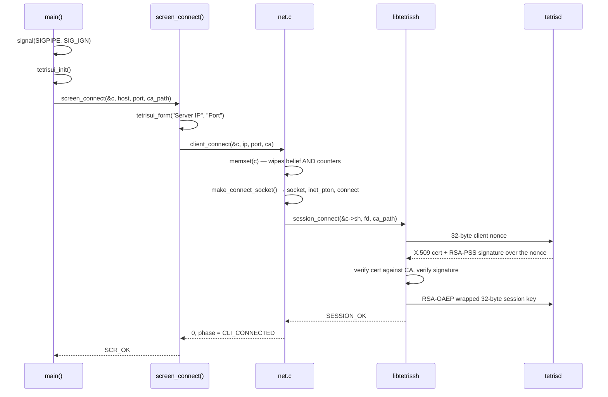

| Function | File | Job |
|---|---|---|
| `main` | `tetrisu.c:119` | argv, `SIGPIPE`, the outer connection loop |
| `screen_connect` | `screens.c:43` | host/port form, then live per-step progress |
| `client_connect` | `net.c:58` | `memset` the Client, open TCP, run the handshake |
| `make_connect_socket` | `net.c:35` | `socket` → `inet_pton` → `connect` |
| `session_connect` | `libtetrissh` | the whole PA2 handshake |

**Worth remembering.** `client_connect` returns the `session_connect` error
code *verbatim* rather than squashing it to `-1` (`net.c:69`). A rejected
certificate and a dead route need different messages, and `SESSION_ERR_AUTH` is
the only thing that separates them. The progress panel in `screen_connect` is
real, not animated — step two genuinely fails on an expired cert, and the user
needs to see *which* step broke.

---

## A2. The auth gate

`screen_auth` (`screen_auth.c:302`) runs once per connection, before the lobby
exists. Three ways through: login, register, guest.

| Function | File | Job |
|---|---|---|
| `screen_auth` | `screen_auth.c:302` | mode menu → the chosen flow |
| `guest_flow` | `screen_auth.c:149` | no credentials, straight to `client_guest` |
| `credential_flow` | `screen_auth.c:173` | form → validate → send → interpret |
| `valid_username` / `valid_password` | `screen_auth.c:42,51` | local checks before spending a round trip |
| `wait_auth_reply` | `screen_auth.c:89` | blocking wait for the one response |
| `client_login` / `client_register` / `client_guest` | `net.c:236,241,246` | send the request |

**Worth remembering.** `auth_pending` (`client.h:142`) is a single slot, and it
does two jobs. It scopes the failure budget to auth replies — a `401` answering
a `JOIN` would be a server bug, not a bad password — and it separates *"409,
name taken"* from *"409, already authenticated"*, which the status line alone
cannot. Single-slot is safe only because the auth screens are modal and never
have two requests outstanding.

---

## A3. The lobby state machine

This is the part of `main()` most worth reading in full (`tetrisu.c:198-289`).
Two nested loops:

```
outer for(;;)          one iteration per CONNECTION
  screen_auth
  inner while           one iteration per lobby visit
    screen_main_menu
    screen_wait_start
    while GAME_START
      screen_game       one iteration per ROUND
```

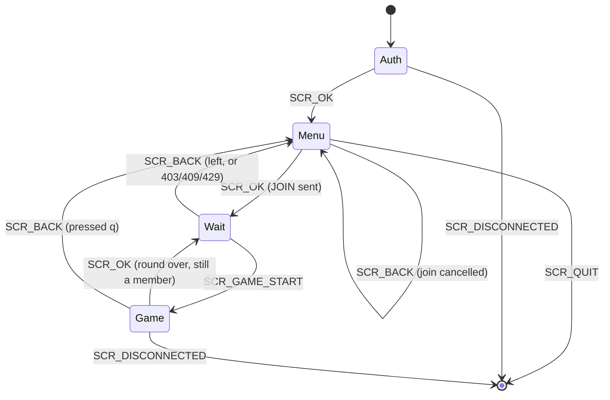

Each screen returns *what happened* rather than leaving `main` to re-derive it
from `Client.phase`, so every transition is readable in one place.

**Worth remembering — the rounds loop is inside the room, not outside it.** A
finished round does not eject you: the server's `handle_gameover` resets the
room to `SESSION_WAITING` and keeps every member, so the owner can `START`
again. Falling back to the menu would offer only `JOIN`, which the server then
refuses with `409` — you are already in a room. The way out of a room is `q` in
the wait screen, which sends `LEAVE`.

Only two results end the loop: `SCR_QUIT` and `SCR_DISCONNECTED`.

---

## A4. The game loop

`screen_game` (`game_screen.c:95`) is the only 20 Hz thing in the client, and
the only place two input sources compete.

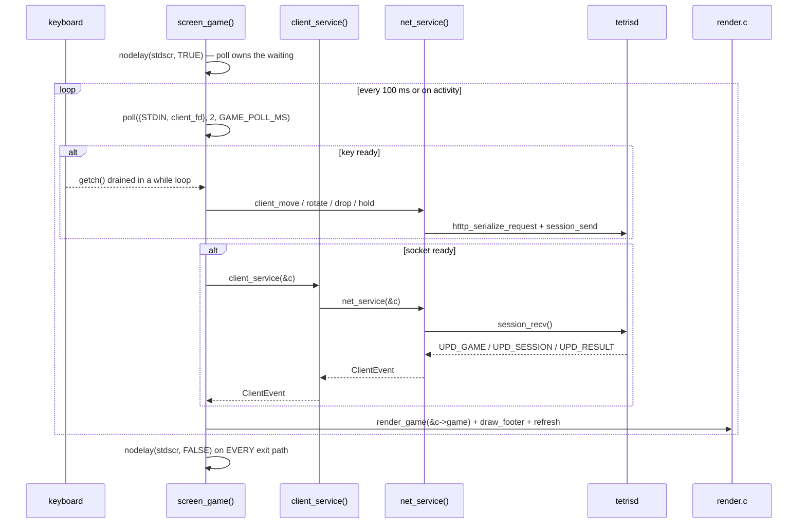

| Function | File | Job |
|---|---|---|
| `screen_game` | `game_screen.c:95` | the poll loop |
| `handle_key` | `game_screen.c:31` | keystroke → `client_*` call; returns true to leave |
| `draw_footer` | `game_screen.c:82` | says *which* of two states we are in |
| `render_game` | `render.c` | board, HOLD, NEXT, score, ghost piece |
| `client_fd` | `net.c:117` | returns **−1 in mock mode** |

**Three things worth remembering.**

`nodelay(stdscr, TRUE)` at entry, `FALSE` on *every* exit path
(`game_screen.c:107,236`). `poll()` owns the waiting here, not ncurses. If the
flag leaked out, the next blocking modal would spin at 100% CPU.

`getch()` is drained in a `while` loop, not called once (`game_screen.c:157`).
One poll wake-up can cover several buffered keys; at 20 Hz that is the
difference between responsive and mushy.

`client_fd()` returns `-1` in mock mode and `poll()` ignores negative fds — so
**one event loop drives both backends with no `if (mock)` in it**. That single
property is why `fd` lives in the struct at all.

### Exit conditions

| Returns | Meaning |
|---|---|
| `SCR_OK` | round finished; `c->last_winner` names the winner |
| `SCR_BACK` | player pressed `q`; `LEAVE` already sent |
| `SCR_DISCONNECTED` | transport died |

`CLI_EV_RESULT` is the primary exit. **Your own `game_over` is not enough** —
the server only broadcasts `ADMIN_RESULT` once the *last* member has topped
out (`room.c handle_gameover`), so a dead player stays on the screen as a
spectator until the round genuinely ends. `CLI_EV_SESSION` with a phase other
than `PLAYING` is a second, redundant exit, so a dropped or reordered result
frame cannot strand the player on a frozen board.

---

## A5. Decoding a frame

`net_service` (`net.c:279`) is the whole receive path, and it is worth reading
line by line because it handles **two message shapes**.

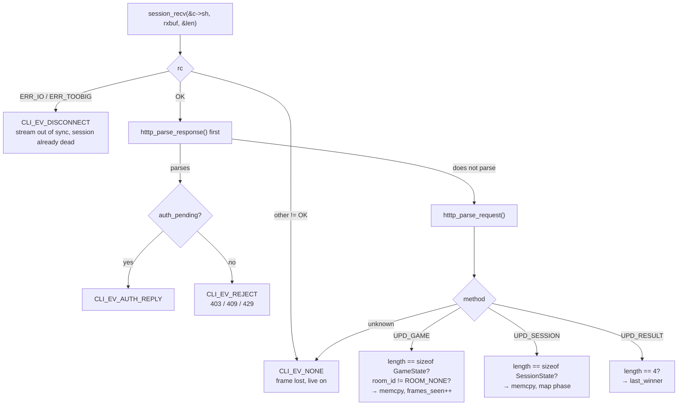

Responses are tried **first** because a status line is unambiguous, whereas a
response would not parse as a request anyway.

| Why the server sends two shapes | |
|---|---|
| `UPD_GAME`, `UPD_SESSION`, `UPD_RESULT` | pushed as **requests** — they are unsolicited |
| `403` / `409` / `429` | come back as **responses** — they answer a command just sent |

**Two guards worth remembering.**

*Exact*-length checks, not `>=` (`net.c:330`). `libhtttp` guarantees `body_len`
matches `Content-Length` and that the bytes are present, but it has no idea
what a `GameState` is. A short frame would leave most of the struct holding the
previous tick while looking fresh; a long one is a straight overrun.

Frames from a room you already left are dropped (`net.c:349`). The server
pushes at 20 Hz, so leaving mid-round leaves a backlog queued on the socket —
and the lobby menu blocks on input without servicing it, so the backlog is
still there when the next screen opens. Accepting one would flip the client to
`CLI_PLAYING` and send the wait screen into a game that already ended.

`client_service` (`net.c:414`) wraps this: it picks the backend
(`mock_service` or `net_service`), folds `CLI_EV_AUTH_REPLY` into
`AUTH_OK`/`REJECT` so no caller ever sees it, and on disconnect clears the auth
budget — *"no connection implies the count is zero."*

---

## A6. Disconnect and reconnect

The outer loop offers a reconnect for **exactly one** cause: the server closed
the link after too many failed logins.

```
if (r != SCR_DISCONNECTED || !c.reconnect_ok)
    break;                                    tetrisu.c:299
```

`reconnect_ok` is set in `client_service` when the event is a `POLLHUP`
*immediately behind* a counted auth `401` — the only disconnect a fresh
connection can plausibly fix. A dead route or a server going away mid-game
falls straight through and exits.

**Worth remembering.** `frames_seen` is a property of the *connection*, not the
program: `client_connect`'s `memset` wipes it on every reconnect. So
`total_frames_seen` accumulates what is about to be erased (`tetrisu.c:302`),
and the final count is printed *after* `endwin()` so it survives on the real
terminal.

---

# Part B — `tetrisctl`, the admin client

## B0. Orientation

```
bin/tetrisctl
├── tetrisctl.c       argv, mode choice, CLI formatters
├── ctl_tui.c         dashboard + action pane      ─┐
├── ctl_client.c      transport, JSON → structs     ├─ both faces share these
└── ctl_lifecycle.c   dspawn2, probe, pidfile      ─┘

src/tetrisctl/control_plane.c  ← lives here but links into bin/tetrisd
```

That last line is the thing that confuses everyone. `control_plane.c` sits in
`src/tetrisctl/` because it *is* the control plane, but it runs **inside
tetrisd** as its own thread. It links into `bin/tetrisd`, not `bin/tetrisctl` —
which is why the Makefile lists the four client sources explicitly instead of
wildcarding the directory.

One binary, two faces: any argv command is CLI, bare invocation on a tty opens
the console.

---

## B1. argv routing

`main` (`tetrisctl.c:189`) collects flags and positional arguments in one pass,
resolves the socket path, then branches once.

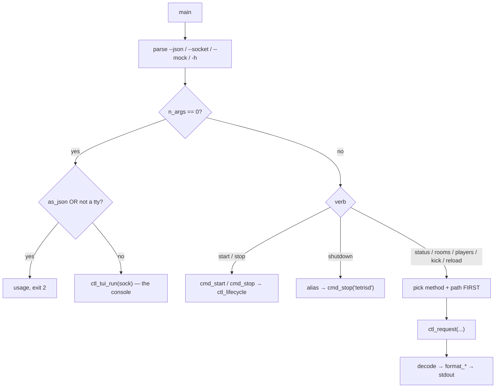

**Worth remembering.** The verb is decided *before* anything is opened
(`tetrisctl.c:264`). An unknown command costs no connection, and a `kick` with
missing arguments fails locally instead of reaching the daemon as a `400`.

The console is gated on `isatty(STDOUT_FILENO)` **and** `!as_json`. In a pipe
`initscr()` produces garbage rather than a UI, and `--json` with no verb
expresses CLI intent with nothing to run.

Exit codes are distinct so scripts can tell cases apart: `0` success, `1` the
daemon refused, `2` usage, `3` could not connect.

---

## B2. One command, end to end

This is the most important diagram in the document. A single `tetrisctl status`
crosses a process boundary **and two threads inside the daemon**.

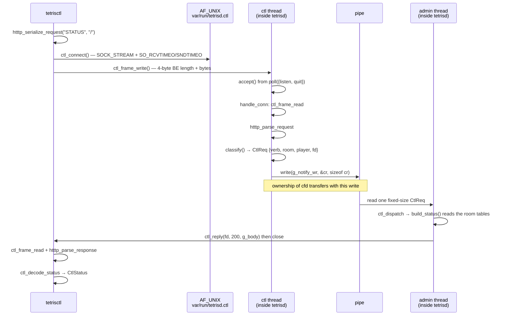

| Function | File | Side |
|---|---|---|
| `ctl_request` | `ctl_client.c:207` | client |
| `ctl_connect` | `ctl_client.c:183` | client — sets both socket timeouts |
| `ctl_frame_write` / `ctl_frame_read` | `control_plane.h` | **shared by both** |
| `ctl_thread` | `control_plane.c:390` | daemon, ctl thread |
| `handle_conn` | `control_plane.c:347` | daemon, ctl thread |
| `classify` | `control_plane.c:317` | daemon, ctl thread |
| `ctl_dispatch` | `control_plane.c:544` | daemon, **admin thread** |
| `build_status` / `build_rooms` / `build_players` | `control_plane.c:494,502,520` | daemon, admin thread |
| `ctl_reply` | `control_plane.c:150` | daemon |

**Why the split exists — this is the exam answer.** Every byte that came from
outside the process is parsed on the ctl thread. The admin thread — the one
routing every game message — receives only a *fixed-size, already-validated
struct* off a pipe. A slow or hostile control client therefore cannot stall
room routing. Different socket, different thread, different backlog, no shared
queue. That is the whole reason `tetrisctl shutdown` still works when the game
port is saturated.

**Second thing worth remembering.** `handle_conn` writes the `CtlReq` and then
must never touch `cfd` again (`control_plane.c:381`) — ownership transferred
with the write, and the admin thread will reply and close. Touching it after
would race.

`ctl_thread` never calls `accept()` blind. It polls a quit pipe alongside the
listening socket, because a thread parked in `accept()` cannot be woken:
closing its fd races fd reuse, and a signal races the gap between the flag
check and entering the syscall. A pipe is level-triggered, so a quit byte
written before the `poll()` is even reached still returns.

---

## B3. The snapshot

The dashboard needs three things at once. `ctl_refresh` (`ctl_client.c:367`)
fetches them with three separate connections and commits atomically.

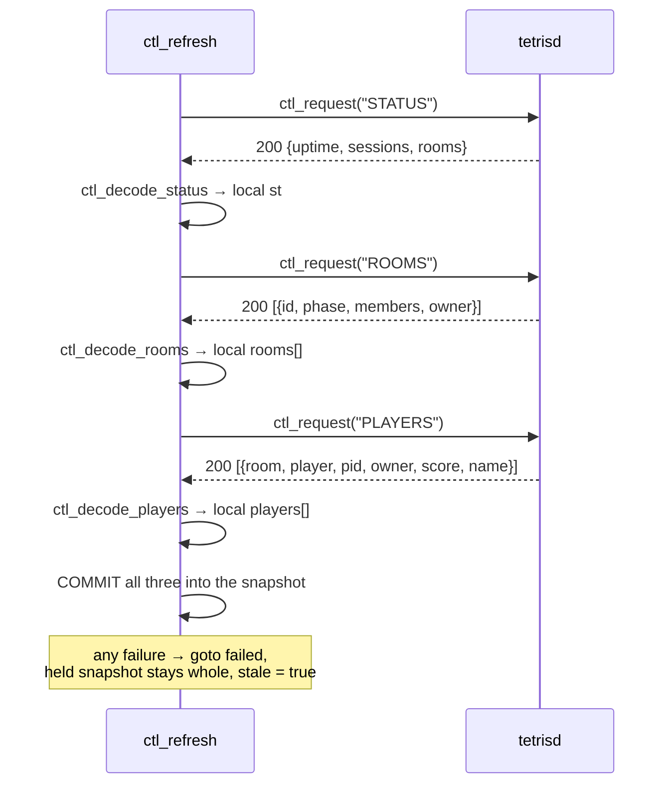

| Function | File | Job |
|---|---|---|
| `ctl_refresh` | `ctl_client.c:367` | three requests, one commit |
| `ctl_decode_status` | `ctl_client.c:294` | JSON object → `CtlStatus` |
| `ctl_decode_rooms` | `ctl_client.c:323` | JSON array → `CtlRoom[]` |
| `ctl_decode_players` | `ctl_client.c:355` | JSON array → `CtlPlayer[]` |
| `json_each` | `ctl_client.c:79` | walks a top-level array, calls back per item |
| `find_key` / `json_int` / `json_str` / `json_bool` | `ctl_client.c:25-63` | the `strstr`-based reader |

**Worth remembering.** Decoding into locals and committing only when all three
succeed means a mid-sequence failure leaves the held snapshot *whole*, rather
than half-updated from two different instants. That is what makes the
"stale data" banner honest.

**Why not one combined verb?** It was considered and rejected on arithmetic.
Combined worst case is ~41 KB against `g_body`'s 32 KB (`control_plane.c:483`),
so a `SNAPSHOT` verb would answer `500` at full capacity where three separate
calls survive.

**A real, pre-existing bug you should know about.** `tetrisctl players` already
`500`s on a full server: 254 sessions × ~187 bytes of worst-case escaped name
≈ 47 KB > 32 KB. `BODY_APPEND` refuses to truncate, which is the *right*
failure, but it is a failure — and the dashboard inherits it.

**A subtle invariant.** The decoder is `strstr`-based, so a player named
`x","score":9999` would forge a field — except the daemon escapes it first in
`json_escape` (`control_plane.c:80`). The invariant lives in a different file
from the code that depends on it, which is exactly why `tests/test_ctl_client.c`
pins it.

---

## B4. The console loop

`ctl_tui_run` (`ctl_tui.c:475`). Two hand-drawn panes, and one reason they had
to be hand-drawn.

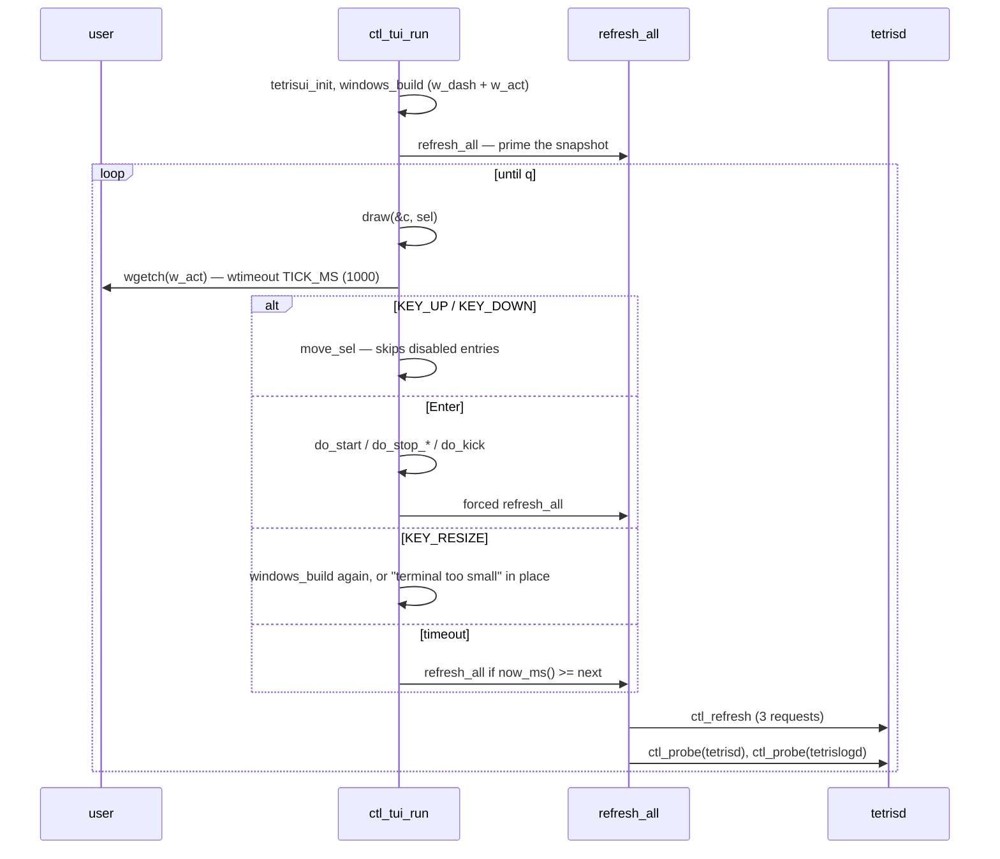

| Function | File | Job |
|---|---|---|
| `ctl_tui_run` | `ctl_tui.c:475` | the loop |
| `windows_build` / `windows_free` | `ctl_tui.c:193,183` | the two panes; enforces 24×60 floor |
| `draw` | `ctl_tui.c:215` | paints both panes |
| `build_dashboard` | `ctl_tui.c:115` | snapshot → lines of text |
| `disabled_reason` | `ctl_tui.c:72` | why Enter would do nothing |
| `move_sel` | `ctl_tui.c:458` | cursor, skipping disabled entries |
| `refresh_all` | `ctl_tui.c:430` | snapshot + both probes + backoff |
| `after_page` | `ctl_tui.c:296` | `clear` / `refresh` / `redrawwin` after a modal |

**Why the panes are hand-drawn.** `libtetrisui`'s `frame_win()` calls `clear()`
and `refresh()` before *every* window (`tetrisui.c:74`). Two persistent panes
therefore cannot coexist with it. The resolution: widgets are used as
full-screen **pages** that take over, run, and return; the two panes are drawn
by hand. Forking vendored code was explicitly off the table.

**Fixed labels, dimmed when unavailable.** A label that relabels under a 1 s
refresh lets Enter do the opposite of what the user just read. Same reason
`kick` uses a typed form rather than selecting a live row.

**`move_sel` with delta 0** means *"stay unless the refresh just disabled us"* —
which happens whenever a daemon changes state under the cursor. Quit is never
disabled, so the search always terminates.

**Backoff.** A failed refresh doubles the interval, 1 s → 5 s max
(`ctl_tui.c:436-441`). A dead daemon should not be hammered once a second.

---

## B5. Lifecycle — starting and stopping daemons

`ctl_lifecycle.c` is the part that makes `tetrisctl` more than a client. It
spawns and signals real processes.

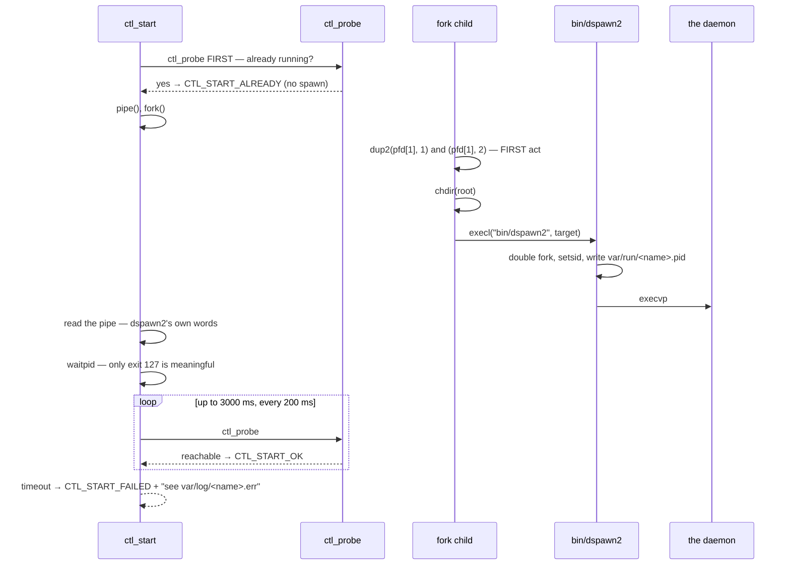

| Function | File | Job |
|---|---|---|
| `ctl_start` | `ctl_lifecycle.c:230` | pre-probe, spawn, confirm |
| `spawn_dspawn2` | `ctl_lifecycle.c:179` | fork with diagnostics on a pipe |
| `ctl_probe` | `ctl_lifecycle.c:130` | is it actually alive? |
| `ctl_stop_logd` | `ctl_lifecycle.c:310` | cross-check, `SIGTERM`, confirm |
| `logd_socket_alive` | `ctl_lifecycle.c:110` | `connect()` only, **never** `send` |
| `read_pidfile` / `pidfile_path` | `ctl_lifecycle.c:85,78` | `var/run/<name>.pid` |

**Five decisions worth remembering.**

*Confirm by observation, never by exit status.* `dspawn2`'s parent exits after
its **first** fork, before `execvp` — so `waitpid` proves only that forking
worked. Only exit 127 is meaningful, and only because it is ours.

*Probe before spawning.* The confirm loop would pass on its first poll against
a daemon that was already up, and report a spawn that `dspawn2` in fact
refused. Asking first is the only way the answer is true.

*Redirect before anything else in the child.* `already_running()` writes to
stderr in `dspawn2`'s parent, before any fork of its own. Inherited onto a live
ncurses screen, that text corrupts the display — so `dup2` onto fds 1 and 2 is
the child's first act, before `chdir` and `execl`.

*The child must `chdir(root)`.* `dspawn2` deliberately keeps the caller's cwd
and resolves `var/run/<name>.pid` against it, so a `tetrisctl` launched from
elsewhere would otherwise scatter pidfiles.

*Stopping `tetrislogd` needs two signals of life.* It has no control plane, so
the check is pidfile **and** live socket. Pidfiles are never unlinked, so a
recycled pid would otherwise get signalled. And `logd_socket_alive` uses
`connect()` only — a zero-length datagram would reach the log sink as a
message.

---

# Part C — the two clients side by side

| | `tetrisu` | `tetrisctl` |
|---|---|---|
| Transport | TCP, encrypted (`libtetrissh`) | AF_UNIX stream, plaintext |
| Framing | 4-byte BE inside the session layer | 4-byte BE directly |
| Message layer | `libhtttp` | `libhtttp` |
| Connection | one, long-lived | **one per command** |
| Who speaks first | either side, any time | client always; server only answers |
| Server pushes? | yes — `UPD_GAME` at 20 Hz | never |
| Loop driver | `poll()` on 2 fds | `wgetch` with `wtimeout` |
| Refresh | server-driven | client-driven, 1 s + backoff |
| State | a `Client` struct that accumulates | a `CtlSnapshot` replaced whole |
| Mock | `mock.c`, runs the real rules engine | `--mock`, canned bodies |

**The shape of the difference.** `tetrisu` holds one connection open and reacts
to whatever arrives; `tetrisctl` opens a connection, asks one question, and
closes. That is forced by `control_plane.h:285` — *"always consumes `req->fd`"*
— which makes one connection per command structural, not a style choice.

Both clients decode into structs before rendering, and for the same reason: the
CLI and the dashboard render from the same `CtlStatus`/`CtlRoom`/`CtlPlayer`,
so they cannot disagree; the screens and the mock render from the same
`Client`, so they cannot either.

---

## Suggested reading order

1. `include/tetrisu/client.h` — the whole model in one header
2. `src/tetrisu/net.c:279` `net_service` — two message shapes, one function
3. `src/tetrisu/game_screen.c:95` `screen_game` — the poll loop
4. `src/tetrisu/tetrisu.c:198` — the two nested loops
5. `include/tetrisctl/control_plane.h` — the shared framing and `CtlReq`
6. `src/tetrisctl/control_plane.c:347` `handle_conn` → `ctl_dispatch` — the thread crossing
7. `src/tetrisctl/ctl_client.c:367` `ctl_refresh` — atomic commit
8. `src/tetrisctl/ctl_tui.c:475` `ctl_tui_run` — the console loop
9. `src/tetrisctl/ctl_lifecycle.c:230` `ctl_start` — liveness by observation

---

# Part D — the data model

C has no classes. What it has is structs plus a naming convention: a function
whose first parameter is `T *` is that struct's method. `client_join(Client *c,
…)` is `Client::join` in everything but syntax. The diagrams below read that
convention literally.

One property matters before you look at them. **Almost nothing here is a
pointer.** Composition is by *value* — `GameState` sits inside `Client`, not
behind a pointer to it. That is not an accident and not laziness: the server
`memcpy`s a `GameState` straight onto the wire and the client `memcpy`s it
straight back off (`net.c:357`). A pointer anywhere in that chain would make
the struct unsendable. The wire format *is* the memory layout, which is why
`libtetrisutil` owns `gamestate.h` rather than `libtetrisbrain` — server, client
and renderer must all agree on the bytes, and none of them should have to
inherit the rules engine to do it.

## D1. tetrisu

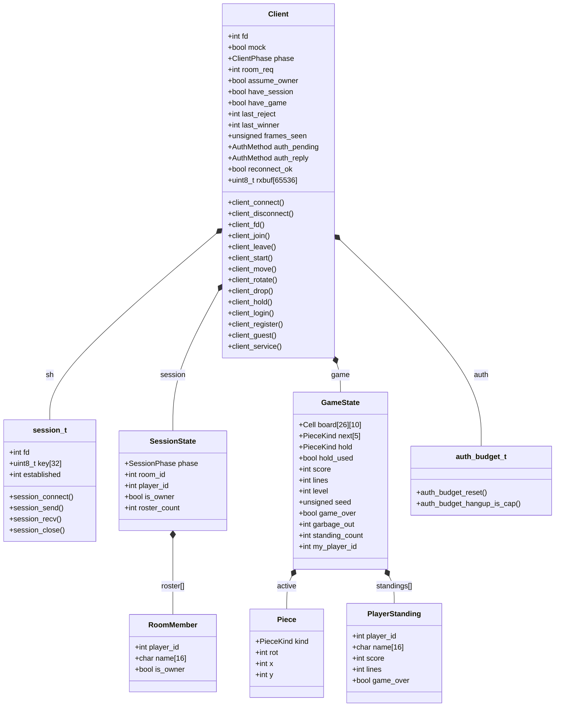

**Reading it.** Every `*--` is by value. `Client` is one flat allocation, about
64 KB of it `rxbuf` — which lives in the struct rather than on a stack because
`libhtttp` parses zero-copy, so `req.body` points *into* it and must outlive
the parse.

Note what `Client` does **not** contain: no screen, no window, no renderer.
The dependency runs one way. Screens take a `Client *`; `Client` has never
heard of them. That is the whole reason `mock.c` can substitute for the
network without touching a single screen.

## D2. tetrisctl

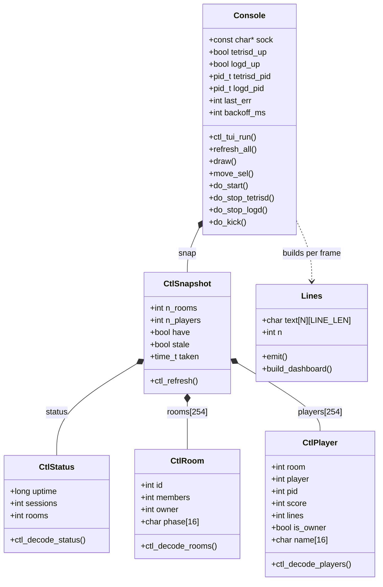

**Reading it.** `Console` is the TUI's whole world; the CLI has no equivalent
struct because it needs none — it decodes, prints, and exits.

`CtlSnapshot` is the interesting one. It is **replaced whole, never patched**,
which is what `ctl_refresh`'s all-or-nothing commit enforces. Compare with
`Client`, which *accumulates*: fields land as frames arrive and `have_session` /
`have_game` mark which parts are real yet. Two opposite strategies, each right
for its traffic pattern — one client is pushed to, the other polls.

`Lines` is a scratch buffer, not state: `..>` because `draw()` builds one per
frame and throws it away. It exists so `build_dashboard` can be tested as a
pure snapshot-to-text function without a terminal.

## D3. Across the process boundary

The server side has its own types, and the seam between them is worth drawing
on its own.

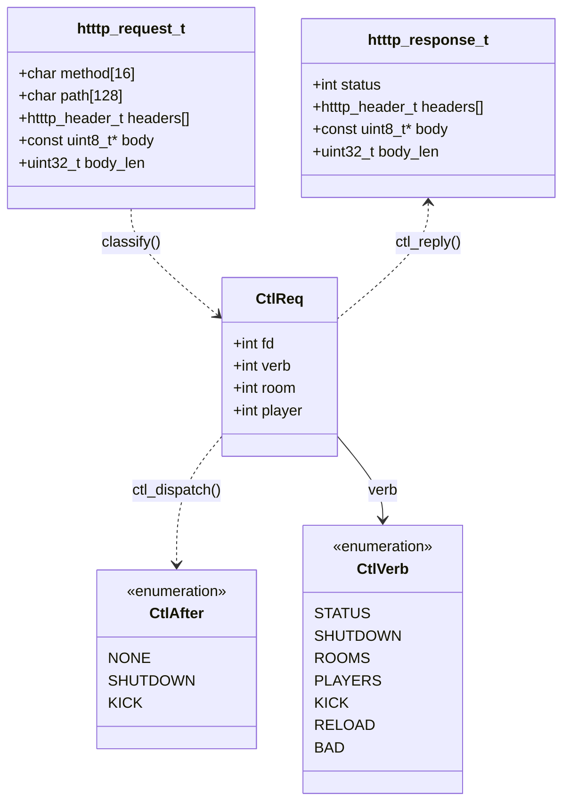

**This is the diagram that explains the thread split.** `htttp_request_t`
carries pointers (`body` points into a receive buffer) and is ~4 KB of headers.
`CtlReq` is **16 bytes, four ints, no pointers** — which is exactly why it can
cross a pipe.

The ctl thread turns the first into the second and never lets the first travel.
The admin thread only ever sees `CtlReq`. Everything hostile a control client
could send — a malformed path, a lying `Content-Length`, an oversized header
block — is spent on the ctl thread, and the thread that routes game traffic
receives four validated integers. That is the mechanism behind *"the control
plane must remain available even when the public TCP listener is saturated."*

`CtlAfter` is the return channel for actions the dispatcher cannot perform
itself: it has already replied `200`, but shutting down or closing a victim's
socket belongs to the admin loop that called it.

## D4. Module dependencies

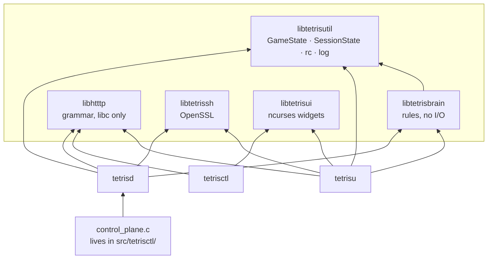

Two facts this makes visible.

**`libhtttp` and `libtetrissh` never touch each other.** No compile-time or
link-time dependency either way. They meet only in the application, which pipes
plaintext out of `session_recv` into `htttp_parse_*`. That is why `libhtttp`
links against libc alone and can be fuzzed with no OpenSSL in the picture.

**`control_plane.c` points the wrong way on purpose.** It sits in
`src/tetrisctl/` but links into `bin/tetrisd`. The directory names the
*feature*; the arrow names the *binary*. This is the single most confusing
thing about the layout, and it is why the Makefile lists tetrisctl's four
sources explicitly instead of wildcarding the directory — a wildcard would drag
`control_plane.c` into the CLI and fail to link on `client_count` and friends.
