# Domain model — every struct in tetriSH

Fifteen figures and one inventory covering **every `struct` defined under `include/`, `src/`, and
`benchmarks/`** — 93 types. Test-local harness structs are listed at the end but not drawn; they
model a fixture, not the domain.

**Reading the diagrams.** A filled diamond means "contains by value" — this is C, so containment is
literal embedding, not a pointer. An open diamond means "refers to by handle" (an fd or an index). A
dashed arrow means "derived from", "flattened into", or "measured into". A box with only a
`<<figure N>>` stereotype is drawn in full elsewhere and appears here just to anchor the edge.

Array bounds come from `include/libtetrisutil/limits.h`: `MAX_SESSIONS` = `MAX_ROOMS` =
`MAX_ROOM_MEMBERS` = 254, `MAX_STANDINGS` = 8, `MAX_PLAYER_NAME` = 16, board = 24 × 10.

Two name collisions are real and deliberate — different translation units, unrelated shapes:

| Name | One | The other |
| --- | --- | --- |
| `Client` | `include/tetrisu/client.h` — the whole client program's state | `src/tetrisd/room.c` — one member slot in a room |
| `Session` / `session_t` | `include/tetrisd/session.h` — a server session process | `include/libtetrissh/tetrissh.h` — an encrypted transport session |

---

## Part I — The game

What the engine, the server, and the client all agree a game is. `GameState` and `SessionState` are the two types that cross every process boundary.

### 1. The board

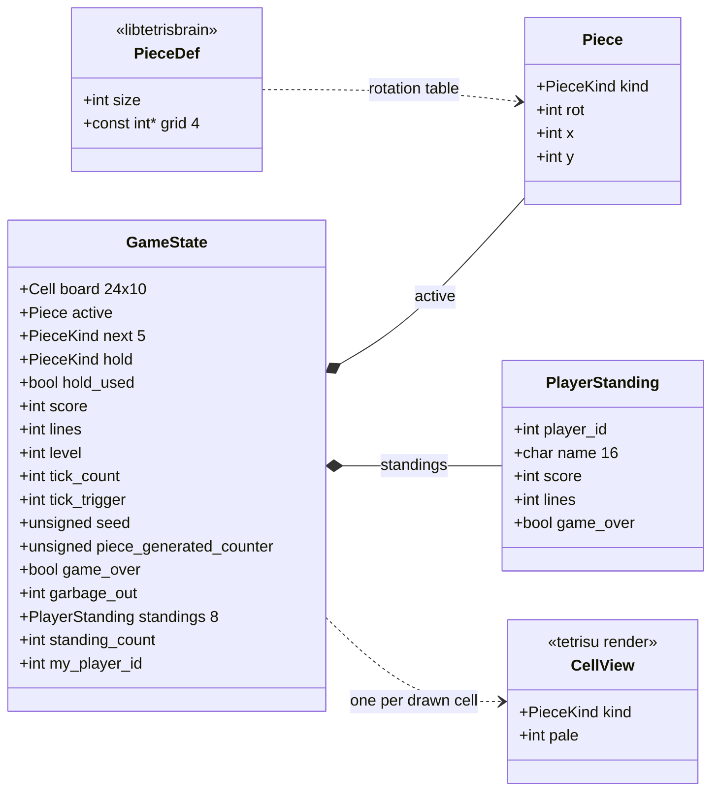
```mermaid
%%{init: {'class': {'nodeSpacing': 55, 'rankSpacing': 230}}}%%
classDiagram
  direction LR

class GameState {
  +Cell board 24x10
  +Piece active
  +PieceKind next 5
  +PieceKind hold
  +bool hold_used
  +int score
  +int lines
  +int level
  +int tick_count
  +int tick_trigger
  +unsigned seed
  +unsigned piece_generated_counter
  +bool game_over
  +int garbage_out
  +PlayerStanding standings 8
  +int standing_count
  +int my_player_id
}
class Piece {
  +PieceKind kind
  +int rot
  +int x
  +int y
}
class PlayerStanding {
  +int player_id
  +char name 16
  +int score
  +int lines
  +bool game_over
}
class PieceDef {
  <<libtetrisbrain>>
  +int size
  +const int* grid 4
}
class CellView {
  <<tetrisu render>>
  +PieceKind kind
  +int pale
}
PieceDef ..> Piece : rotation table
GameState *-- Piece : active
GameState *-- PlayerStanding : standings
GameState ..> CellView : one per drawn cell
```

One `GameState` is one player's board plus the room scoreboard the server pushed down with it. The engine owns every field except `standings[]` — it knows about exactly one board and cannot validate anyone else's, so `tetrisbrain_init` leaves that array alone. `PieceDef` is the static rotation table in `piece.c`; `CellView` is what the renderer sees after the active piece and its landing preview are composited onto the board.

### 2. The room

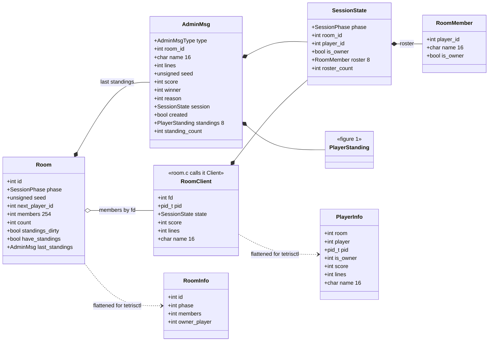
```mermaid
%%{init: {'class': {'nodeSpacing': 55, 'rankSpacing': 230}}}%%
classDiagram
  direction LR

class SessionState {
  +SessionPhase phase
  +int room_id
  +int player_id
  +bool is_owner
  +RoomMember roster 8
  +int roster_count
}
class RoomMember {
  +int player_id
  +char name 16
  +bool is_owner
}
class Room {
  +int id
  +SessionPhase phase
  +unsigned seed
  +int next_player_id
  +int members 254
  +int count
  +bool standings_dirty
  +bool have_standings
  +AdminMsg last_standings
}
class RoomClient {
  <<room.c calls it Client>>
  +int fd
  +pid_t pid
  +SessionState state
  +int score
  +int lines
  +char name 16
}
class AdminMsg {
  +AdminMsgType type
  +int room_id
  +char name 16
  +int lines
  +unsigned seed
  +int score
  +int winner
  +int reason
  +SessionState session
  +bool created
  +PlayerStanding standings 8
  +int standing_count
}
class PlayerStanding {
  <<figure 1>>
}
class RoomInfo {
  +int id
  +int phase
  +int members
  +int owner_player
}
class PlayerInfo {
  +int room
  +int player
  +pid_t pid
  +int is_owner
  +int score
  +int lines
  +char name 16
}
SessionState *-- RoomMember : roster
Room o-- RoomClient : members by fd
RoomClient *-- SessionState
Room *-- AdminMsg : last standings
AdminMsg *-- PlayerStanding
AdminMsg *-- SessionState
Room ..> RoomInfo : flattened for tetrisctl
RoomClient ..> PlayerInfo : flattened for tetrisctl
```

The admin thread owns rooms. Each member is a `RoomClient` slot holding that player's `SessionState` and live score; the room folds those into `PlayerStanding[]`, parks the result in `last_standings`, and only republishes when the payload actually changed. `AdminMsg` is fixed-size on purpose — one `sizeof` frames it, so the two binaries on the socketpair cannot disagree about where a message ends. `RoomInfo` and `PlayerInfo` are the flattened rows the control plane serves.

### 3. The session process

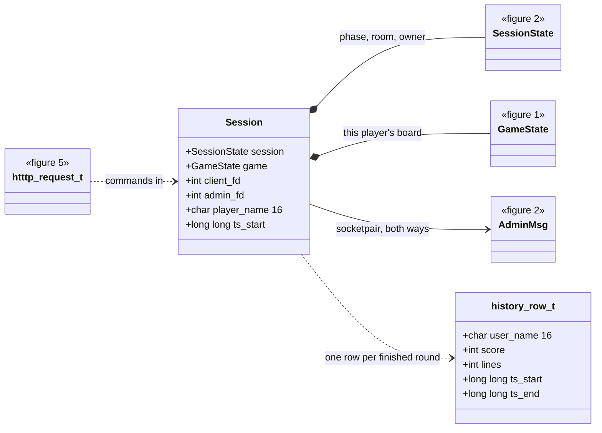
```mermaid
%%{init: {'class': {'nodeSpacing': 55, 'rankSpacing': 230}}}%%
classDiagram
  direction LR

class Session {
  +SessionState session
  +GameState game
  +int client_fd
  +int admin_fd
  +char player_name 16
  +long long ts_start
}
class SessionState {
  <<figure 2>>
}
class GameState {
  <<figure 1>>
}
class AdminMsg {
  <<figure 2>>
}
class history_row_t {
  +char user_name 16
  +int score
  +int lines
  +long long ts_start
  +long long ts_end
}
class htttp_request_t {
  <<figure 5>>
}
Session *-- SessionState : phase, room, owner
Session *-- GameState : this player's board
Session --> AdminMsg : socketpair, both ways
Session ..> history_row_t : one row per finished round
htttp_request_t ..> Session : commands in
```

One process per connected player. It holds the client socket on one side and the socketpair to the admin thread on the other, and it is the only thing that owns both a `SessionState` and a `GameState`. Commands arrive as parsed `htttp_request_t`; a finished round leaves one `history_row_t` behind.

### 4. The client program

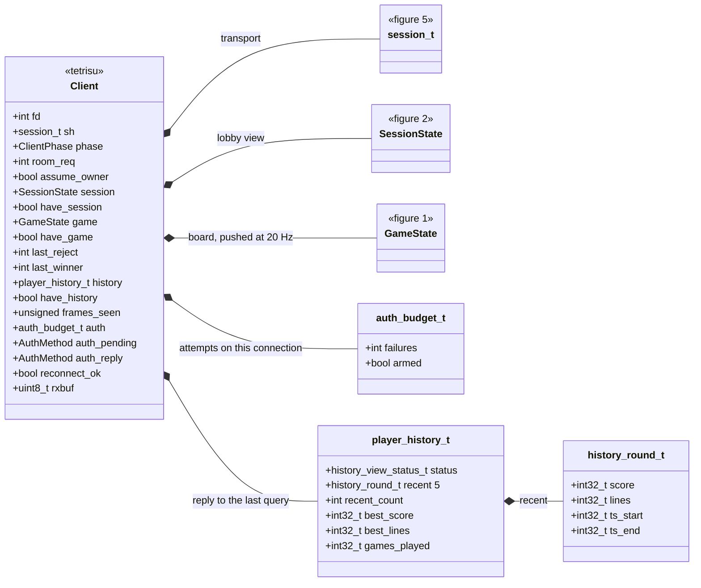
```mermaid
%%{init: {'class': {'nodeSpacing': 55, 'rankSpacing': 230}}}%%
classDiagram
  direction LR

class Client {
  <<tetrisu>>
  +int fd
  +session_t sh
  +ClientPhase phase
  +int room_req
  +bool assume_owner
  +SessionState session
  +bool have_session
  +GameState game
  +bool have_game
  +int last_reject
  +int last_winner
  +player_history_t history
  +bool have_history
  +unsigned frames_seen
  +auth_budget_t auth
  +AuthMethod auth_pending
  +AuthMethod auth_reply
  +bool reconnect_ok
  +uint8_t rxbuf
}
class session_t {
  <<figure 5>>
}
class SessionState {
  <<figure 2>>
}
class GameState {
  <<figure 1>>
}
class auth_budget_t {
  +int failures
  +bool armed
}
class player_history_t {
  +history_view_status_t status
  +history_round_t recent 5
  +int recent_count
  +int32_t best_score
  +int32_t best_lines
  +int32_t games_played
}
class history_round_t {
  +int32_t score
  +int32_t lines
  +int32_t ts_start
  +int32_t ts_end
}
Client *-- session_t : transport
Client *-- SessionState : lobby view
Client *-- GameState : board, pushed at 20 Hz
Client *-- auth_budget_t : attempts on this connection
Client *-- player_history_t : reply to the last query
player_history_t *-- history_round_t : recent
```

One `tetrisu` is one user, not one connection — `client_connect()` runs more than once in a user's lifetime. That is why the auth budget lives on `Client` rather than in a file static: it must be zeroed on both edges of a connection, and it must survive leaving the auth screens and coming back, because the server does not forget either. `rxbuf` lives here too, since `htttp` parses zero-copy and `req.body` points into it.

---

## Part II — The machinery

Everything under the domain: framing, crypto, tokens, the database seam, the logger, and the control console.

### 5. The wire

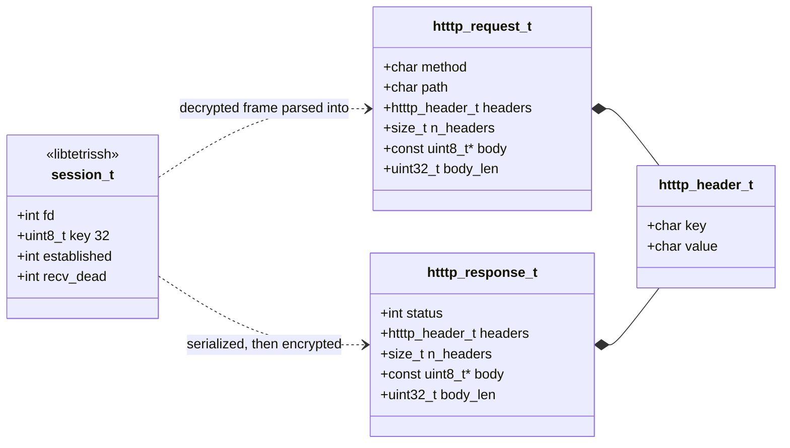
```mermaid
%%{init: {'class': {'nodeSpacing': 55, 'rankSpacing': 230}}}%%
classDiagram
  direction LR

class session_t {
  <<libtetrissh>>
  +int fd
  +uint8_t key 32
  +int established
  +int recv_dead
}
class htttp_request_t {
  +char method
  +char path
  +htttp_header_t headers
  +size_t n_headers
  +const uint8_t* body
  +uint32_t body_len
}
class htttp_response_t {
  +int status
  +htttp_header_t headers
  +size_t n_headers
  +const uint8_t* body
  +uint32_t body_len
}
class htttp_header_t {
  +char key
  +char value
}
htttp_request_t *-- htttp_header_t
htttp_response_t *-- htttp_header_t
session_t ..> htttp_request_t : decrypted frame parsed into
session_t ..> htttp_response_t : serialized, then encrypted
```

Two framings stacked. `session_t` is the encrypted transport: a socket, a 32-byte session key laid out as HMAC key then AES key, and a `recv_dead` flag that marks the receive stream desynced while send still works — that window is how an app answers 413 before closing. Above it, `htttp` parses into borrowed slices: `body` points into the caller's buffer, never a copy.

### 6. Auth and tokens

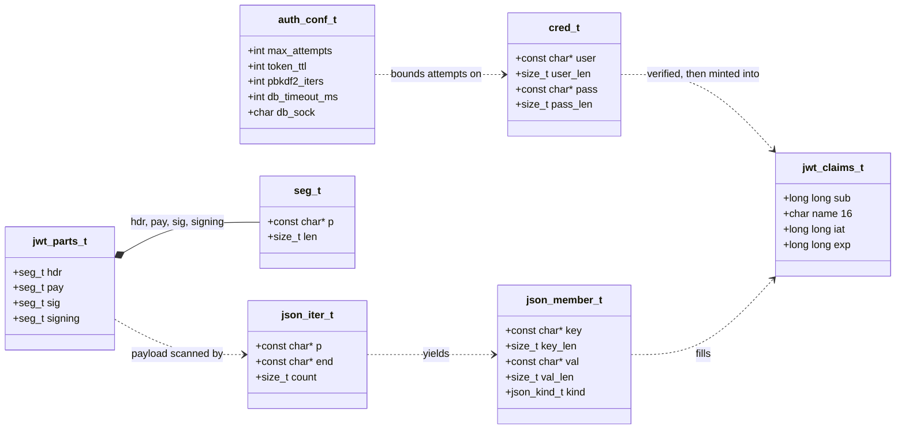
```mermaid
%%{init: {'class': {'nodeSpacing': 55, 'rankSpacing': 230}}}%%
classDiagram
  direction LR

class auth_conf_t {
  +int max_attempts
  +int token_ttl
  +int pbkdf2_iters
  +int db_timeout_ms
  +char db_sock
}
class cred_t {
  +const char* user
  +size_t user_len
  +const char* pass
  +size_t pass_len
}
class jwt_claims_t {
  +long long sub
  +char name 16
  +long long iat
  +long long exp
}
class jwt_parts_t {
  +seg_t hdr
  +seg_t pay
  +seg_t sig
  +seg_t signing
}
class seg_t {
  +const char* p
  +size_t len
}
class json_iter_t {
  +const char* p
  +const char* end
  +size_t count
}
class json_member_t {
  +const char* key
  +size_t key_len
  +const char* val
  +size_t val_len
  +json_kind_t kind
}
auth_conf_t ..> cred_t : bounds attempts on
cred_t ..> jwt_claims_t : verified, then minted into
jwt_parts_t *-- seg_t : hdr, pay, sig, signing
jwt_parts_t ..> json_iter_t : payload scanned by
json_iter_t ..> json_member_t : yields
json_member_t ..> jwt_claims_t : fills
```

`cred_t` borrows the username and password rather than copying them. Token verification walks `jwt_parts_t` — three `seg_t` slices plus the signing input the MAC covers — and the claim scanner yields `json_member_t` values into `jwt_claims_t`. `auth_conf_t` carries the tunables, including the attempt cap the client mirrors through `auth_budget_t`.

### 7. The database seam

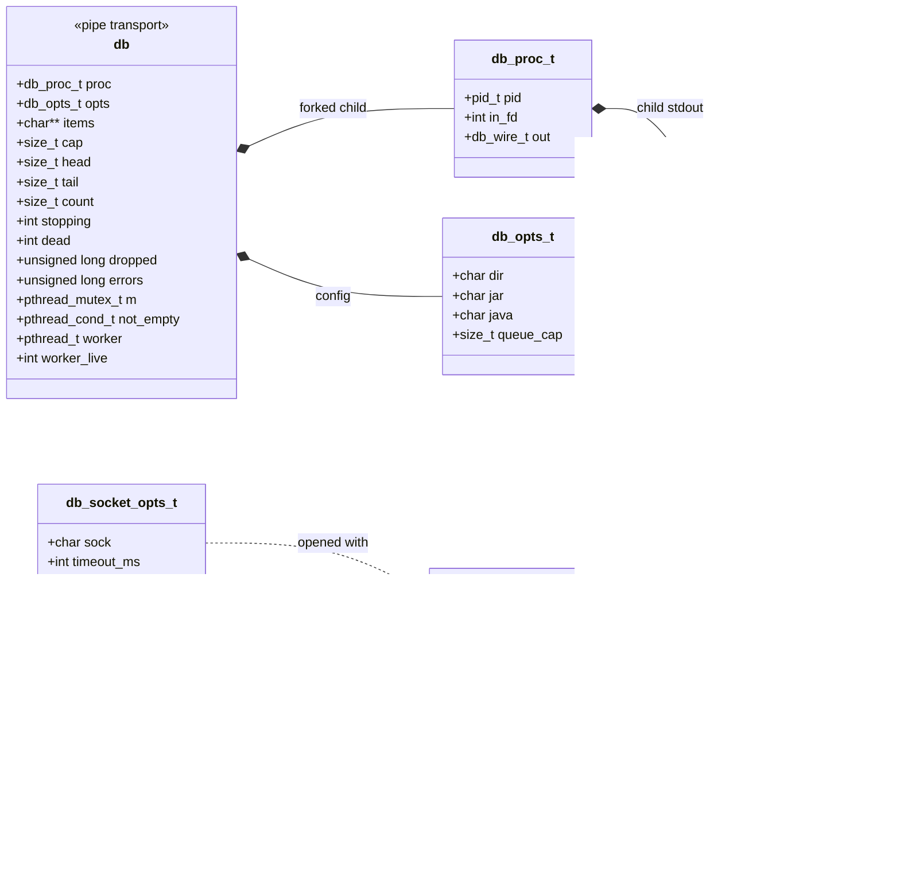
```mermaid
%%{init: {'class': {'nodeSpacing': 55, 'rankSpacing': 230}}}%%
classDiagram
  direction LR

class db_wire_t {
  <<shared primitive>>
  +int fd
  +char buf 4096
  +size_t len
  +size_t pos
}
class db {
  <<pipe transport>>
  +db_proc_t proc
  +db_opts_t opts
  +char** items
  +size_t cap
  +size_t head
  +size_t tail
  +size_t count
  +int stopping
  +int dead
  +unsigned long dropped
  +unsigned long errors
  +pthread_mutex_t m
  +pthread_cond_t not_empty
  +pthread_t worker
  +int worker_live
}
class db_proc_t {
  +pid_t pid
  +int in_fd
  +db_wire_t out
}
class db_opts_t {
  +char dir
  +char jar
  +char java
  +size_t queue_cap
}
class db_socket {
  <<socket transport>>
  +db_wire_t wire
  +long long deadline
  +db_status_t failed
}
class db_socket_opts_t {
  +char sock
  +int timeout_ms
}
class db_runner_opts_t {
  +char dir
  +char jar
  +char java
  +char err_path
  +char ipc
  +int sessions
  +int recover
}
db *-- db_opts_t : config
db *-- db_proc_t : forked child
db_proc_t *-- db_wire_t : child stdout
db_socket *-- db_wire_t : the socket
db_socket_opts_t ..> db_socket : opened with
db_runner_opts_t ..> db_socket : Java runner spawned with
```

Two transports, one primitive. `db_wire_t` is the buffered line reader both use: the pipe transport wraps it in `db_proc_t` behind a queue and a worker thread, the socket transport wraps it in `db_socket` with a whole-exchange deadline and a sticky terminal status.

### 8. The logger

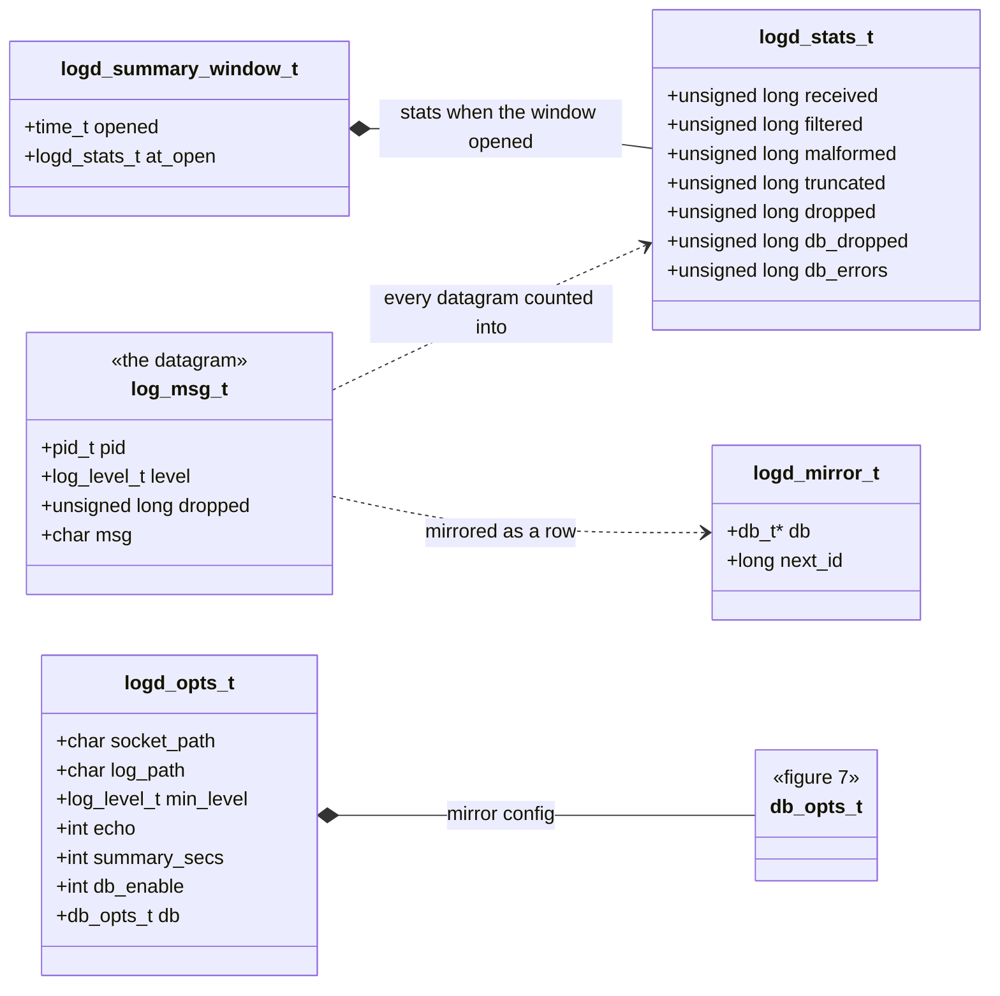
```mermaid
%%{init: {'class': {'nodeSpacing': 55, 'rankSpacing': 230}}}%%
classDiagram
  direction LR

class log_msg_t {
  <<the datagram>>
  +pid_t pid
  +log_level_t level
  +unsigned long dropped
  +char msg
}
class logd_opts_t {
  +char socket_path
  +char log_path
  +log_level_t min_level
  +int echo
  +int summary_secs
  +int db_enable
  +db_opts_t db
}
class db_opts_t {
  <<figure 7>>
}
class logd_stats_t {
  +unsigned long received
  +unsigned long filtered
  +unsigned long malformed
  +unsigned long truncated
  +unsigned long dropped
  +unsigned long db_dropped
  +unsigned long db_errors
}
class logd_summary_window_t {
  +time_t opened
  +logd_stats_t at_open
}
class logd_mirror_t {
  +db_t* db
  +long next_id
}
logd_opts_t *-- db_opts_t : mirror config
log_msg_t ..> logd_stats_t : every datagram counted into
logd_summary_window_t *-- logd_stats_t : stats when the window opened
log_msg_t ..> logd_mirror_t : mirrored as a row
```

`log_msg_t` is the datagram every process sends, carrying its own dropped-count so a sender that lost records can piggyback that fact on the next one it lands. `tetrislogd` counts each arrival into `logd_stats_t`, snapshots those counters per summary window, and optionally mirrors records into SimpleDB through `logd_mirror_t`.

### 9. The control plane

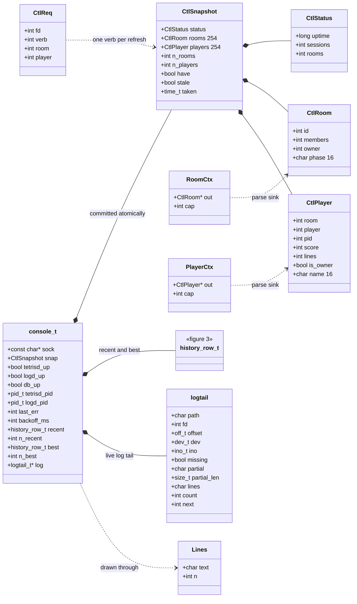
```mermaid
%%{init: {'class': {'nodeSpacing': 55, 'rankSpacing': 230}}}%%
classDiagram
  direction LR

class CtlReq {
  +int fd
  +int verb
  +int room
  +int player
}
class CtlSnapshot {
  +CtlStatus status
  +CtlRoom rooms 254
  +CtlPlayer players 254
  +int n_rooms
  +int n_players
  +bool have
  +bool stale
  +time_t taken
}
class CtlStatus {
  +long uptime
  +int sessions
  +int rooms
}
class CtlRoom {
  +int id
  +int members
  +int owner
  +char phase 16
}
class CtlPlayer {
  +int room
  +int player
  +int pid
  +int score
  +int lines
  +bool is_owner
  +char name 16
}
class RoomCtx {
  +CtlRoom* out
  +int cap
}
class PlayerCtx {
  +CtlPlayer* out
  +int cap
}
class console_t {
  +const char* sock
  +CtlSnapshot snap
  +bool tetrisd_up
  +bool logd_up
  +bool db_up
  +pid_t tetrisd_pid
  +pid_t logd_pid
  +int last_err
  +int backoff_ms
  +history_row_t recent
  +int n_recent
  +history_row_t best
  +int n_best
  +logtail_t* log
}
class logtail {
  +char path
  +int fd
  +off_t offset
  +dev_t dev
  +ino_t ino
  +bool missing
  +char partial
  +size_t partial_len
  +char lines
  +int count
  +int next
}
class Lines {
  +char text
  +int n
}
class history_row_t {
  <<figure 3>>
}
CtlReq ..> CtlSnapshot : one verb per refresh
RoomCtx ..> CtlRoom : parse sink
PlayerCtx ..> CtlPlayer : parse sink
CtlSnapshot *-- CtlStatus
CtlSnapshot *-- CtlRoom
CtlSnapshot *-- CtlPlayer
console_t *-- CtlSnapshot : committed atomically
console_t *-- history_row_t : recent and best
console_t *-- logtail : live log tail
console_t ..> Lines : drawn through
```

`tetrisctl` never touches a domain type. It reads flattened `Ctl*` rows through parse sinks into a `CtlSnapshot` the console commits in one step, so a failed refresh leaves the previous screen standing and flips `stale` rather than half-updating it. `logtail` tracks the log by device and inode, so a rotation at the same path is detected even when the replacement is the same size.

---

## Part III — The benchmark harness

`benchmarks/support` supplies the measurement primitives; every suite composes them into the same profile / resources / result triple.

### 10. Measurement primitives

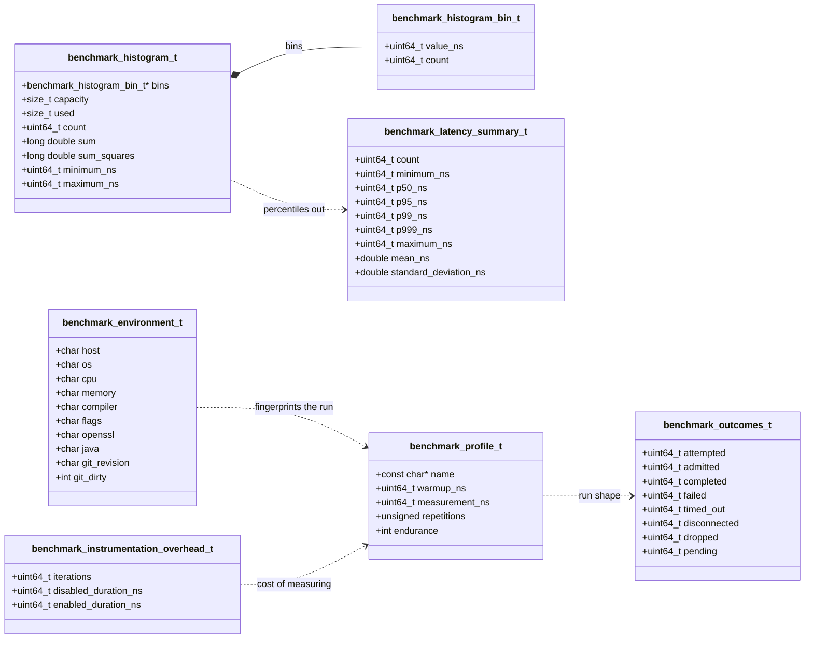
```mermaid
%%{init: {'class': {'nodeSpacing': 55, 'rankSpacing': 230}}}%%
classDiagram
  direction LR

class benchmark_histogram_t {
  +benchmark_histogram_bin_t* bins
  +size_t capacity
  +size_t used
  +uint64_t count
  +long double sum
  +long double sum_squares
  +uint64_t minimum_ns
  +uint64_t maximum_ns
}
class benchmark_histogram_bin_t {
  +uint64_t value_ns
  +uint64_t count
}
class benchmark_latency_summary_t {
  +uint64_t count
  +uint64_t minimum_ns
  +uint64_t p50_ns
  +uint64_t p95_ns
  +uint64_t p99_ns
  +uint64_t p999_ns
  +uint64_t maximum_ns
  +double mean_ns
  +double standard_deviation_ns
}
class benchmark_outcomes_t {
  +uint64_t attempted
  +uint64_t admitted
  +uint64_t completed
  +uint64_t failed
  +uint64_t timed_out
  +uint64_t disconnected
  +uint64_t dropped
  +uint64_t pending
}
class benchmark_profile_t {
  +const char* name
  +uint64_t warmup_ns
  +uint64_t measurement_ns
  +unsigned repetitions
  +int endurance
}
class benchmark_environment_t {
  +char host
  +char os
  +char cpu
  +char memory
  +char compiler
  +char flags
  +char openssl
  +char java
  +char git_revision
  +int git_dirty
}
class benchmark_instrumentation_overhead_t {
  +uint64_t iterations
  +uint64_t disabled_duration_ns
  +uint64_t enabled_duration_ns
}
benchmark_histogram_t *-- benchmark_histogram_bin_t : bins
benchmark_histogram_t ..> benchmark_latency_summary_t : percentiles out
benchmark_profile_t ..> benchmark_outcomes_t : run shape
benchmark_environment_t ..> benchmark_profile_t : fingerprints the run
benchmark_instrumentation_overhead_t ..> benchmark_profile_t : cost of measuring
```

A histogram of raw bins, collapsed to a percentile summary at report time; one outcome vocabulary shared by every suite; and an environment fingerprint that decides whether two runs are even comparable.

### 11. Baseline comparison

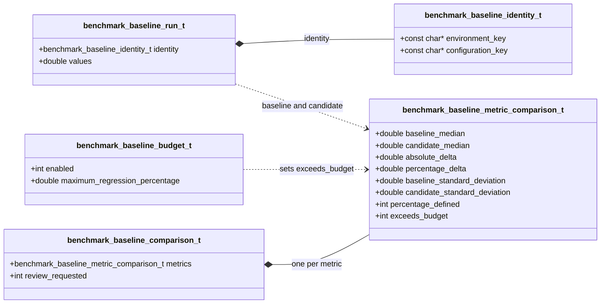
```mermaid
%%{init: {'class': {'nodeSpacing': 55, 'rankSpacing': 230}}}%%
classDiagram
  direction LR

class benchmark_baseline_run_t {
  +benchmark_baseline_identity_t identity
  +double values
}
class benchmark_baseline_identity_t {
  +const char* environment_key
  +const char* configuration_key
}
class benchmark_baseline_budget_t {
  +int enabled
  +double maximum_regression_percentage
}
class benchmark_baseline_metric_comparison_t {
  +double baseline_median
  +double candidate_median
  +double absolute_delta
  +double percentage_delta
  +double baseline_standard_deviation
  +double candidate_standard_deviation
  +int percentage_defined
  +int exceeds_budget
}
class benchmark_baseline_comparison_t {
  +benchmark_baseline_metric_comparison_t metrics
  +int review_requested
}
benchmark_baseline_run_t *-- benchmark_baseline_identity_t : identity
benchmark_baseline_run_t ..> benchmark_baseline_metric_comparison_t : baseline and candidate
benchmark_baseline_budget_t ..> benchmark_baseline_metric_comparison_t : sets exceeds_budget
benchmark_baseline_comparison_t *-- benchmark_baseline_metric_comparison_t : one per metric
```

A stored run is keyed by environment and configuration. Comparison is per metric — deltas plus both standard deviations, with `percentage_defined` marking the divide-by-zero case — and the budget decides which of those deltas trips `exceeds_budget`.

### 12. Database suites

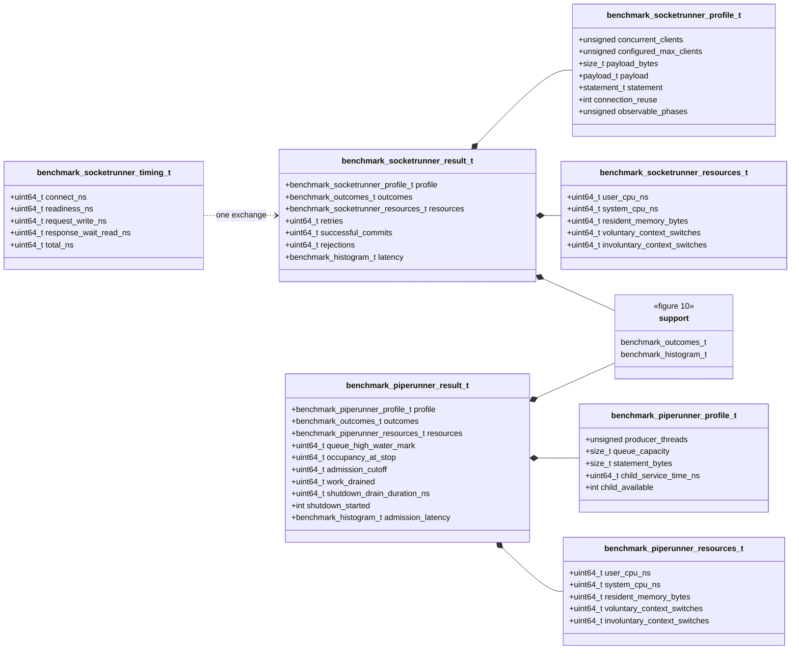
```mermaid
%%{init: {'class': {'nodeSpacing': 55, 'rankSpacing': 230}}}%%
classDiagram
  direction LR

class benchmark_socketrunner_result_t {
  +benchmark_socketrunner_profile_t profile
  +benchmark_outcomes_t outcomes
  +benchmark_socketrunner_resources_t resources
  +uint64_t retries
  +uint64_t successful_commits
  +uint64_t rejections
  +benchmark_histogram_t latency
}
class benchmark_socketrunner_profile_t {
  +unsigned concurrent_clients
  +unsigned configured_max_clients
  +size_t payload_bytes
  +payload_t payload
  +statement_t statement
  +int connection_reuse
  +unsigned observable_phases
}
class benchmark_socketrunner_resources_t {
  +uint64_t user_cpu_ns
  +uint64_t system_cpu_ns
  +uint64_t resident_memory_bytes
  +uint64_t voluntary_context_switches
  +uint64_t involuntary_context_switches
}
class benchmark_socketrunner_timing_t {
  +uint64_t connect_ns
  +uint64_t readiness_ns
  +uint64_t request_write_ns
  +uint64_t response_wait_read_ns
  +uint64_t total_ns
}
class benchmark_piperunner_result_t {
  +benchmark_piperunner_profile_t profile
  +benchmark_outcomes_t outcomes
  +benchmark_piperunner_resources_t resources
  +uint64_t queue_high_water_mark
  +uint64_t occupancy_at_stop
  +uint64_t admission_cutoff
  +uint64_t work_drained
  +uint64_t shutdown_drain_duration_ns
  +int shutdown_started
  +benchmark_histogram_t admission_latency
}
class benchmark_piperunner_profile_t {
  +unsigned producer_threads
  +size_t queue_capacity
  +size_t statement_bytes
  +uint64_t child_service_time_ns
  +int child_available
}
class benchmark_piperunner_resources_t {
  +uint64_t user_cpu_ns
  +uint64_t system_cpu_ns
  +uint64_t resident_memory_bytes
  +uint64_t voluntary_context_switches
  +uint64_t involuntary_context_switches
}
class support {
  <<figure 10>>
  benchmark_outcomes_t
  benchmark_histogram_t
}
benchmark_socketrunner_timing_t ..> benchmark_socketrunner_result_t : one exchange
benchmark_socketrunner_result_t *-- benchmark_socketrunner_profile_t
benchmark_socketrunner_result_t *-- benchmark_socketrunner_resources_t
benchmark_piperunner_result_t *-- benchmark_piperunner_profile_t
benchmark_piperunner_result_t *-- benchmark_piperunner_resources_t
benchmark_socketrunner_result_t *-- support
benchmark_piperunner_result_t *-- support
```

The socket runner measures concurrent clients against the Java runner and keeps per-phase timings; the pipe runner measures the queue in front of the forked child — high-water mark, admission cutoff, drain at shutdown.

### 13. Auth and logger suites

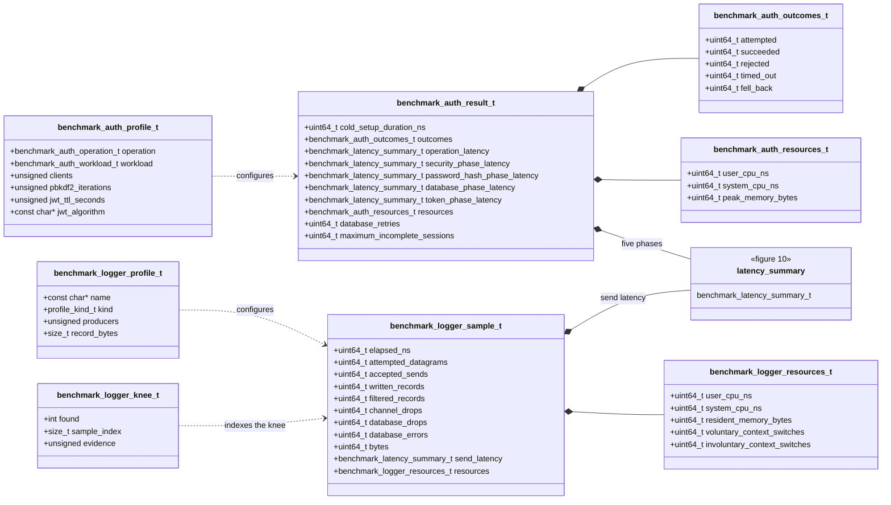
```mermaid
%%{init: {'class': {'nodeSpacing': 55, 'rankSpacing': 230}}}%%
classDiagram
  direction LR

class benchmark_auth_result_t {
  +uint64_t cold_setup_duration_ns
  +benchmark_auth_outcomes_t outcomes
  +benchmark_latency_summary_t operation_latency
  +benchmark_latency_summary_t security_phase_latency
  +benchmark_latency_summary_t password_hash_phase_latency
  +benchmark_latency_summary_t database_phase_latency
  +benchmark_latency_summary_t token_phase_latency
  +benchmark_auth_resources_t resources
  +uint64_t database_retries
  +uint64_t maximum_incomplete_sessions
}
class benchmark_auth_profile_t {
  +benchmark_auth_operation_t operation
  +benchmark_auth_workload_t workload
  +unsigned clients
  +unsigned pbkdf2_iterations
  +unsigned jwt_ttl_seconds
  +const char* jwt_algorithm
}
class benchmark_auth_outcomes_t {
  +uint64_t attempted
  +uint64_t succeeded
  +uint64_t rejected
  +uint64_t timed_out
  +uint64_t fell_back
}
class benchmark_auth_resources_t {
  +uint64_t user_cpu_ns
  +uint64_t system_cpu_ns
  +uint64_t peak_memory_bytes
}
class benchmark_logger_sample_t {
  +uint64_t elapsed_ns
  +uint64_t attempted_datagrams
  +uint64_t accepted_sends
  +uint64_t written_records
  +uint64_t filtered_records
  +uint64_t channel_drops
  +uint64_t database_drops
  +uint64_t database_errors
  +uint64_t bytes
  +benchmark_latency_summary_t send_latency
  +benchmark_logger_resources_t resources
}
class benchmark_logger_profile_t {
  +const char* name
  +profile_kind_t kind
  +unsigned producers
  +size_t record_bytes
}
class benchmark_logger_resources_t {
  +uint64_t user_cpu_ns
  +uint64_t system_cpu_ns
  +uint64_t resident_memory_bytes
  +uint64_t voluntary_context_switches
  +uint64_t involuntary_context_switches
}
class benchmark_logger_knee_t {
  +int found
  +size_t sample_index
  +unsigned evidence
}
class latency_summary {
  <<figure 10>>
  benchmark_latency_summary_t
}
benchmark_auth_profile_t ..> benchmark_auth_result_t : configures
benchmark_auth_result_t *-- benchmark_auth_outcomes_t
benchmark_auth_result_t *-- benchmark_auth_resources_t
benchmark_auth_result_t *-- latency_summary : five phases
benchmark_logger_profile_t ..> benchmark_logger_sample_t : configures
benchmark_logger_sample_t *-- benchmark_logger_resources_t
benchmark_logger_sample_t *-- latency_summary : send latency
benchmark_logger_knee_t ..> benchmark_logger_sample_t : indexes the knee
```

Auth splits latency five ways so PBKDF2 cost is separable from database cost and token cost. The logger suite samples throughput as load rises and looks for the knee where drops start.

### 14. System suites

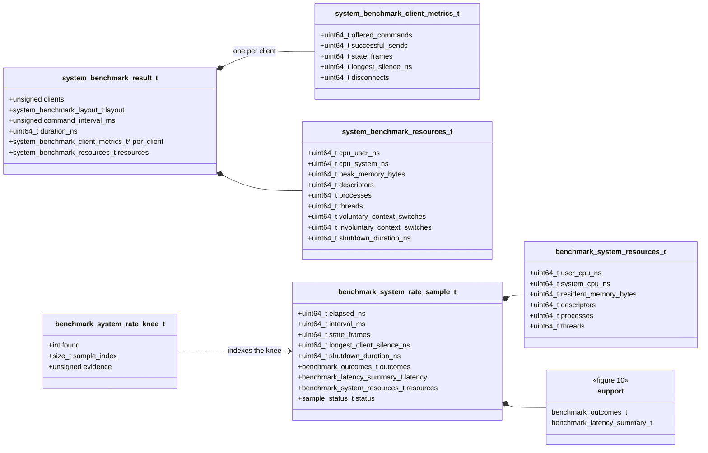
```mermaid
%%{init: {'class': {'nodeSpacing': 55, 'rankSpacing': 230}}}%%
classDiagram
  direction LR

class system_benchmark_result_t {
  +unsigned clients
  +system_benchmark_layout_t layout
  +unsigned command_interval_ms
  +uint64_t duration_ns
  +system_benchmark_client_metrics_t* per_client
  +system_benchmark_resources_t resources
}
class system_benchmark_client_metrics_t {
  +uint64_t offered_commands
  +uint64_t successful_sends
  +uint64_t state_frames
  +uint64_t longest_silence_ns
  +uint64_t disconnects
}
class system_benchmark_resources_t {
  +uint64_t cpu_user_ns
  +uint64_t cpu_system_ns
  +uint64_t peak_memory_bytes
  +uint64_t descriptors
  +uint64_t processes
  +uint64_t threads
  +uint64_t voluntary_context_switches
  +uint64_t involuntary_context_switches
  +uint64_t shutdown_duration_ns
}
class benchmark_system_rate_sample_t {
  +uint64_t elapsed_ns
  +uint64_t interval_ms
  +uint64_t state_frames
  +uint64_t longest_client_silence_ns
  +uint64_t shutdown_duration_ns
  +benchmark_outcomes_t outcomes
  +benchmark_latency_summary_t latency
  +benchmark_system_resources_t resources
  +sample_status_t status
}
class benchmark_system_resources_t {
  +uint64_t user_cpu_ns
  +uint64_t system_cpu_ns
  +uint64_t resident_memory_bytes
  +uint64_t descriptors
  +uint64_t processes
  +uint64_t threads
}
class benchmark_system_rate_knee_t {
  +int found
  +size_t sample_index
  +unsigned evidence
}
class support {
  <<figure 10>>
  benchmark_outcomes_t
  benchmark_latency_summary_t
}
system_benchmark_result_t *-- system_benchmark_client_metrics_t : one per client
system_benchmark_result_t *-- system_benchmark_resources_t
benchmark_system_rate_sample_t *-- benchmark_system_resources_t
benchmark_system_rate_sample_t *-- support
benchmark_system_rate_knee_t ..> benchmark_system_rate_sample_t : indexes the knee
```

Whole-system load: per-client command and frame counters, and a rate-saturation sweep that records the longest silence any client saw at each offered rate.

### 15. Fan-out, garbage, lifecycle

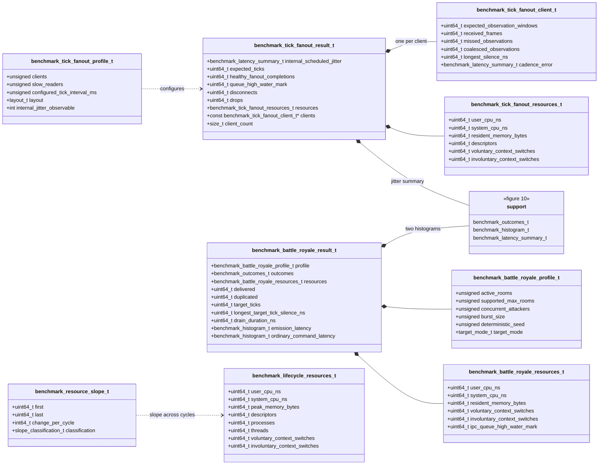
```mermaid
%%{init: {'class': {'nodeSpacing': 55, 'rankSpacing': 230}}}%%
classDiagram
  direction LR

class benchmark_tick_fanout_result_t {
  +benchmark_latency_summary_t internal_scheduled_jitter
  +uint64_t expected_ticks
  +uint64_t healthy_fanout_completions
  +uint64_t queue_high_water_mark
  +uint64_t disconnects
  +uint64_t drops
  +benchmark_tick_fanout_resources_t resources
  +const benchmark_tick_fanout_client_t* clients
  +size_t client_count
}
class benchmark_tick_fanout_profile_t {
  +unsigned clients
  +unsigned slow_readers
  +unsigned configured_tick_interval_ms
  +layout_t layout
  +int internal_jitter_observable
}
class benchmark_tick_fanout_client_t {
  +uint64_t expected_observation_windows
  +uint64_t received_frames
  +uint64_t missed_observations
  +uint64_t coalesced_observations
  +uint64_t longest_silence_ns
  +benchmark_latency_summary_t cadence_error
}
class benchmark_tick_fanout_resources_t {
  +uint64_t user_cpu_ns
  +uint64_t system_cpu_ns
  +uint64_t resident_memory_bytes
  +uint64_t descriptors
  +uint64_t voluntary_context_switches
  +uint64_t involuntary_context_switches
}
class benchmark_battle_royale_result_t {
  +benchmark_battle_royale_profile_t profile
  +benchmark_outcomes_t outcomes
  +benchmark_battle_royale_resources_t resources
  +uint64_t delivered
  +uint64_t duplicated
  +uint64_t target_ticks
  +uint64_t longest_target_tick_silence_ns
  +uint64_t drain_duration_ns
  +benchmark_histogram_t emission_latency
  +benchmark_histogram_t ordinary_command_latency
}
class benchmark_battle_royale_profile_t {
  +unsigned active_rooms
  +unsigned supported_max_rooms
  +unsigned concurrent_attackers
  +unsigned burst_size
  +unsigned deterministic_seed
  +target_mode_t target_mode
}
class benchmark_battle_royale_resources_t {
  +uint64_t user_cpu_ns
  +uint64_t system_cpu_ns
  +uint64_t resident_memory_bytes
  +uint64_t voluntary_context_switches
  +uint64_t involuntary_context_switches
  +uint64_t ipc_queue_high_water_mark
}
class benchmark_lifecycle_resources_t {
  +uint64_t user_cpu_ns
  +uint64_t system_cpu_ns
  +uint64_t peak_memory_bytes
  +uint64_t descriptors
  +uint64_t processes
  +uint64_t threads
  +uint64_t voluntary_context_switches
  +uint64_t involuntary_context_switches
}
class benchmark_resource_slope_t {
  +uint64_t first
  +uint64_t last
  +int64_t change_per_cycle
  +slope_classification_t classification
}
class support {
  <<figure 10>>
  benchmark_outcomes_t
  benchmark_histogram_t
  benchmark_latency_summary_t
}
benchmark_tick_fanout_profile_t ..> benchmark_tick_fanout_result_t : configures
benchmark_tick_fanout_result_t *-- benchmark_tick_fanout_client_t : one per client
benchmark_tick_fanout_result_t *-- benchmark_tick_fanout_resources_t
benchmark_tick_fanout_result_t *-- support : jitter summary
benchmark_battle_royale_result_t *-- benchmark_battle_royale_profile_t
benchmark_battle_royale_result_t *-- benchmark_battle_royale_resources_t
benchmark_battle_royale_result_t *-- support : two histograms
benchmark_resource_slope_t ..> benchmark_lifecycle_resources_t : slope across cycles
```

Tick fan-out measures cadence error per client against the scheduled tick. Battle royale measures garbage delivery across rooms. The lifecycle suite tracks resources across repeated start/stop cycles and classifies the slope — that is the leak detector.

---

## Inventory

### Runtime (51)

| Struct | File | Role |
| --- | --- | --- |
| `Piece` | `include/libtetrisutil/gamestate.h:67` | Falling piece: kind, rotation, origin |
| `PlayerStanding` | `include/libtetrisutil/gamestate.h:104` | One scoreboard row |
| `GameState` | `include/libtetrisutil/gamestate.h:167` | Whole board + engine counters + room scoreboard |
| `RoomMember` | `include/libtetrisutil/sessionstate.h:39` | One roster row in the lobby |
| `SessionState` | `include/libtetrisutil/sessionstate.h:66` | Phase, room, player id, ownership, roster |
| `auth_budget_t` | `include/libtetrisutil/authbudget.h:50` | Per-connection auth attempt budget |
| `log_msg_t` | `include/libtetrisutil/logmsg.h:31` | The logging datagram on the wire |
| `history_round_t` | `include/libtetrisutil/historyview.h:25` | One past round, 32-bit timestamps |
| `player_history_t` | `include/libtetrisutil/historyview.h:36` | Recent rounds + bests for one player |
| `PieceDef` | `src/libtetrisbrain/piece.c` | Static rotation table entry |
| `htttp_header_t` | `include/libhtttp/htttp.h:71` | One parsed header |
| `htttp_request_t` | `include/libhtttp/htttp.h:81` | Zero-copy parsed request |
| `htttp_response_t` | `include/libhtttp/htttp.h:90` | Zero-copy parsed response |
| `session_t` | `include/libtetrissh/tetrissh.h:47` | Encrypted transport session (fd + key) |
| `auth_conf_t` | `src/libtetrisauth/auth.h:53` | Auth tunables from the rc file |
| `cred_t` | `src/libtetrisauth/auth.h:87` | Borrowed username/password slices |
| `jwt_claims_t` | `include/libtetrisauth/jwt.h:68` | sub / name / iat / exp |
| `seg_t` | `src/libtetrisauth/jwt.c` | Byte slice into a token |
| `jwt_parts_t` | `src/libtetrisauth/jwt.c` | Header, payload, signature, signing input |
| `json_member_t` | `src/libtetrisauth/jwt.c` | One key/value from the claim scanner |
| `json_iter_t` | `src/libtetrisauth/jwt.c` | Claim scanner cursor |
| `db_wire_t` | `src/libtetrisdb/wire.h` | Buffered line reader over an fd |
| `db_proc_t` | `src/libtetrisdb/pipe/proc.h` | Forked SimpleDB child: pid, stdin, stdout |
| `struct db` | `src/libtetrisdb/pipe/queue.c:10` | Async statement queue + worker thread |
| `db_opts_t` | `include/libtetrisdb/pipe/db.h:15` | Pipe transport config |
| `struct db_socket` | `src/libtetrisdb/socket/socket.c:24` | Socket transport connection + deadline |
| `db_socket_opts_t` | `include/libtetrisdb/socket/db.h` | Socket path + timeout |
| `db_runner_opts_t` | `include/libtetrisdb/socket/runner.h:62` | How to spawn the Java runner |
| `logd_opts_t` | `src/tetrislogd/logger.h` | Logger daemon config |
| `logd_stats_t` | `src/tetrislogd/logger.h` | Received / filtered / dropped counters |
| `logd_mirror_t` | `src/tetrislogd/logger.h` | DB handle + next row id |
| `logd_summary_window_t` | `src/tetrislogd/logger.h` | Periodic summary window |
| `Session` | `include/tetrisd/session.h:26` | One session process: state, board, two fds |
| `AdminMsg` | `include/tetrisd/adminmsg.h:114` | Fixed-size session ↔ admin message |
| `RoomInfo` | `include/tetrisd/room.h:61` | Flattened room row for the control plane |
| `PlayerInfo` | `include/tetrisd/room.h:73` | Flattened player row for the control plane |
| `history_row_t` | `include/tetrisd/history.h:30` | Persisted round record |
| `Client` (room) | `src/tetrisd/room.c:44` | One member slot inside a room |
| `Room` | `src/tetrisd/room.c:58` | Room: phase, seed, members, last standings |
| `Client` (tetrisu) | `include/tetrisu/client.h:160` | Whole client program state |
| `CellView` | `src/tetrisu/render.c` | One cell as the renderer sees it |
| `CtlStatus` | `include/tetrisctl/ctl_client.h:43` | Uptime, session count, room count |
| `CtlRoom` | `include/tetrisctl/ctl_client.h:51` | Room row as `tetrisctl` sees it |
| `CtlPlayer` | `include/tetrisctl/ctl_client.h:62` | Player row as `tetrisctl` sees it |
| `CtlSnapshot` | `include/tetrisctl/ctl_client.h:80` | One atomic refresh of the whole server |
| `CtlReq` | `include/tetrisctl/control_plane.h:91` | Accepted control connection + verb |
| `console_t` | `src/tetrisctl/ctl_tui.c:94` | TUI state: snapshot, liveness, history, log |
| `Lines` | `src/tetrisctl/ctl_tui.c:139` | Fixed dashboard text block |
| `RoomCtx` | `src/tetrisctl/ctl_client.c:269` | Parse sink for room rows |
| `PlayerCtx` | `src/tetrisctl/ctl_client.c:298` | Parse sink for player rows |
| `struct logtail` | `src/tetrisctl/ctl_logtail.c:22` | Rotation-aware log tail ring |

### Benchmarks (42)

`benchmarks/support` (12): `benchmark_histogram_bin_t`, `benchmark_histogram_t`,
`benchmark_latency_summary_t`, `benchmark_outcomes_t`, `benchmark_environment_t`,
`benchmark_profile_t`, `benchmark_instrumentation_overhead_t`, `benchmark_baseline_identity_t`,
`benchmark_baseline_run_t`, `benchmark_baseline_budget_t`,
`benchmark_baseline_metric_comparison_t`, `benchmark_baseline_comparison_t`.

Per suite (30): `benchmark_socketrunner_{profile,resources,timing,result}_t`,
`benchmark_piperunner_{profile,resources,result}_t`,
`benchmark_auth_{profile,resources,outcomes,result}_t`,
`benchmark_logger_{profile,resources,sample,knee}_t`, `benchmark_lifecycle_resources_t`,
`benchmark_resource_slope_t`, `benchmark_system_{resources,rate_sample,rate_knee}_t`,
`system_benchmark_{client_metrics,resources,result}_t`,
`benchmark_tick_fanout_{profile,client,resources,result}_t`,
`benchmark_battle_royale_{profile,resources,result}_t`.

### Test-local (25, not drawn)

Fixture and scenario types defined inside a single test translation unit: `phase_counts_t`,
`action_context_t`, `peer_script_t`, `stream_peer_opts_t`, `submit_task_t`, `stop_task_t`,
`wire_case_t`, `Sess`, `Fixture` (×3), `Step`, `fixture_t` (×3), `resource_baseline_t`, `peer_t`,
`Journey`, `TestEnv` (×2), `ScenarioLayout`, `Scenario`, `TestConfig`, `ClientProgress`,
`auth_thread_t`.

---

Figures are checked mechanically: every relation path and edge label is tested against every class
box, and all fifteen render with zero overlaps (`scratchpad/check.py`).
