# Sequence diagrams — client ↔ daemon

Companion to `docs/CLIENT_INTERNALS.md`. That document explains how each client
is *built*; this one draws every exchange that crosses the process boundary.

Two conversations, two transports:

| | `tetrisu` ↔ `tetrisd` | `tetrisctl` ↔ `tetrisd` |
|---|---|---|
| Socket | TCP, encrypted by `libtetrissh` | `AF_UNIX` stream, plaintext, `var/run/tetrisd.ctl` |
| Framing | 4-byte BE inside the session layer | 4-byte BE directly (`ctl_frame_read/write`) |
| Grammar | `libhtttp` | `libhtttp` |
| Connection | one, long-lived | one per command |
| Server pushes | yes, `STATE` at 20 Hz | never |

**Who is who inside `tetrisd`.** Four participants appear in Part A, and they
are not all threads:

- **listener thread** — `accept()`s, then `fork()` + `execl("bin/session")`.
- **session process** — a *separate process* per client (`src/tetrisd/session.c`).
  Owns the TLS-ish session, the rules engine, and the 50 ms gravity tick.
  Talks to admin over a pre-connected `SOCK_STREAM` socketpair.
- **admin thread** — single-threaded owner of the room tables. Polls every
  session socketpair plus three fixed fds. No locks anywhere.
- **ctl thread** — owns the `AF_UNIX` control socket. Parses, then hands a
  16-byte `CtlReq` to admin over a pipe.

**One naming correction.** `CLIENT_INTERNALS.md` calls the 20 Hz board push
`UPD_GAME`. The wire method is **`STATE`** — `session.c:606` sends it,
`net.c:370` matches it. `UPD_SESSION` and `UPD_RESULT` are named as documented.

---

# Part A — `tetrisu` ↔ `tetrisd`

## A1. Connect and handshake

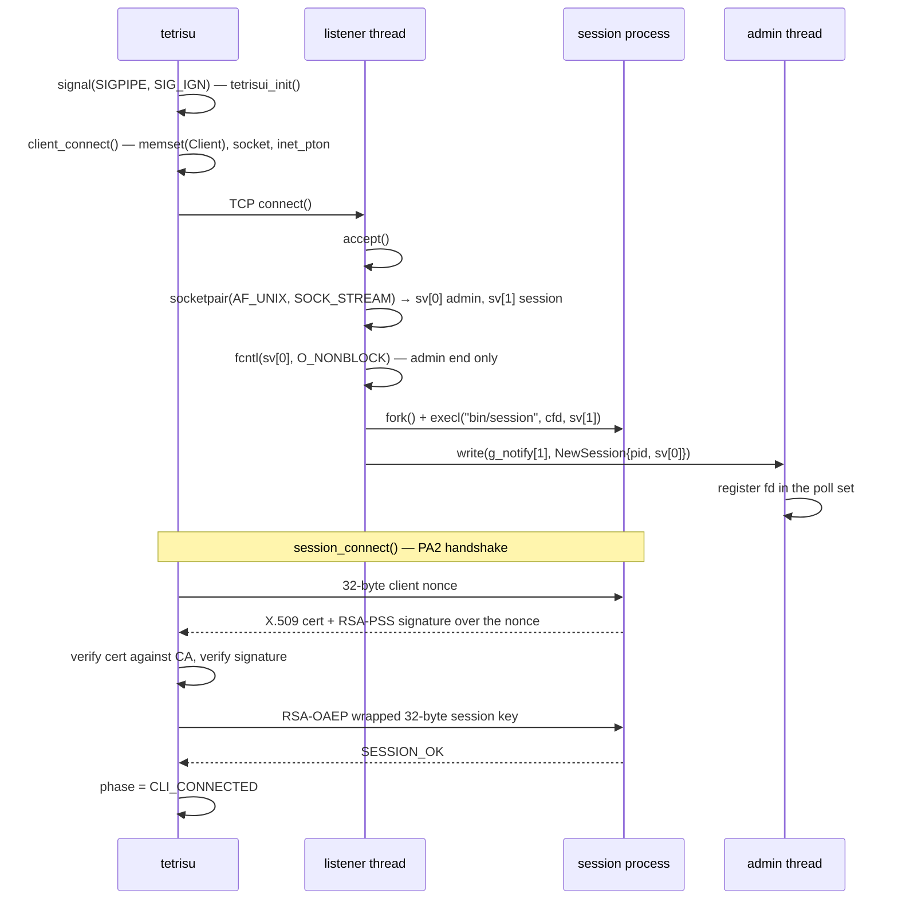
```mermaid
sequenceDiagram
    participant U as tetrisu
    participant L as listener thread
    participant S as session process
    participant AD as admin thread

    U->>U: signal(SIGPIPE, SIG_IGN) — tetrisui_init()
    U->>U: client_connect() — memset(Client), socket, inet_pton
    U->>L: TCP connect()
    L->>L: accept()
    L->>L: socketpair(AF_UNIX, SOCK_STREAM) → sv[0] admin, sv[1] session
    L->>L: fcntl(sv[0], O_NONBLOCK) — admin end only
    L->>S: fork() + execl("bin/session", cfd, sv[1])
    L->>AD: write(g_notify[1], NewSession{pid, sv[0]})
    AD->>AD: register fd in the poll set

    Note over U,S: session_connect() — PA2 handshake
    U->>S: 32-byte client nonce
    S-->>U: X.509 cert + RSA-PSS signature over the nonce
    U->>U: verify cert against CA, verify signature
    U->>S: RSA-OAEP wrapped 32-byte session key
    S-->>U: SESSION_OK
    U->>U: phase = CLI_CONNECTED
```

`client_connect` returns `session_connect`'s error verbatim (`net.c:69`), so
`SESSION_ERR_AUTH` (bad cert) stays distinguishable from a dead route.

---

## A2. Auth gate — GUEST

The session process runs `tauth_login()` *before* the room dispatcher exists.
Nothing but `LOGIN` / `REGISTER` / `GUEST` gets past it.

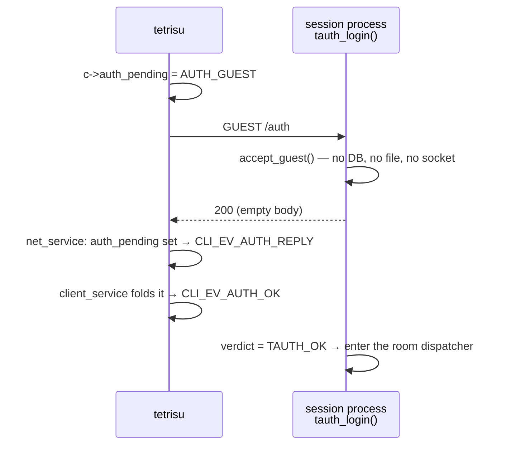
```mermaid
sequenceDiagram
    participant U as tetrisu
    participant S as session process<br/>tauth_login()

    U->>U: c->auth_pending = AUTH_GUEST
    U->>S: GUEST /auth
    S->>S: accept_guest() — no DB, no file, no socket
    S-->>U: 200 (empty body)
    U->>U: net_service: auth_pending set → CLI_EV_AUTH_REPLY
    U->>U: client_service folds it → CLI_EV_AUTH_OK
    S->>S: verdict = TAUTH_OK → enter the room dispatcher
```

`accept_guest` touching no database is Invariant A: the DB can be down and the
game still plays.

---

## A3. Auth gate — LOGIN / REGISTER, including the failure cap

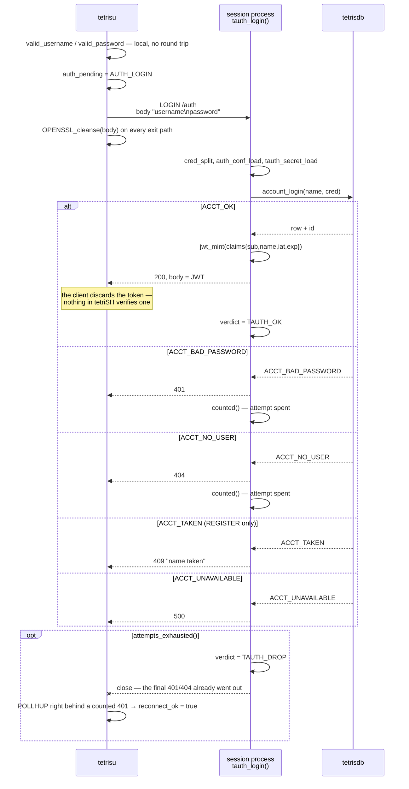
```mermaid
sequenceDiagram
    participant U as tetrisu
    participant S as session process<br/>tauth_login()
    participant DB as tetrisdb

    U->>U: valid_username / valid_password — local, no round trip
    U->>U: auth_pending = AUTH_LOGIN
    U->>S: LOGIN /auth<br/>body "username\npassword"
    U->>U: OPENSSL_cleanse(body) on every exit path
    S->>S: cred_split, auth_conf_load, tauth_secret_load
    S->>DB: account_login(name, cred)

    alt ACCT_OK
        DB-->>S: row + id
        S->>S: jwt_mint(claims{sub,name,iat,exp})
        S-->>U: 200, body = JWT
        Note over U: the client discards the token —<br/>nothing in tetriSH verifies one
        S->>S: verdict = TAUTH_OK
    else ACCT_BAD_PASSWORD
        DB-->>S: ACCT_BAD_PASSWORD
        S-->>U: 401
        S->>S: counted() — attempt spent
    else ACCT_NO_USER
        DB-->>S: ACCT_NO_USER
        S-->>U: 404
        S->>S: counted() — attempt spent
    else ACCT_TAKEN (REGISTER only)
        DB-->>S: ACCT_TAKEN
        S-->>U: 409 "name taken"
    else ACCT_UNAVAILABLE
        DB-->>S: ACCT_UNAVAILABLE
        S-->>U: 500
    end

    opt attempts_exhausted()
        S->>S: verdict = TAUTH_DROP
        S--xU: close — the final 401/404 already went out
        U->>U: POLLHUP right behind a counted 401 → reconnect_ok = true
    end
```

Only `401` and `404` are counted, and the budget never resets — identity is
fixed for the life of the connection.

---

## A4. JOIN — new room versus existing room

`JOIN`, `LEAVE` and `START` have **no responses of their own**. `UPD_SESSION`
*is* their acknowledgement.

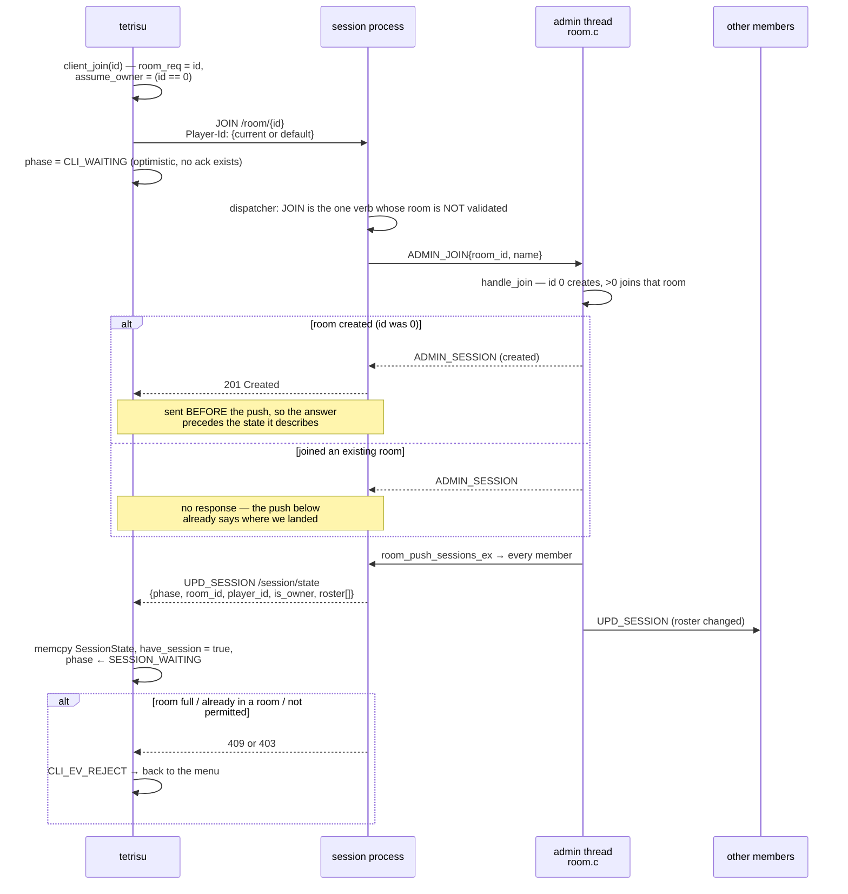
```mermaid
sequenceDiagram
    participant U as tetrisu
    participant S as session process
    participant AD as admin thread<br/>room.c
    participant O as other members

    U->>U: client_join(id) — room_req = id,<br/>assume_owner = (id == 0)
    U->>S: JOIN /room/{id}<br/>Player-Id: {current or default}
    U->>U: phase = CLI_WAITING (optimistic, no ack exists)

    S->>S: dispatcher: JOIN is the one verb whose room is NOT validated
    S->>AD: ADMIN_JOIN{room_id, name}
    AD->>AD: handle_join — id 0 creates, >0 joins that room

    alt room created (id was 0)
        AD-->>S: ADMIN_SESSION (created)
        S-->>U: 201 Created
        Note over S,U: sent BEFORE the push, so the answer<br/>precedes the state it describes
    else joined an existing room
        AD-->>S: ADMIN_SESSION
        Note over S,U: no response — the push below<br/>already says where we landed
    end

    AD->>S: room_push_sessions_ex → every member
    S-->>U: UPD_SESSION /session/state<br/>{phase, room_id, player_id, is_owner, roster[]}
    AD->>O: UPD_SESSION (roster changed)
    U->>U: memcpy SessionState, have_session = true,<br/>phase ← SESSION_WAITING

    alt room full / already in a room / not permitted
        S-->>U: 409 or 403
        U->>U: CLI_EV_REJECT → back to the menu
    end
```

The `Player-Id` header is keyed off the *request*, not the reply: before `JOIN`
it carries the default and the server only checks presence; afterwards it checks
the value.

---

## A5. START — the round begins

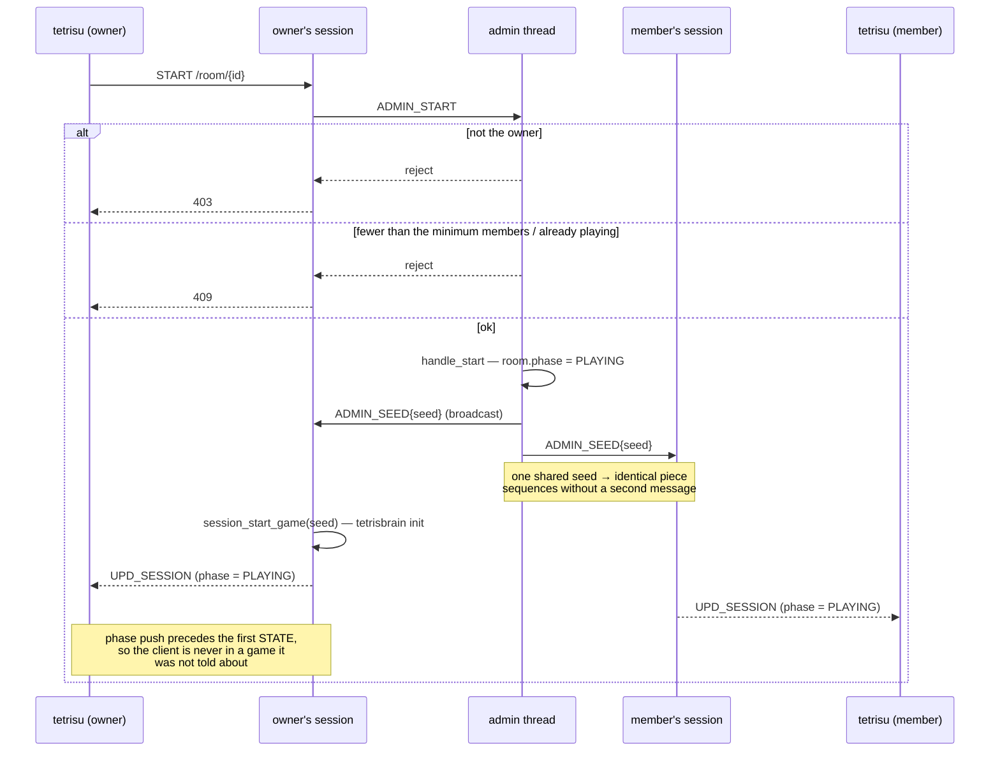
```mermaid
sequenceDiagram
    participant U as tetrisu (owner)
    participant S as owner's session
    participant AD as admin thread
    participant S2 as member's session
    participant U2 as tetrisu (member)

    U->>S: START /room/{id}
    S->>AD: ADMIN_START

    alt not the owner
        AD-->>S: reject
        S-->>U: 403
    else fewer than the minimum members / already playing
        AD-->>S: reject
        S-->>U: 409
    else ok
        AD->>AD: handle_start — room.phase = PLAYING
        AD->>S: ADMIN_SEED{seed} (broadcast)
        AD->>S2: ADMIN_SEED{seed}
        Note over AD,S2: one shared seed → identical piece<br/>sequences without a second message
        S->>S: session_start_game(seed) — tetrisbrain init
        S-->>U: UPD_SESSION (phase = PLAYING)
        S2-->>U2: UPD_SESSION (phase = PLAYING)
        Note over S,U: phase push precedes the first STATE,<br/>so the client is never in a game it<br/>was not told about
    end
```

A non-owner learns the round started **only** from this push (or from the first
`STATE` frame) — there is no other signal.

---

## A6. The live round — input up, board down

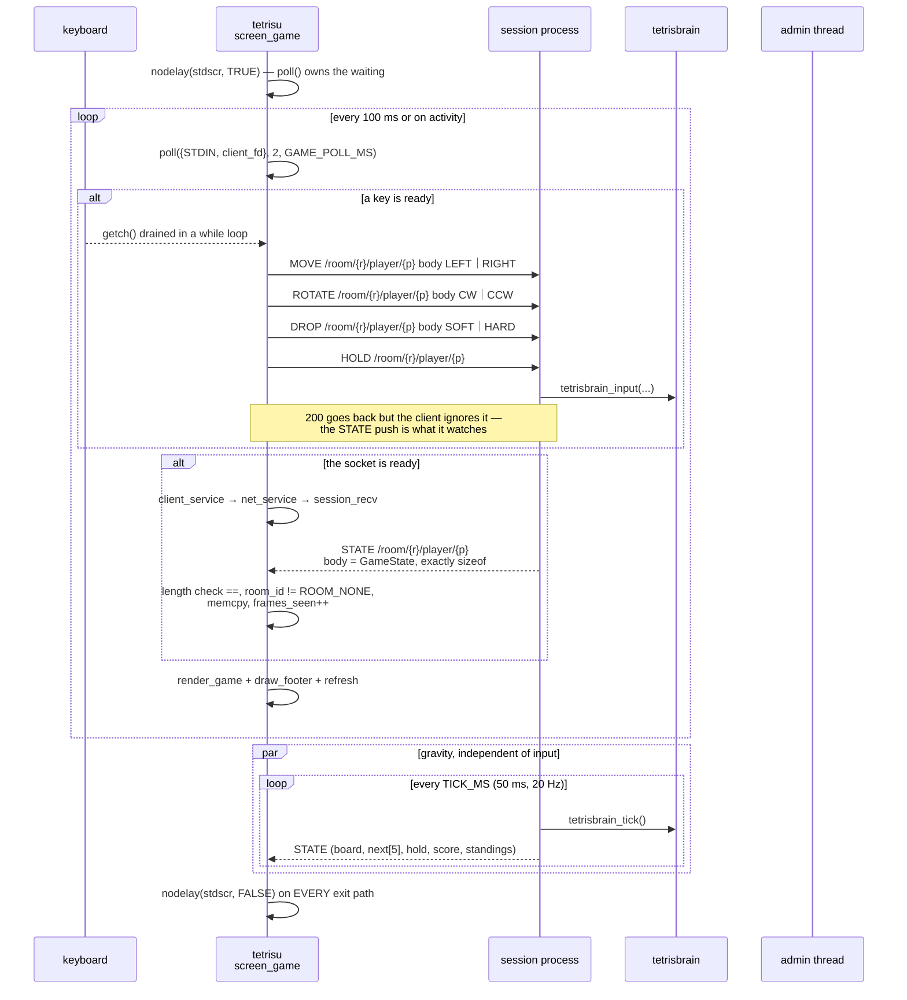
```mermaid
sequenceDiagram
    participant K as keyboard
    participant U as tetrisu<br/>screen_game
    participant S as session process
    participant B as tetrisbrain
    participant AD as admin thread

    U->>U: nodelay(stdscr, TRUE) — poll() owns the waiting

    loop every 100 ms or on activity
        U->>U: poll({STDIN, client_fd}, 2, GAME_POLL_MS)

        alt a key is ready
            K-->>U: getch() drained in a while loop
            U->>S: MOVE /room/{r}/player/{p}  body LEFT｜RIGHT
            U->>S: ROTATE /room/{r}/player/{p}  body CW｜CCW
            U->>S: DROP /room/{r}/player/{p}  body SOFT｜HARD
            U->>S: HOLD /room/{r}/player/{p}
            S->>B: tetrisbrain_input(...)
            Note over S,U: 200 goes back but the client ignores it —<br/>the STATE push is what it watches
        end

        alt the socket is ready
            U->>U: client_service → net_service → session_recv
            S-->>U: STATE /room/{r}/player/{p}<br/>body = GameState, exactly sizeof
            U->>U: length check ==, room_id != ROOM_NONE,<br/>memcpy, frames_seen++
        end

        U->>U: render_game + draw_footer + refresh
    end

    par gravity, independent of input
        loop every TICK_MS (50 ms, 20 Hz)
            S->>B: tetrisbrain_tick()
            S-->>U: STATE (board, next[5], hold, score, standings)
        end
    end

    U->>U: nodelay(stdscr, FALSE) on EVERY exit path
```

`client_fd()` returns `-1` in mock mode and `poll()` ignores negative fds — one
event loop, both backends, no `if (mock)`.

---

## A7. Garbage and the shared scoreboard

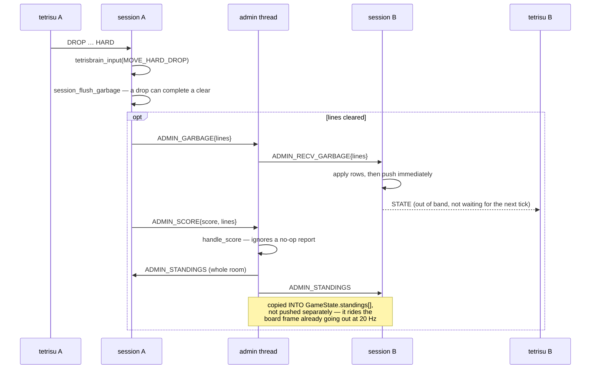
```mermaid
sequenceDiagram
    participant U as tetrisu A
    participant SA as session A
    participant AD as admin thread
    participant SB as session B
    participant U2 as tetrisu B

    U->>SA: DROP … HARD
    SA->>SA: tetrisbrain_input(MOVE_HARD_DROP)
    SA->>SA: session_flush_garbage — a drop can complete a clear

    opt lines cleared
        SA->>AD: ADMIN_GARBAGE{lines}
        AD->>SB: ADMIN_RECV_GARBAGE{lines}
        SB->>SB: apply rows, then push immediately
        SB-->>U2: STATE (out of band, not waiting for the next tick)

        SA->>AD: ADMIN_SCORE{score, lines}
        AD->>AD: handle_score — ignores a no-op report
        AD->>SA: ADMIN_STANDINGS (whole room)
        AD->>SB: ADMIN_STANDINGS
        Note over AD,SB: copied INTO GameState.standings[],<br/>not pushed separately — it rides the<br/>board frame already going out at 20 Hz
    end
```

Score reports fire on line clears, not per tick — which is what keeps the
room-wide fan-out affordable.

---

## A8. Game over — why a dead player stays on screen

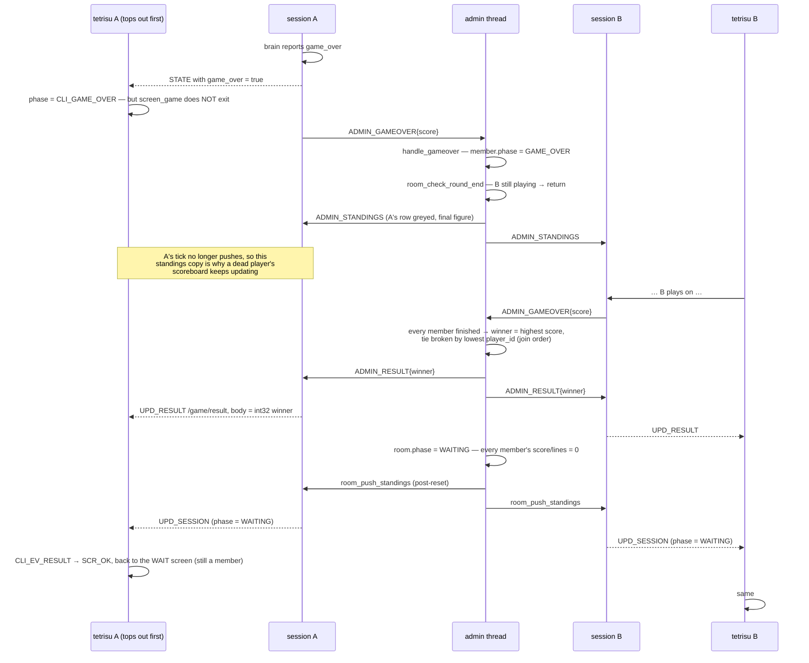
```mermaid
sequenceDiagram
    participant U as tetrisu A (tops out first)
    participant SA as session A
    participant AD as admin thread
    participant SB as session B
    participant U2 as tetrisu B

    SA->>SA: brain reports game_over
    SA-->>U: STATE with game_over = true
    U->>U: phase = CLI_GAME_OVER — but screen_game does NOT exit
    SA->>AD: ADMIN_GAMEOVER{score}
    AD->>AD: handle_gameover — member.phase = GAME_OVER
    AD->>AD: room_check_round_end — B still playing → return
    AD->>SA: ADMIN_STANDINGS (A's row greyed, final figure)
    AD->>SB: ADMIN_STANDINGS
    Note over SA,U: A's tick no longer pushes, so this<br/>standings copy is why a dead player's<br/>scoreboard keeps updating

    U2->>SB: … B plays on …
    SB->>AD: ADMIN_GAMEOVER{score}
    AD->>AD: every member finished → winner = highest score,<br/>tie broken by lowest player_id (join order)
    AD->>SA: ADMIN_RESULT{winner}
    AD->>SB: ADMIN_RESULT{winner}
    SA-->>U: UPD_RESULT /game/result, body = int32 winner
    SB-->>U2: UPD_RESULT

    AD->>AD: room.phase = WAITING — every member's score/lines = 0
    AD->>SA: room_push_standings (post-reset)
    AD->>SB: room_push_standings
    SA-->>U: UPD_SESSION (phase = WAITING)
    SB-->>U2: UPD_SESSION (phase = WAITING)

    U->>U: CLI_EV_RESULT → SCR_OK, back to the WAIT screen (still a member)
    U2->>U2: same
```

`CLI_EV_RESULT` is the primary exit; a `CLI_EV_SESSION` with a phase other than
`PLAYING` is the redundant one, so a dropped `UPD_RESULT` cannot strand a player
on a frozen board.

---

## A9. LEAVE — and the backlog it leaves behind

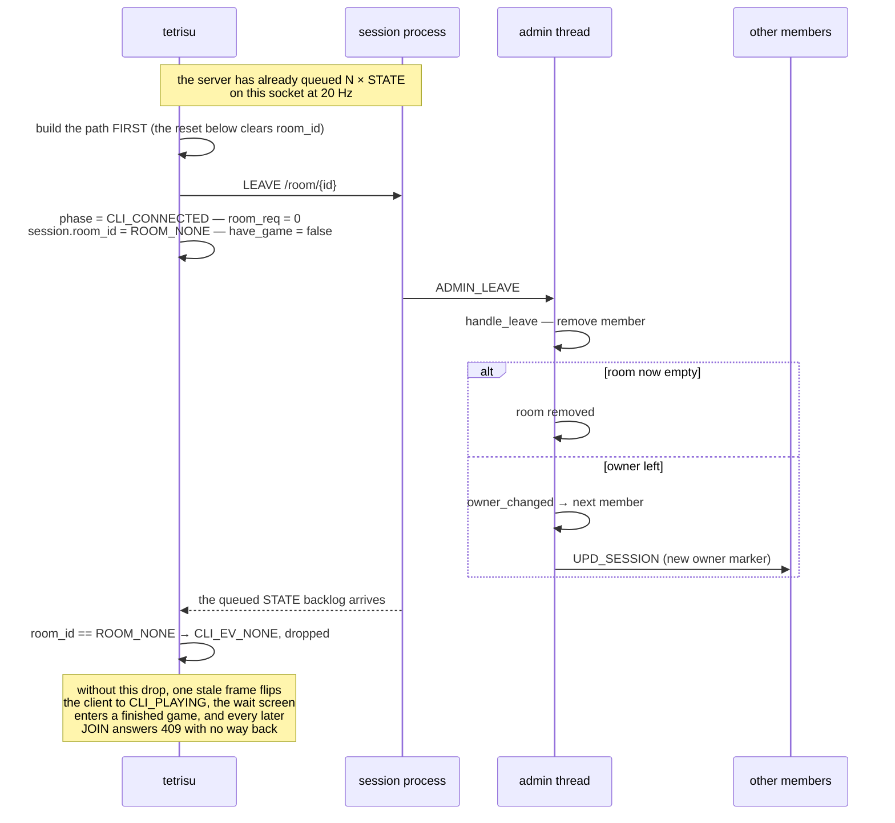
```mermaid
sequenceDiagram
    participant U as tetrisu
    participant S as session process
    participant AD as admin thread
    participant O as other members

    Note over S,U: the server has already queued N × STATE<br/>on this socket at 20 Hz

    U->>U: build the path FIRST (the reset below clears room_id)
    U->>S: LEAVE /room/{id}
    U->>U: phase = CLI_CONNECTED — room_req = 0<br/>session.room_id = ROOM_NONE — have_game = false

    S->>AD: ADMIN_LEAVE
    AD->>AD: handle_leave — remove member

    alt room now empty
        AD->>AD: room removed
    else owner left
        AD->>AD: owner_changed → next member
        AD->>O: UPD_SESSION (new owner marker)
    end

    S-->>U: the queued STATE backlog arrives
    U->>U: room_id == ROOM_NONE → CLI_EV_NONE, dropped
    Note over U: without this drop, one stale frame flips<br/>the client to CLI_PLAYING, the wait screen<br/>enters a finished game, and every later<br/>JOIN answers 409 with no way back
```

---

## A10. Rejections — the four the client can actually see

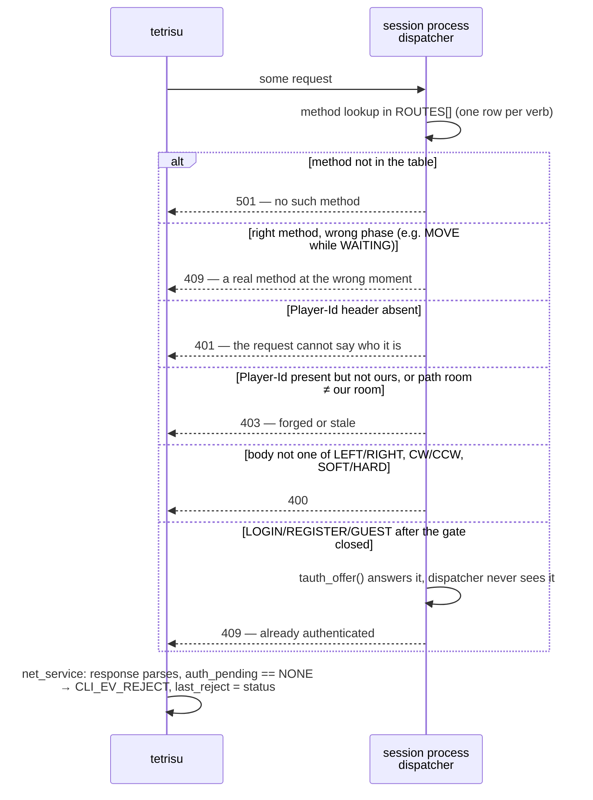
```mermaid
sequenceDiagram
    participant U as tetrisu
    participant S as session process<br/>dispatcher

    U->>S: some request
    S->>S: method lookup in ROUTES[] (one row per verb)

    alt method not in the table
        S-->>U: 501 — no such method
    else right method, wrong phase (e.g. MOVE while WAITING)
        S-->>U: 409 — a real method at the wrong moment
    else Player-Id header absent
        S-->>U: 401 — the request cannot say who it is
    else Player-Id present but not ours, or path room ≠ our room
        S-->>U: 403 — forged or stale
    else body not one of LEFT/RIGHT, CW/CCW, SOFT/HARD
        S-->>U: 400
    else LOGIN/REGISTER/GUEST after the gate closed
        S->>S: tauth_offer() answers it, dispatcher never sees it
        S-->>U: 409 — already authenticated
    end

    U->>U: net_service: response parses, auth_pending == NONE<br/>→ CLI_EV_REJECT, last_reject = status
```

A `2xx` with no `auth_pending` is swallowed as `CLI_EV_NONE` — the `200` per
`MOVE` must not show up as an event.

---

## A11. Disconnect and reconnect

Exactly one cause earns a reconnect offer.

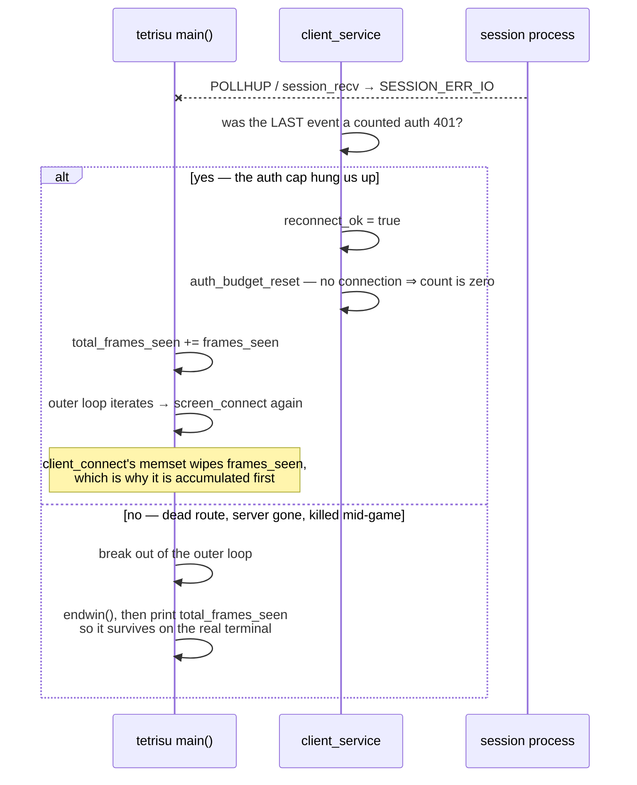
```mermaid
sequenceDiagram
    participant U as tetrisu main()
    participant CS as client_service
    participant S as session process

    S--xU: POLLHUP / session_recv → SESSION_ERR_IO
    CS->>CS: was the LAST event a counted auth 401?

    alt yes — the auth cap hung us up
        CS->>CS: reconnect_ok = true
        CS->>CS: auth_budget_reset — no connection ⇒ count is zero
        U->>U: total_frames_seen += frames_seen
        U->>U: outer loop iterates → screen_connect again
        Note over U: client_connect's memset wipes frames_seen,<br/>which is why it is accumulated first
    else no — dead route, server gone, killed mid-game
        U->>U: break out of the outer loop
        U->>U: endwin(), then print total_frames_seen<br/>so it survives on the real terminal
    end
```

`ERR_IO` / `ERR_TOOBIG` mean the stream is out of sync and the session is
already dead → `CLI_EV_DISCONNECT`. Any other non-OK code is one lost frame →
`CLI_EV_NONE`, live on.

---

## A12. Decode — the one function that handles two message shapes

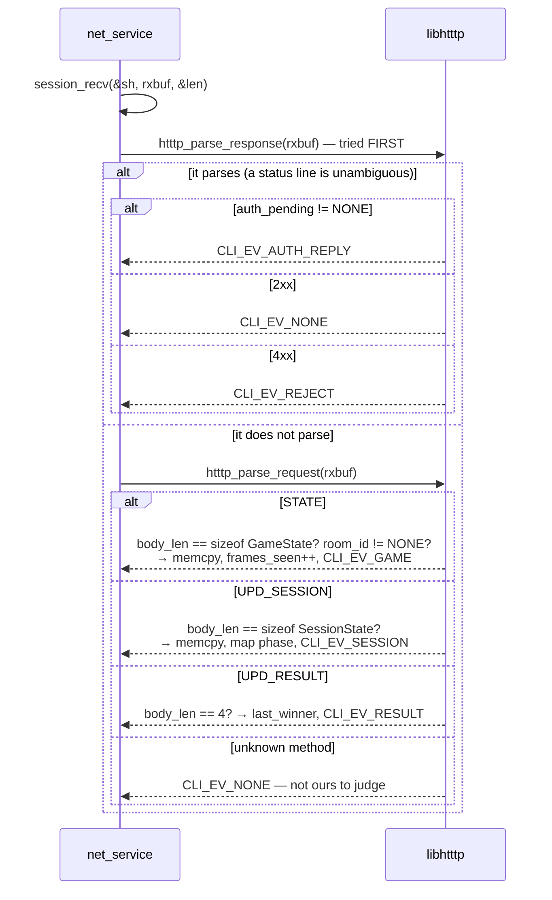
```mermaid
sequenceDiagram
    participant N as net_service
    participant H as libhtttp

    N->>N: session_recv(&sh, rxbuf, &len)
    N->>H: htttp_parse_response(rxbuf) — tried FIRST

    alt it parses (a status line is unambiguous)
        alt auth_pending != NONE
            H-->>N: CLI_EV_AUTH_REPLY
        else 2xx
            H-->>N: CLI_EV_NONE
        else 4xx
            H-->>N: CLI_EV_REJECT
        end
    else it does not parse
        N->>H: htttp_parse_request(rxbuf)
        alt STATE
            H-->>N: body_len == sizeof GameState? room_id != NONE?<br/>→ memcpy, frames_seen++, CLI_EV_GAME
        else UPD_SESSION
            H-->>N: body_len == sizeof SessionState?<br/>→ memcpy, map phase, CLI_EV_SESSION
        else UPD_RESULT
            H-->>N: body_len == 4? → last_winner, CLI_EV_RESULT
        else unknown method
            H-->>N: CLI_EV_NONE — not ours to judge
        end
    end
```

Lengths are checked with `==`, never `>=`: `libhtttp` guarantees the bytes match
`Content-Length` but has no idea what a `GameState` is. A short frame would leave
most of the struct holding the previous tick while looking fresh.

---

# Part B — `tetrisctl` ↔ `tetrisd`

## B1. One CLI command, end to end

The exam diagram: a single `tetrisctl status` crosses a process boundary **and
two threads inside the daemon**.

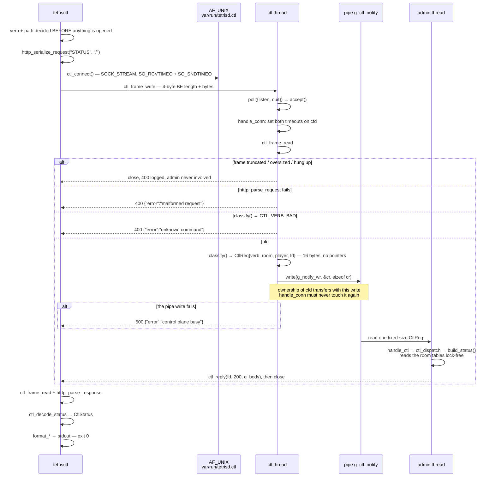
```mermaid
sequenceDiagram
    participant U as tetrisctl
    participant SK as AF_UNIX<br/>var/run/tetrisd.ctl
    participant CT as ctl thread
    participant P as pipe g_ctl_notify
    participant AD as admin thread

    U->>U: verb + path decided BEFORE anything is opened
    U->>U: htttp_serialize_request("STATUS", "/")
    U->>SK: ctl_connect() — SOCK_STREAM, SO_RCVTIMEO + SO_SNDTIMEO
    U->>CT: ctl_frame_write — 4-byte BE length + bytes

    CT->>CT: poll({listen, quit}) → accept()
    CT->>CT: handle_conn: set both timeouts on cfd
    CT->>CT: ctl_frame_read

    alt frame truncated / oversized / hung up
        CT--xU: close, 400 logged, admin never involved
    else htttp_parse_request fails
        CT-->>U: 400 {"error":"malformed request"}
    else classify() → CTL_VERB_BAD
        CT-->>U: 400 {"error":"unknown command"}
    else ok
        CT->>CT: classify() → CtlReq{verb, room, player, fd} — 16 bytes, no pointers
        CT->>P: write(g_notify_wr, &cr, sizeof cr)
        Note over CT,P: ownership of cfd transfers with this write<br/>handle_conn must never touch it again
        alt the pipe write fails
            CT-->>U: 500 {"error":"control plane busy"}
        end
        P->>AD: read one fixed-size CtlReq
        AD->>AD: handle_ctl → ctl_dispatch → build_status()<br/>reads the room tables lock-free
        AD-->>U: ctl_reply(fd, 200, g_body), then close
    end

    U->>U: ctl_frame_read + htttp_parse_response
    U->>U: ctl_decode_status → CtlStatus
    U->>U: format_* → stdout — exit 0
```

**Why the split exists.** Every byte from outside the process is parsed on the
ctl thread. The admin thread — the one routing every game message — receives
only four validated integers. A slow or hostile control client cannot stall room
routing, which is why `tetrisctl shutdown` still works when the game port is
saturated.

Exit codes: `0` success, `1` daemon refused, `2` usage, `3` could not connect.

---

## B2. ROOMS and PLAYERS — and the 32 KB ceiling

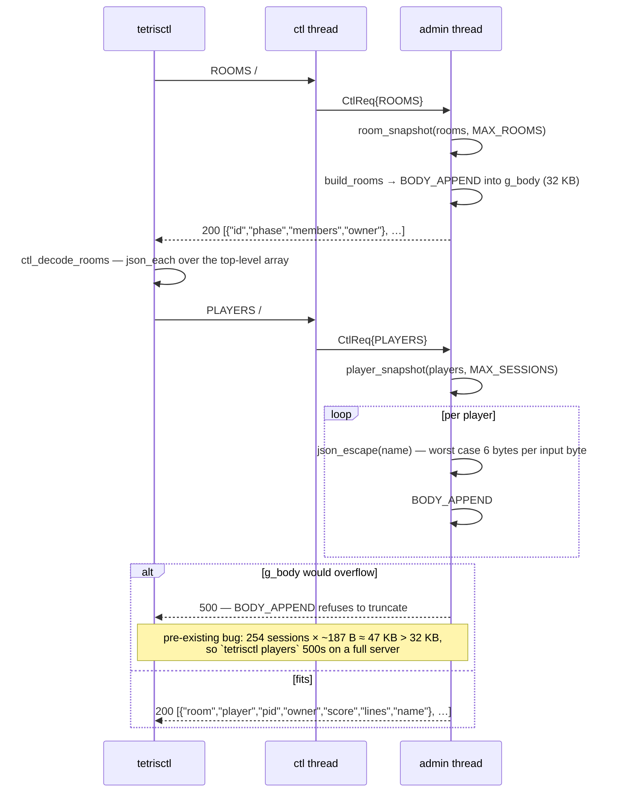
```mermaid
sequenceDiagram
    participant U as tetrisctl
    participant CT as ctl thread
    participant AD as admin thread

    U->>CT: ROOMS /
    CT->>AD: CtlReq{ROOMS}
    AD->>AD: room_snapshot(rooms, MAX_ROOMS)
    AD->>AD: build_rooms → BODY_APPEND into g_body (32 KB)
    AD-->>U: 200 [{"id","phase","members","owner"}, …]
    U->>U: ctl_decode_rooms — json_each over the top-level array

    U->>CT: PLAYERS /
    CT->>AD: CtlReq{PLAYERS}
    AD->>AD: player_snapshot(players, MAX_SESSIONS)
    loop per player
        AD->>AD: json_escape(name) — worst case 6 bytes per input byte
        AD->>AD: BODY_APPEND
    end
    alt g_body would overflow
        AD-->>U: 500 — BODY_APPEND refuses to truncate
        Note over AD,U: pre-existing bug: 254 sessions × ~187 B ≈ 47 KB > 32 KB,<br/>so `tetrisctl players` 500s on a full server
    else fits
        AD-->>U: 200 [{"room","player","pid","owner","score","lines","name"}, …]
    end
```

`json_escape` on the daemon side is what makes the client's `strstr`-based
decoder safe — a player named `x","score":9999` would otherwise forge a field.
The invariant lives in a different file from the code depending on it, which is
why `tests/test_ctl_client.c` pins it.

---

## B3. KICK

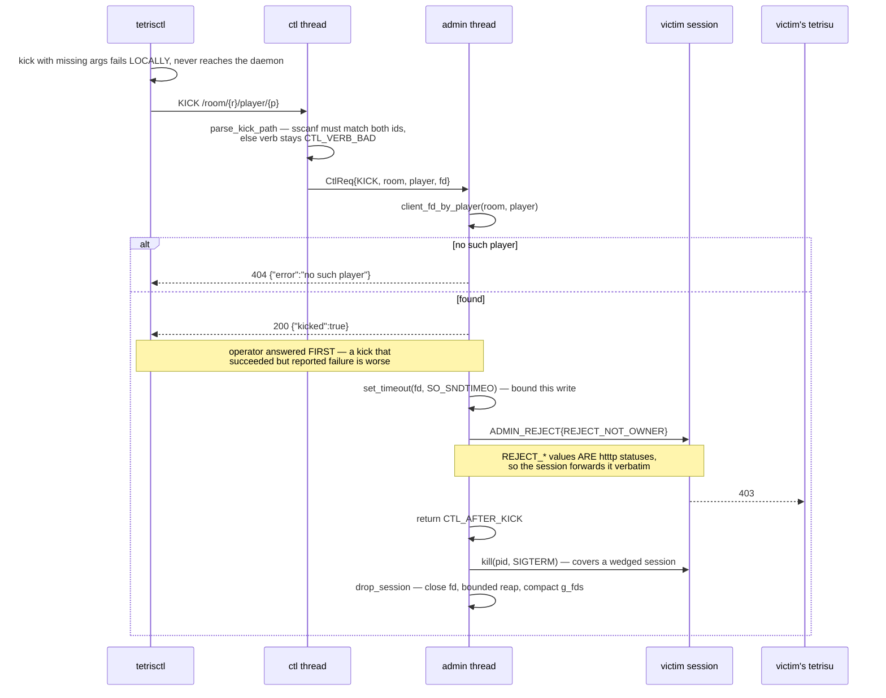
```mermaid
sequenceDiagram
    participant U as tetrisctl
    participant CT as ctl thread
    participant AD as admin thread
    participant SV as victim session
    participant V as victim's tetrisu

    U->>U: kick with missing args fails LOCALLY, never reaches the daemon
    U->>CT: KICK /room/{r}/player/{p}
    CT->>CT: parse_kick_path — sscanf must match both ids,<br/>else verb stays CTL_VERB_BAD
    CT->>AD: CtlReq{KICK, room, player, fd}

    AD->>AD: client_fd_by_player(room, player)
    alt no such player
        AD-->>U: 404 {"error":"no such player"}
    else found
        AD-->>U: 200 {"kicked":true}
        Note over AD,U: operator answered FIRST — a kick that<br/>succeeded but reported failure is worse
        AD->>AD: set_timeout(fd, SO_SNDTIMEO) — bound this write
        AD->>SV: ADMIN_REJECT{REJECT_NOT_OWNER}
        Note over AD,SV: REJECT_* values ARE htttp statuses,<br/>so the session forwards it verbatim
        SV-->>V: 403
        AD->>AD: return CTL_AFTER_KICK
        AD->>SV: kill(pid, SIGTERM) — covers a wedged session
        AD->>AD: drop_session — close fd, bounded reap, compact g_fds
    end
```

Losing the `403` is acceptable; the `SIGTERM` and the reap do not depend on it.

---

## B4. SHUTDOWN

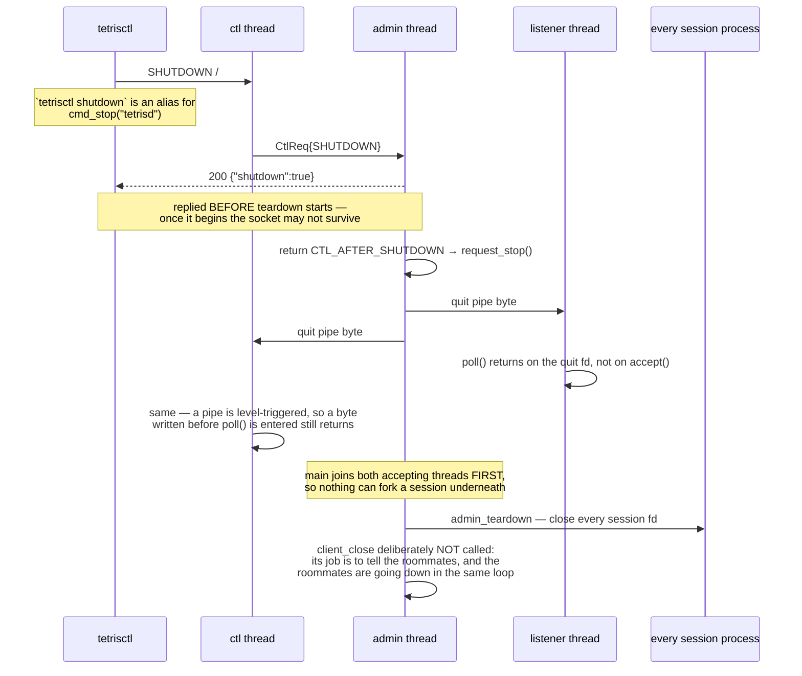
```mermaid
sequenceDiagram
    participant U as tetrisctl
    participant CT as ctl thread
    participant AD as admin thread
    participant L as listener thread
    participant S as every session process

    U->>CT: SHUTDOWN /
    Note over U: `tetrisctl shutdown` is an alias for<br/>cmd_stop("tetrisd")
    CT->>AD: CtlReq{SHUTDOWN}
    AD-->>U: 200 {"shutdown":true}
    Note over AD,U: replied BEFORE teardown starts —<br/>once it begins the socket may not survive
    AD->>AD: return CTL_AFTER_SHUTDOWN → request_stop()
    AD->>L: quit pipe byte
    AD->>CT: quit pipe byte
    L->>L: poll() returns on the quit fd, not on accept()
    CT->>CT: same — a pipe is level-triggered, so a byte<br/>written before poll() is entered still returns
    Note over AD: main joins both accepting threads FIRST,<br/>so nothing can fork a session underneath
    AD->>S: admin_teardown — close every session fd
    AD->>AD: client_close deliberately NOT called:<br/>its job is to tell the roommates, and the<br/>roommates are going down in the same loop
```

---

## B5. RELOAD and unknown verbs

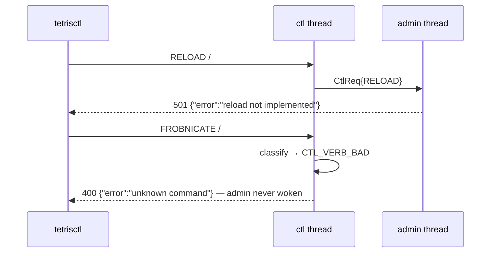
```mermaid
sequenceDiagram
    participant U as tetrisctl
    participant CT as ctl thread
    participant AD as admin thread

    U->>CT: RELOAD /
    CT->>AD: CtlReq{RELOAD}
    AD-->>U: 501 {"error":"reload not implemented"}

    U->>CT: FROBNICATE /
    CT->>CT: classify → CTL_VERB_BAD
    CT-->>U: 400 {"error":"unknown command"} — admin never woken
```

---

## B6. The console — one refresh cycle

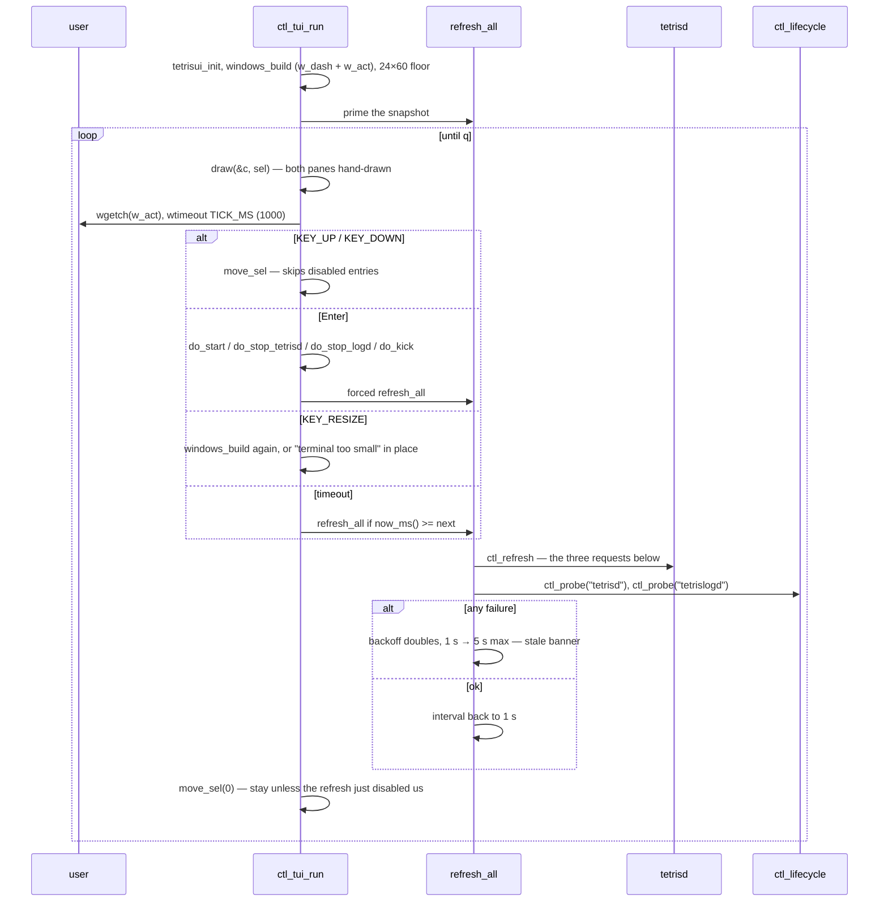
```mermaid
sequenceDiagram
    participant K as user
    participant T as ctl_tui_run
    participant R as refresh_all
    participant D as tetrisd
    participant LC as ctl_lifecycle

    T->>T: tetrisui_init, windows_build (w_dash + w_act), 24×60 floor
    T->>R: prime the snapshot

    loop until q
        T->>T: draw(&c, sel) — both panes hand-drawn
        T->>K: wgetch(w_act), wtimeout TICK_MS (1000)

        alt KEY_UP / KEY_DOWN
            T->>T: move_sel — skips disabled entries
        else Enter
            T->>T: do_start / do_stop_tetrisd / do_stop_logd / do_kick
            T->>R: forced refresh_all
        else KEY_RESIZE
            T->>T: windows_build again, or "terminal too small" in place
        else timeout
            T->>R: refresh_all if now_ms() >= next
        end

        R->>D: ctl_refresh — the three requests below
        R->>LC: ctl_probe("tetrisd"), ctl_probe("tetrislogd")
        alt any failure
            R->>R: backoff doubles, 1 s → 5 s max — stale banner
        else ok
            R->>R: interval back to 1 s
        end
        T->>T: move_sel(0) — stay unless the refresh just disabled us
    end
```

Panes are hand-drawn because `libtetrisui`'s `frame_win()` calls `clear()` and
`refresh()` before every window, so two persistent panes cannot coexist with it.
Widgets are used as full-screen *pages* instead; `after_page` repaints.

Labels are fixed and dimmed when unavailable — a label that relabels under a 1 s
refresh lets Enter do the opposite of what the user just read.

---

## B7. `ctl_refresh` — three connections, one atomic commit

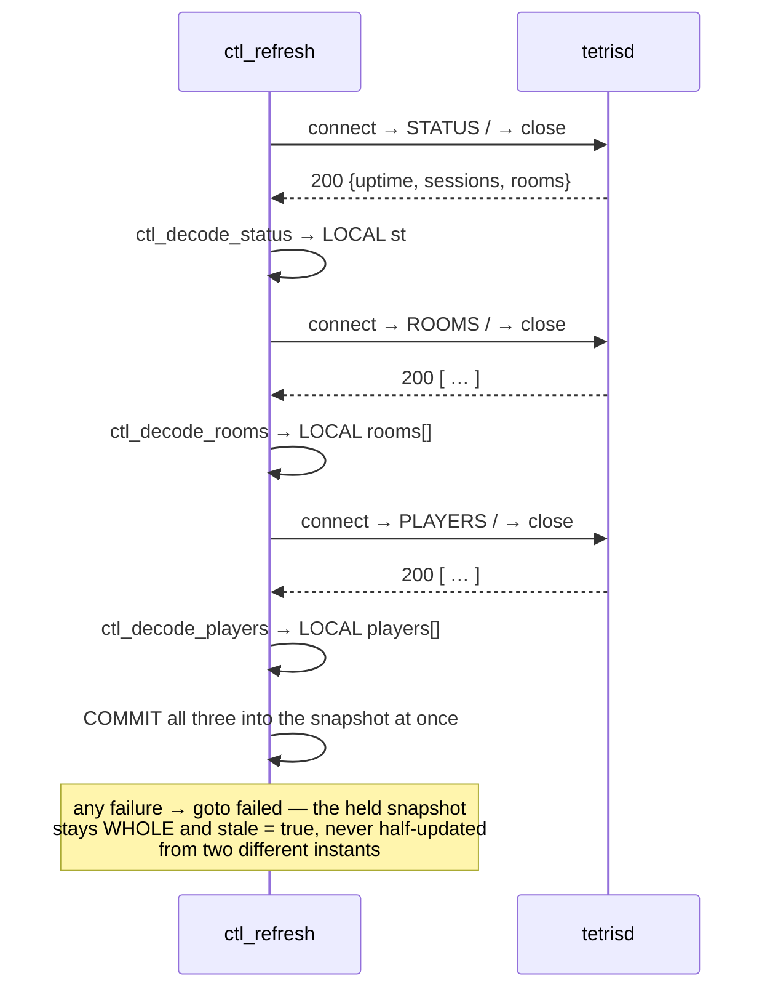
```mermaid
sequenceDiagram
    participant T as ctl_refresh
    participant D as tetrisd

    T->>D: connect → STATUS / → close
    D-->>T: 200 {uptime, sessions, rooms}
    T->>T: ctl_decode_status → LOCAL st

    T->>D: connect → ROOMS / → close
    D-->>T: 200 [ … ]
    T->>T: ctl_decode_rooms → LOCAL rooms[]

    T->>D: connect → PLAYERS / → close
    D-->>T: 200 [ … ]
    T->>T: ctl_decode_players → LOCAL players[]

    T->>T: COMMIT all three into the snapshot at once

    Note over T: any failure → goto failed — the held snapshot<br/>stays WHOLE and stale = true, never half-updated<br/>from two different instants
```

One connection per request is structural, not style: `control_plane.h:285` says
the dispatcher *always consumes* `req->fd`.

**Why not one `SNAPSHOT` verb?** Arithmetic. Combined worst case ≈ 41 KB against
`g_body`'s 32 KB, so it would answer `500` at full capacity where three separate
calls survive.

---

## B8. `ctl start` — liveness by observation

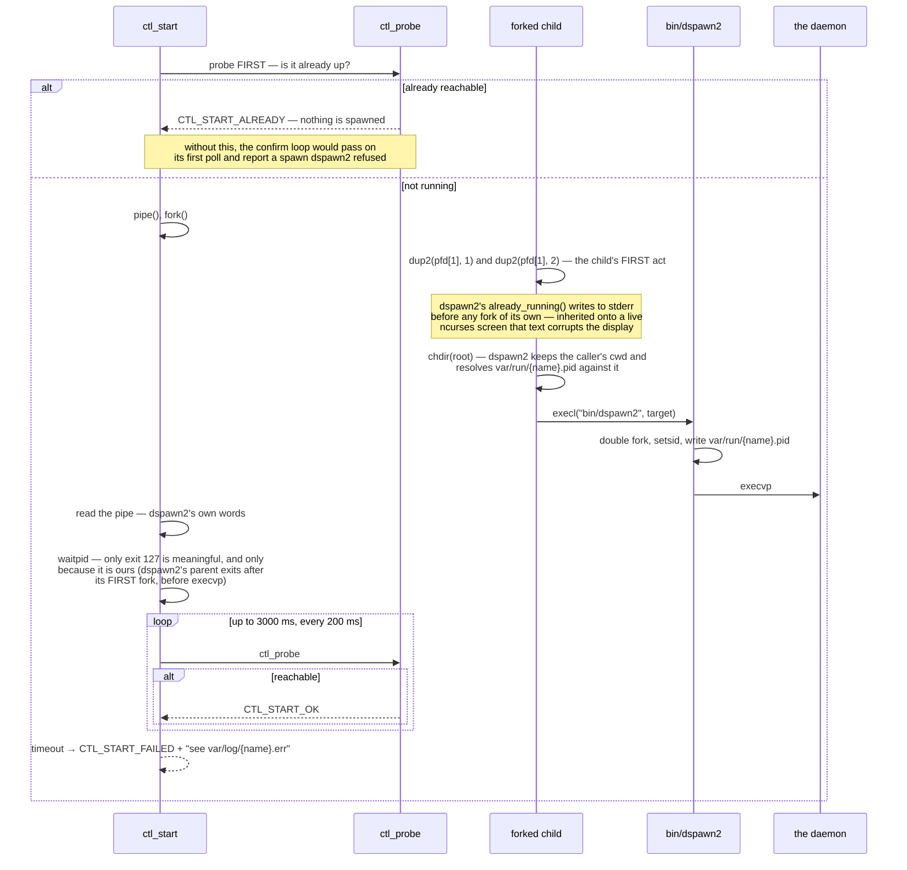
```mermaid
sequenceDiagram
    participant C as ctl_start
    participant P as ctl_probe
    participant F as forked child
    participant DS as bin/dspawn2
    participant D as the daemon

    C->>P: probe FIRST — is it already up?
    alt already reachable
        P-->>C: CTL_START_ALREADY — nothing is spawned
        Note over C,P: without this, the confirm loop would pass on<br/>its first poll and report a spawn dspawn2 refused
    else not running
        C->>C: pipe(), fork()
        F->>F: dup2(pfd[1], 1) and dup2(pfd[1], 2) — the child's FIRST act
        Note over F: dspawn2's already_running() writes to stderr<br/>before any fork of its own — inherited onto a live<br/>ncurses screen that text corrupts the display
        F->>F: chdir(root) — dspawn2 keeps the caller's cwd and<br/>resolves var/run/{name}.pid against it
        F->>DS: execl("bin/dspawn2", target)
        DS->>DS: double fork, setsid, write var/run/{name}.pid
        DS->>D: execvp
        C->>C: read the pipe — dspawn2's own words
        C->>C: waitpid — only exit 127 is meaningful, and only<br/>because it is ours (dspawn2's parent exits after<br/>its FIRST fork, before execvp)
        loop up to 3000 ms, every 200 ms
            C->>P: ctl_probe
            alt reachable
                P-->>C: CTL_START_OK
            end
        end
        C-->>C: timeout → CTL_START_FAILED + "see var/log/{name}.err"
    end
```

---

## B9. `ctl stop` — tetrisd versus tetrislogd

```mermaid
sequenceDiagram
    participant C as tetrisctl
    participant D as tetrisd
    participant LG as tetrislogd

    alt target = tetrisd (has a control plane)
        C->>D: SHUTDOWN / (see B4)
        D-->>C: 200
        loop confirm
            C->>D: ctl_probe → unreachable = stopped
        end
    else target = tetrislogd (no control plane)
        C->>C: read_pidfile(var/run/tetrislogd.pid)
        C->>LG: logd_socket_alive — connect() ONLY
        Note over C,LG: never send: a zero-length datagram would<br/>reach the log sink as a message
        alt pidfile AND socket both alive
            C->>LG: kill(pid, SIGTERM)
            loop confirm
                C->>LG: logd_socket_alive → dead = stopped
            end
        else only one signal of life
            C->>C: refuse — pidfiles are never unlinked, so a<br/>recycled pid would otherwise get signalled
        end
    end
```

---

# Appendix — the seam, in one picture

```mermaid
sequenceDiagram
    participant OUT as anything outside the process
    participant CT as ctl thread
    participant AD as admin thread

    OUT->>CT: htttp_request_t — carries POINTERS into a receive<br/>buffer, ~4 KB of headers, attacker-shaped
    CT->>CT: parse, validate path shape, classify
    CT->>AD: CtlReq — 16 bytes, four ints, NO pointers
    Note over CT,AD: everything hostile is spent on the ctl thread<br/>the thread routing game traffic receives four<br/>validated integers
    AD->>AD: ctl_dispatch replies 200 itself
    AD-->>CT: CtlAfter{NONE｜SHUTDOWN｜KICK}
    Note over AD: CtlAfter is the return channel for actions the<br/>dispatcher cannot perform: it has already replied,<br/>but shutting down or closing a victim's socket<br/>belongs to the admin loop that called it
```

That mechanism is the whole reason *"the control plane must remain available
even when the public TCP listener is saturated"* is true rather than hoped for.
